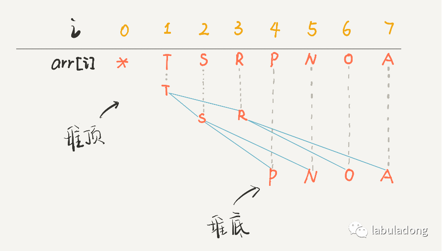

# 1. 数据结构
数据结构的存储方式只有两种实现：数组（顺序存储）和链表（链式存储）。其他所有的数据结构的底层实现都是这两种：
- 数组：
    - 队列：需要考虑扩容缩容问题
    - 栈：同队列
    - 图：用邻接矩阵的形式表达，判断连通性比较迅速
    - 树：

    数组是紧凑连续存储，可以随机访问，能够通过索引快速找到对应元素，而且相对节约空间。但是也正是因为连续存储，因此内存空间需要一次性分配足够，如果需要扩容，需要重新分配再复制；如果想要在数组中进行插入和删除，必须搬移后续所有元素，这两个操作的时间复杂度都是O(N)。

- 链表：
    - 队列：不需要处理扩容缩容，但是需要更多空间存储节点指针
    - 栈：同队列
    - 图：用邻接表形式表达，表示稀疏矩阵有空间存储的优势
    - 散列表：

    链表因为元素不连续，而是靠指针指向下一个元素的位置，所以不存在数组的扩容问题；如果知道某一元素的前驱和后驱，操作指针即可删除该元素或者插入新元素，时间复杂度 O(1)。但是正因为存储空间不连续，你无法根据一个索引算出对应元素的地址，所以不能随机访问；而且由于每个元素必须存储指向前后元素位置的指针，会消耗相对更多的储存空间。

## 1.1 数据结构的基本操作

对于任何数据结构，基本操作就是遍历+访问，更具体一点是：增删改查。抽象来看，各种数据的遍历+访问可以分成线性和非线性。

#### 1.1.1 数组遍历
```cpp
void traverse(int[] arr){
    for(int i = 0; i < arr.length(); i++){
        // 线性迭代访问 arr[i]
    }
}
```

#### 1.1.2 链表遍历
```cpp
class ListNode {
    int val;
    ListNode next;
}

void traverse(ListNode head){
    for (ListNode p = head; p != null; p = p.next){
        // 迭代访问 p.val
    }
}

void traverse(ListNode head){
    // 递归方式
    traverse(head.next);
}
```

#### 1.1.3 二叉树/N叉树遍历
二叉树：
```cpp
class TreeNode {
    int val;
    TreeNode left, right;
}

void traverse(TreeNode root){
    traverse(root.left);
    traverse(root.right);
}
```

N叉树：
```cpp
class TreeNode {
    int val;
    TreeNode[] children;
}

void traverse(TreeNode root) {
    for (TreeNode child : root.children){
        traverse(child);
    }
}
```

## 1.2 二叉堆和优先级队列

### 1.2.1 二叉堆

二叉堆是特殊的二叉树（完全二叉树），是存储在数组中。一般的链表二叉树中，操作节点的指针。而在数组中，我们可以用数组索引作为指针。

**完全二叉树**指除了最底层，所有层节点是满的，同时最底层是从左向右插入节点。

```cpp
// 父节点的索引
int parent(int root){
    return root / 2;
}

// 左孩子的索引
int left(int root){
    return root * 2;
}

// 右孩子的索引
int right(int root){
    return root * 2 + 1;
}
```
这里的`root`是给定节点的数组索引，而返回的结果是给定节点的左右孩子以及父节点的数组索引。通过图片可以非常明确的知道，同时需要注意，这里的`arr[0]`是空着不用的，因为根节点对应是1：


二叉堆还可以分成最大堆和最小堆，其特性是：
- 最大堆：每个节点都大于等于它的两个子节点
- 最小堆：每个节点都小于等于它的两个子节点

### 1.2.2 优先级队列
优先级队列在插入或者删除元素的时候，元素会自动排序，底层的原理就是二叉堆的操作。优先级队列的两个主要API，分别是`insert`和`delMax`（`delMin`）。在C++中有相应的函数实现，头文件是`<queue>`，函数名称为`priority_queue`。

优先级队列的实现基于二叉堆，有以下功能：
- max()
- insert()
- exchange(): 交换两个元素
- swim(): 上浮第K个元素
- sink(): 下沉第k个元素
- less(): 用于判断两个元素的大小
- parent(): 获得父节点索引
- left(): 获得左孩子索引
- right(): 获得右孩子索引

当新元素插入时，会破坏最大堆的结构，因此就有可能出现子节点上浮、父节点下沉的情况，同时上浮（下沉）的节点可能多次循环才能到达正确的位置，因此上浮和下沉的代码中需要`while`循环。
```cpp
void swim(int k){
    while(k > 1 && less(parent(k), k)){
        exchange(parent(k), k);
        k = parent(k);
    }
}
```
上浮的代码中，只需要讲该节点和它的父节点进行比较，然后交换即可。

```cpp
void sink(int k){
    int left_child = left(k);
    int right_child = right(k);
    while(left(k) <= N){
        int bigger = left(k);
        if(right(k) <= N && less(bigger, right(k))){
            bigger = right(k);
        }
        if(less(bigger, k)){
            break;
        }
        exchange(k, bigger);
        k = bigger;
    }
}
```

而优先级队列涉及到的两个操作`insert`和`delMax`就是依赖以上下沉与上浮操作：
```cpp
void insert(int k){
    N++;
    pq.push_back(k);
    swim(N);
}

int delMax(){
    int max = pq[1];
    exchange(1, N);
    pq.pop_back();
    N--;
    sink(1);
    return max;
}

```

上述操作的时间复杂度均为`log(N)`。
