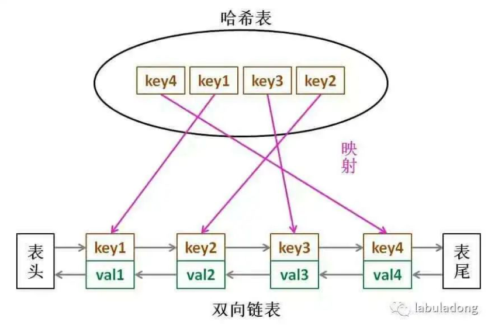

# LRU算法
LRU的全称是Least Recently Used，是一种缓存淘汰策略，用于清理缓存中无用数据，根据LRU策略，缓存中很久没有使用过的数据是无用的，因此会被清理。

## 算法思想

把LRU缓存机制想象成一个队列，越靠近队列头部，近期越没有使用。该队列有一个最大容量，需要实现两个API，`put(key,val)`和`get(key)`。同时，这两个API的时间复杂度需要为`O(1)`。

如果查找和删除都需要O(1)的时间复杂度，我们知道查找O(1)可以使用哈希表，删除O(1)可以使用链表，因此两者结合，对于LRU算法，我们使用哈希链表这个数据结构。具体结构如下图所示：

**问：为什么实现哈希链表需要双向链表？**

答：因为我们在删除一个节点的时候，不仅需要知道该节点的后继节点，还需要前驱节点的指针，因此双向链表才能实现直接查找前驱。

# LFU算法

LFU的全称是Least Frequency Used，和LRU一样是一种缓存淘汰策略。不同的是，LFU淘汰访问频次最低的数据，如果访问次数最低的数据有多条，淘汰最旧的数据。

## 算法思想

把LFU算法和LRU算法比较，不同的是，需要把数据访问频次进行排序，并且频次也需要进行更新。同时，如果频次相同，还需要知道数据的插入时间，把最旧的数据删除。

经过分析，可以列举以下要求：

- 调用`get(key)`，需要返回该`key`对应的值。
- 只要使用`get`或者`put`方法访问以此某个`key`，该`key`的频次需要加一。
- 如果容量满了的时候进行插入，需要将频次最小的`key`删除，如果最小频次对应多个`key`，则删除最旧的。
