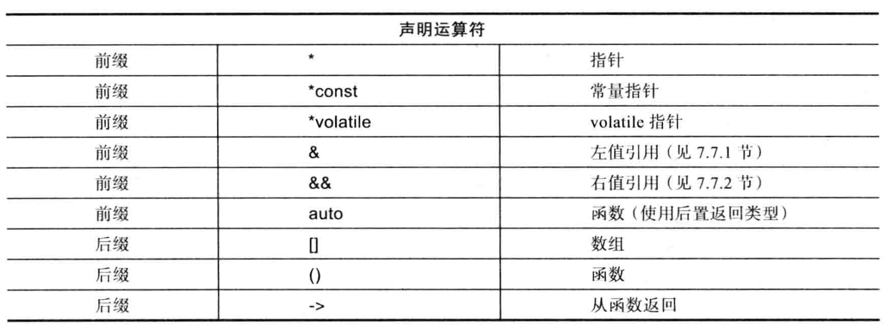

## 1.2 声明

C++程序中想要使用某个标识符，必须先对齐进程声明。大多数声明同时也是定义。

C++中，每个名字可以对应多个声明，但是只能有一个定义，并且同一实体的所有声明，实体的类型必须保持一致。

### 1.2.1 声明的结构

一条声明语句包含5个部分：
1. 可选的前缀修饰符
2. 基本类型
3. 可选的声明符
4. 可选的后缀函数修饰符
5. 可选的初始化器或函数体

声明符由一个名字和一些可选的声明运算符组成，常用的声明运算符包括：



后缀声明符的绑定效果比前缀声明符更加紧密，考虑下面两个例子：
```
char *kings[];
char(*kings)[];
```
前者是char指针的数组，因为`[]`先和kings结合，构成数组的定义，名称为kings，然后`char *`修饰数组的内容。

后者是指向char数组的指针，因为`()`优先级更高，所以`*kings`先组合，表示kings是一个指针，指向一个数组，数组的内容是`char`。

### 1.2.2 作用域

声明语句位作用域引入了一个新名字，换句话说，某个名字只能在程序文本的某个特定区域使用：
- **局部作用域**

    函数或lambda表达式中声明的名字。作用域从声明处开始，到声明语句所在的块结束。
- **类作用域**

    略。
- **名字空间作用域**

    略。
- **全局作用域**

    略
- **语句作用域**

    定义在`for`、`while`、`if`和`switch`语句的`()`部分。

### 1.2.3 初始化

初始化器是对象在初始状态下被赋予的值，初始化器有四种可能的形式，推荐第一种：
- `X a1{v};`
- `X a2 = {v};`
- `X a3 = v;`
- `X a4(v);`

但是使用`auto`的时候的时候不要使用列表初始化，因为可能得到的类型不是我们想得到的。

#### 1.2.3.1 缺少初始化器

当我们缺少初始化器会，有些事情会变得复杂。

对于全局变量、命名空间变量、局部static变量和static成员，如果没有指定初始化器，则会默认执行相应数据类型的列表初始化。

对于局部变量和动态对象，除非位于用户自定义类型的默认构造函数中，否则不会执行默认初始化。

### 1.2.4 推断类型：auto和decltype

#### 1.2.4.1 auto类型

auto根据对象的初始化器推断对象的数据类型，可能是变量、const或constexpr的类型。

当声明语句中的变量含有初始化器时，我们无需显式地指定变量的类型，只要让变量取其初始化器的类型即可。

对于基本类型，auto的使用帮助不够明显，但是在更长的类型声明中，使用auto会让程序更简洁好读。因此建议在小作用域中使用auto。

同时需要注意，在使用auto时，我们最好使用`=`进行初始化，而不是使用`{}`。

#### 1.2.4.2 decltype()

`declytpe()`不是根据初始化器推断对象，而是根据函数的返回类型或者类成员的类型进行推断。

用法如下：
```
decltype(exp) varname = value;
decltype(exp) varname;
```

其中`exp`时一个表达式，decltype根据exp的类型推断类型。

高级用法目前没有使用场景，等用到再学。