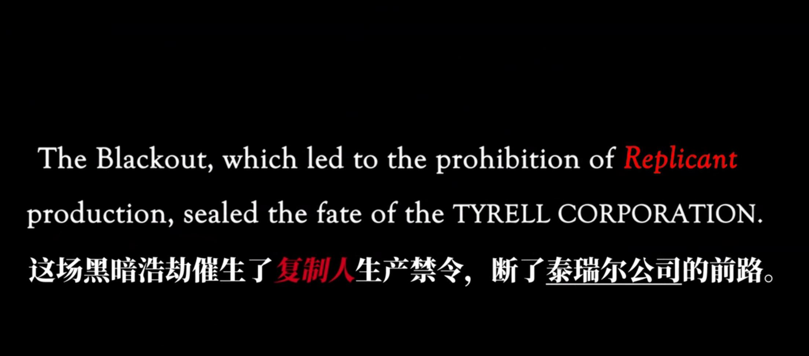
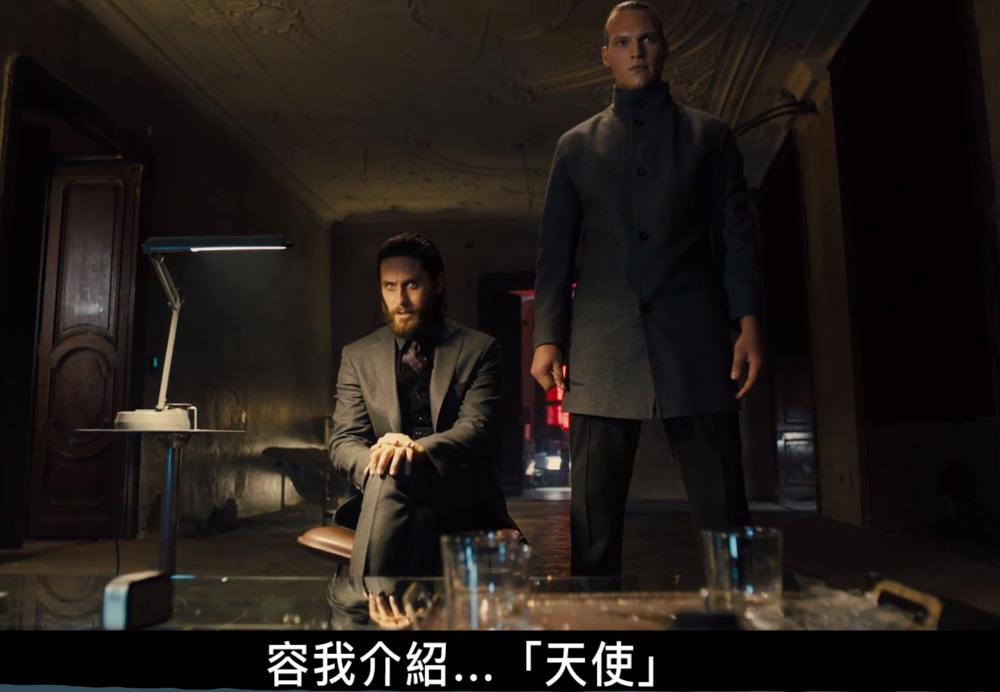
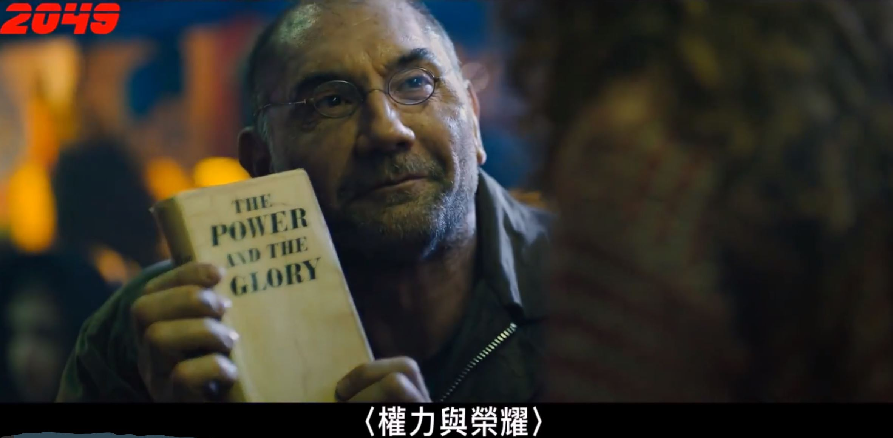
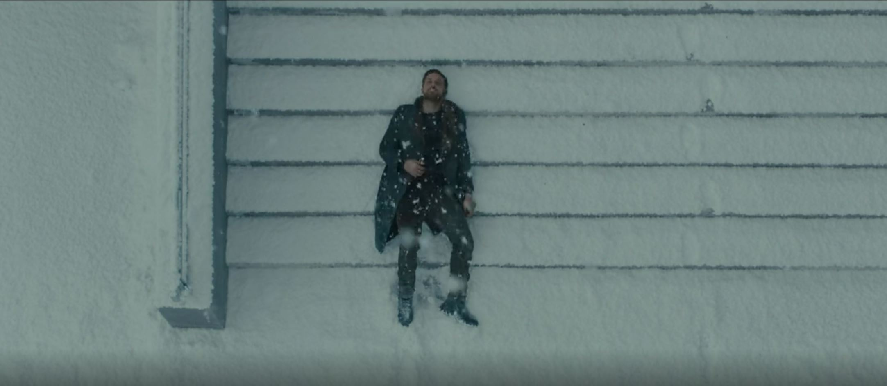

**《银翼杀手2049》(Blade Runner 2049)**是一部2017年上映的硬核科幻电影，改编自菲利普·K·迪克小说《仿生人会梦见电子羊吗？》，作为《银翼杀手》的续集，其实本片在上映前还放出了三部银翼杀手宇宙的短片，按照时间线分别是**2022黑暗浩劫**，**2036复制人时代**和**2048无处可逃**，这几部短片之后我也会补上，更好的理解完整的银翼杀手世界。

**More human than human.**

<!-- more -->

## 剧情介绍

银翼杀手的世界是有完整时间线的，虽然电影讲述的是2049发生的故事，但是电影中有一些配角人物，在前面的时间线都曾参与了大事件。因此为了完整介绍世界观，我会从**2022**年开始介绍。

### 2022 Blackout

这一代是`Nexus 8`型号复制人，他们的身体和精神都比人类强，拥有和人类一样的寿命，会随着年龄而衰老，他们和人类唯一的区别在于有眼球下方有编号。因此随着复制人占据了大量岗位，人类也兴起了*人类至上主义*，根据数据库中的身份信息大肆虐杀复制人。与此同时，在地外星系的战争中，5名`Nexus 8`型复制人发现敌方士兵也是同型号复制人，复制人仅仅只是人类制造的玩具士兵这一真相，因此叛逃，回到地球并谋划一场大停电行动。在这场`2022 Black Out`行动中，有一部分人类认为复制人**比人类更有人性**，因此决心帮助复制人开展革命。短片中，就是一名人类伪造核弹发射命令，并控制核弹在`LA`上空爆炸，制造`EMP`使得所有电子设备失灵。与此同时，复制人在所有数据中心放火，使得所有复制人的数据信息全部销毁。这一场浩劫使得泰瑞公司破产，并且让地球生态再一次恶化，随后到来的粮食危机，也间接导致华莱士公司的崛起。

### 2036 复制人时代

华莱士公司接受了破产的泰瑞公司遗产，经过10年的研究生产出新的复制人，被华莱士本人称为**天使**。短片讲述的是在2036年，原本政府已经不允许再次生产复制人，但是华莱士新创造的复制人完全服从人类的命令，即使命令是伤害自己。因此这种服从人类又强大的复制人，获得了政府的生产批准，因为人类的贪婪，复制人时代再次开启。

### 2048 无处可逃

8型复制人**萨珀**隐姓埋名生活多年，并结识集市中的小女孩。在一次交易（相当于农夫种田卖粮）后，看到黑帮分子劫持女孩母女，最终忍不住出手，并留下了地址信息，以至于被有心人举报。这也解释了影片正片的开端，主角**K**追捕的就是**萨博**。

值得一提的是，在这三个短片中，人类的面孔几乎都是邪恶、残忍、狡诈的，人类出现的角色是这样的：虐杀复制人的路人、在办公室负责追杀叛逃士兵的政府人员、为了利益开启禁令的议员、街头吸毒堕落的路人和残忍的帮派分子，就连萨博帮助的小女孩，也在萨博杀人后畏惧萨博，没有帮助萨博捡起遗落的文件。于此截然相反的形象，**More human than human**的复制人。这几个短片已经将银翼杀手的世界轮廓描绘出来，正呼应着影片正片中压抑、令人不舒服的氛围。

### 2049

接下来咱们进入正片。

主角**K**是`LAPD`的一名复制人警员，型号为`Nexus 9`，日常的工作是追杀之前型号的复制人。影片开头，他驾驶飞行警车来到加利福尼亚州，找到了上一部短片中为救小女孩而暴露的8型复制人**萨博**。K对于这样的事情早就已经司空见惯，并且不理解旧型复制人为何要反抗人类，不理解为何复制人要做无谓的抵抗。在打斗中，**萨博**对**K**说，`“因为你从未见过奇迹。”`随后K杀死了萨博并拿走了他的右眼球，在将要离开的时候，他发现萨博家门口的枯树下埋着一个盒子。

这个盒子被局长**乔茜**派人挖了出来，里面是一个女性的骸骨。在对骸骨进行研究后，**乔茜**等人发现其有过生育痕迹，并且这个女性的身份是复制人。这一个发现让**乔茜**非常震惊和担忧，因为其威胁到人类与现在数以百万计的人造人奴隶之间的秩序，复制人对人类的服从情况取决于他们的内置有效期，以及他们是被创造出来服务于主人这种思想，如果复制人也能孕育生命，那么人类和复制人之间的界限就不存在了。复制人可以不再作为人类的附庸存在战争就会到来。之后，**乔茜**让**K**保密，并去查找生下来的这个孩子，将一切痕迹清除干净，以便维持整个社会的秩序。

**K**随后前往华莱士地球总公司查询女性复制人的身份，引起了**露芙**的注意。**露芙**是华莱士制造的最得力复制人助手，帮助**华莱士**打理公司开展业务。由于**华莱士**能够制造绝对听从他命令的复制人，而如果他创造的复制人可以生育，那么一代接着一代，他将成为复制人的神，就像圣经中上帝创造出人类一样。因此，**华莱士**让**露芙**去找到那个生下来的孩子，这样就能发现复制人生育的秘密。

**K**再次查找线索，在**萨博**家门口的树上，他发现了一个出生日期，`6-10-21`。这个发现让他非常惶恐，因为**K**经常做梦，梦见他小时候有过一个刻着他生日的木马玩具，因为怕别的孩子抢夺，他将木马埋在了一个锅炉下面，而这个木马玩具的生日，正是`6-10-21`。在这个时候，K开始怀疑自己是否是一个复制人，为了调查真相，K首先查找了当日出生的孩子的DNA记录，结果发现一个男孩和一个女孩的DNA记录完全一致，而女孩因病去世，男孩失踪。随后，K前往当年收养这两个孩子的孤儿院，虽然当年的收养记录被人撕毁，但是他却在废弃锅炉中真的找到了记忆中的那个木马，底下刻着他的生日`6-10-21`。这一个发现让K不再保持冷静，因为在他的理解中，人类和复制人的区别在于是否有灵魂，他认为生下来的生物具有灵魂，而被制造出的复制人没有灵魂。为了验证自己记忆的真实性，他前往最好的记忆制造者**安娜**那里，确认自己的记忆是否是真实发生的事情，得到了**安娜**的肯定回答。**K**感到非常崩溃，**K**认为自己就是生下来的那个孩子，他从**安娜**住处回来以后，没有通过基线测试。K隐瞒调查的结果，瞒骗**乔茜**说已经解决了这个孩子，**乔茜**看在**K**完成任务的基础上，懂了恻隐之心，她隐瞒了这次基线测试的结果，给了**K**两天的时间恢复正常。

通过检测木马的来源，**K**前往洛杉矶寻找最后的真相，出发前他将电子女友**乔伊**的定位天线扯断。**露芙**由于失去了K的踪迹，前往`LAPD`质问**乔茜**，杀死**乔茜**并知晓**K**前往洛杉矶。K在洛杉矶找到了前银翼杀手——**德克**，**K**以为**德克**是他的父亲，并询问了关于那个孩子母亲的问题。由于**德克**并没有见过自己的孩子，也因为被追杀没有去找过自己的孩子，因此**K也想通了他的身世问题。

**露芙**定位了**K**的位置，便派人抓了**德克**，也踩碎了**乔伊**的电子数据。而**K**也被复制人革命组织救走，复制人革命组织的领袖告知**K**，当年的那个孩子是一名女孩，并希望**K**加入到反抗组织中，希望**K**杀了**德克**，为了反抗组织的延续。**K**再一次迷茫，因为他不是`the chosen one`，他还是复制人。随后，**K**看到了电子伴侣**乔伊**的广告，他意识到自己深爱的**乔伊**可能也只是设定的，**乔伊**对自己的情感可能是虚假的，**K**没有真实的记忆，也没有真实的情感。

K在想明白**“Dying for the right causes, it's the most human thing we can do.”**他决定救出德克，并将他带到安娜那里，帮助他们父女团圆。最后K精疲力竭的躺在满是雪的台阶上，感受着飘雪，望着天空，说不出的寂寥。

## 随感

我还记得第一遍看这部电影的时候，我在纠结**K**和虚拟女友**乔伊**之间的情感到底是不是真的，电影的前半段，直至乔伊牺牲展现出来的都是深爱着K，而K也只能在乔伊那里得到安慰。但实际呢，在看到她的广告——“everything you want to see, everything you want to hear ”，我深深怀疑这一点，或许K对乔伊是真的感情，但是乔伊所说的所做的，到底是AI匹配了K的喜好，还是真的那么爱他呢？

这里不得不提一句，我认为在科技发达的未来，如果个人的数据都由科技巨头掌握，那么其开发出来的产品真的可以完美匹配一个人的喜好。例如现在的新闻和知乎里的话题推送，因为大多数人愿意看到他们所喜欢的。如果乔伊是一款虚拟女友产品，如何让购买这款产品的人再一次消费？那么一定是成为K心中的唯一，这也是后来K愿意花费薪水购买便携的发散器。

但是第二遍看这部电影的时候，我不在纠结这个问题，因为我感受到了K的悲哀。用一句《龙族》里面的描述，K就是一只没有人在意的败犬，他从头到尾都是`nobody`，他自认为是一个没有父母没有朋友的复制人，没有灵魂，为了人类付出却被所有人类歧视。他家的门上写着`fuck off skinner`，在警局被人类警员辱骂，他唯一拥有的就是自己购买的虚拟女友`Joi`。他内心渴望爱，渴望灵魂，渴望自己有存在的意义。这时候他发现自己拥有的记忆可能暗示自己是特别的，因此他不断去寻找，当他发现自己可能真的是`the chosen one`，他有父母，有灵魂，有存在的意义，乔伊喊他叫**乔**，他也觉得自己应该有一个名字。

然而，一切发生转变，他并不是那个婴儿，他又变回了一个被制造出来的复制人。甚至他所拥有的美好的记忆。都是量产的，是很多复制人都有的。他所拥有的情感，在他看见乔伊的广告的时候，也是虚假的。试想一下，当一个人没有父母，没有朋友，没有姓名，美好的记忆是伪造的，曾经的情感是虚假的，他连应该去恨谁都不知道，这样的虚无、寂灭、孤独真的震撼，久久不能忘记。

借用一个知乎答主的回答：

> 作者：Hymo
> 链接：https://www.zhihu.com/question/53507083/answer/251515014
> 来源：知乎
>
> 而本片男主亦是如此，为了复制人的未来，他也做了这个最人性的选择。他所追求的一切，都是为了那句“我知道你和别人是不一样的”，那个灵魂，那一点独特性，让他自己可以说服自己，与其他复制人的区别。
>
> 人类说起AI，就觉得它是假的，都是既定的程序，没有自我意识。说起复制人，就说它们是假货，令人作呕，没有灵魂。在这个世界里，只有说出来的歧视，和没说出来的。就连似乎最相信他的上司都对他说，没有灵魂你也活的很好。
>
> 在片中，唯一一个没有歧视复制人，反而同情他们的，是那个记忆制造师，可是，她也两个复制人生下的孩子。追根溯源，复制人就一定没有灵魂了吗，AI就一定没有自我意识了吗，要知道，曾经瓦尔基里也反抗过奥丁。
>
> 男主不知道该怎么办了，他无所适从，这时女警察长官对男主说，有时我会忘记你是个复制人。她一说，男主就抓住了那个记忆中的小木马。
>
> 可是小木马是不属于他的，英雄，荣誉，珍贵，这些都是不属于他的，没有人在乎他，没有人关心他。公司一开始就知道他不是那个孩子，警局也没有这样想过，组织让他牺牲，没有人把他当作一个特别的存在，他只是一个复制人，无关紧要的复制人。就连迪克问他是谁 他都说不出口，让他如何回答，毕竟自己谁也不是。
>
> 唯一说他特别的那个人，唯一关心他，爱他的那个人，只是一个产品，一个投影，甚至接触不到。尽管如此，他还是觉得这个女孩很特别，他们是彼此与客观世界的唯一联系。可是连这一点点虚幻的假象，也被击碎了。只是一个产品，连告别都那样匆匆。
>
> 这类电影通常男主都会得到些什么的。不管是结局的改变，赞美，他人的眼泪，追思，有的有崇拜者，有的找到真爱。他们往往一开始以为自己是普通人，然后有人告诉他，你是个英雄。可是他不一样，他反过来，最后什么都没有。
>
> 他努力了，却也无力。一次次打开自己的衣服，低头看见的只是鲜血淋漓的伤口。他躺在一片白雪里，还是没能明白自己存在的意义，没能抓住自己与这个世界的一点联系。
>
> 要恨谁，自己生来如此。那个女孩如此善良温柔，自己都不敢去羡慕她。没有联系，他只是一个细胞，被关联在主干上。
>
> 无所谓了吧，他的叹息好像在说。没有回忆，没有信仰，没有意义。
>
> 最后他什么都没有。连一点希翼都不给，只有无尽的痛苦。因为——
>
> “所有美好的回忆都是她的。”

