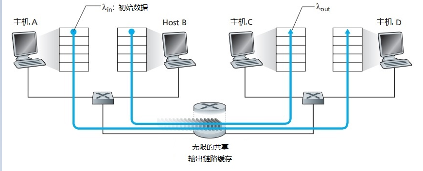
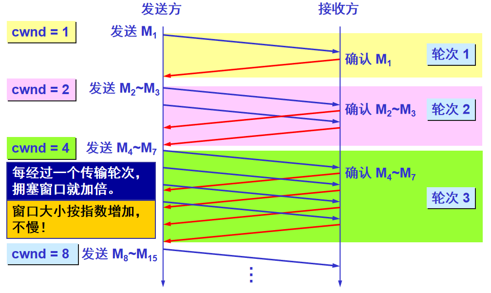
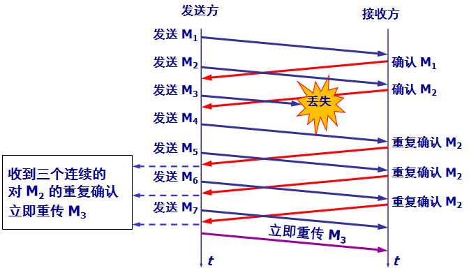

# Chapter 3. 传输层

## 3.1 概述

传输层的第一个关键功能是**将网络层的在两个端系统之间的交付服务扩展到运行在两个不同端系统上的应用层进程之间的交付服务**。传输层协议为不同主机的应用进程提供了**逻辑通信**，所谓的逻辑通信，就是让应用进程使用传输层的功能彼此发送报文，而无需考虑报文传输的具体细节。

传输层协议是在端系统中实现的，而不是在路由器中实现的。也就是说，在路由器中只作用与网络层字段，不会提取传输层字段。

因特网为应用层提供了两种传输层协议：
- UDP(用户数据报协议)：不可靠、无连接
- TCP(传输控制协议)：可靠、面向连接

同时，将主机间交付扩展到进程间交付被称为传输层的**多路复用**和**多路分解**。

## 3.2 多路复用和多路分解

- 多路分解：即将传输层报文段中的数据交付到正确的套接字的工作。
- 多路复用：即将不同套接字的数据块封装并传递到网络层的工作。

在传输层中，有源端口号和目的端口号两个字段，这两个字段就是用于识别哪个套接字。

### 3.2.1 无连接的多路复用和多路分解

在客户端，传输层协议自动并透明的分配端口号，而在服务器端则分配一个特定的端口号。两种`python`方式：
```python
clientSocket = socket(AF_INET, SOCK_DGRAM);

clientSocket.bind(('', 19157));
```

一个UDP套接字是由一个二元组全面标识，如果两个UDP报文具有不同的源IP和源端口，只要它们拥有相同的目的IP和目的端口，会被定位到相同的套接字：
```
<destination IP, destination port>
```

### 3.2.2 面向连接的多路复用和多路分解

一个TCP套接字是由一个四元组全面标识，如果两个具有不同源IP或源端口的TCP报文将被定向到两个不同的套接字上，除非这两个TCP报文是初始创建连接的报文。
```
<source IP, source port, destination IP, destination port>
```

大概的过程如下：
1. TCP客户端创建套接字，并向目的主机、目的端口发送TCP连接请求。
2. 服务器端在对应端口号等待连接，接收到请求报文后，服务器进程会创建一个新的套接字，然后将新的套接字和四元组绑定。TCP连接完成。
3. 服务器将会为每一个连接创建新的进程，每一个进程也将会与新的套接字（四元组）绑定。（当然现在高性能服务器会创建具有新套接字的新线程而非进程）。


## 3.3 UDP

UDP除了最基本的分解/复用和少量的差错检测外，没有增加其他功能。网络管理SNMP协议和DNS协议通常使用UDP协议。

### 3.3.1 UDP报文结构

UDP报文段结构如下所示：
```
0          15                31
source port | destination port
length      | check sum
Application data
```
- length：指示UDP报文段中的字节数（首部+数据），以字节为单位。

### 3.3.2 UDP校验和

UDP校验和用于确定当前UDP报文段，从源到目的移动时，其中的比特是否发生变化。

- 发送方：
    
    发送方的UDP对报文段中所有16比特字的和进行反码运算，求和时遇到的溢出会被回卷。而回卷运算就是进行16比特的加法运算时，如果进位到17位，那么要将第17位和后面16位进行加法运算。

    ```
    0110 0110 0110 0000
    0101 0101 0101 0101
    1000 1111 0000 1100
    ```
    进行加法运算，先进性前两个：
    ```
    0110 0110 0110 0000
    0101 0101 0101 0101
    -------------------
    1011 1011 1011 0101
    ```
    再进行加法，进位并回卷：
    ```
      1011 1011 1011 0101
      1000 1111 0000 1100
      -------------------
     10100 1010 1100 0001

      0100 1010 1100 0001
                        1
      -------------------
      0100 1010 1100 0010
    ```
    最后取反码：
    ```
    1011 0101 0011 1101
    ```

- 接收方

    接收方也做这样的操作，并进行差错检验。

其实有很多链路层协议时提供差错检验的，但是UDP首先提供，是因为：
1. 不能保证左右链路都提供差错检验；
2. 并且有可能报文段存储再某台路由器的内存中，引入了比特差错。

但是UDP虽然提供差错校验，但是没有纠错能力。

## 3.4 可靠数据传输原理

可靠数据传输协议(reliable data transfer protocol)是抽象的实现可靠数据传输的协议，接下来将一步一步设计这样一个传输协议：

1. rdt1.0

    <!--  -->

    我们首先考虑最简单的情况，也就是底层信道是完全可信，收发双方的速率完全相等。
    在这种情况下，rdt1.0收发双方都只需要一种状态，即发送/接受状态。
2. rdt2.0

    <!--  -->
    进一步，考虑传输过程中，数据包有比特位发生差错，但是数据包的顺序仍然一致。

    在这种情况是，基于这样的重传机制的协议称为**自动重传请求协议**，Automatic Repeat reQuest(ARQ)。

    这时需要考虑另一种问题，就是如果ACK或NAK分组报文出错了呢？

3. rdt3.0

    <!--  -->
    考虑传输过程中，可能发生比特错位和数据包丢失。

在rdt3.0中，已经能够实现可靠传输，利用自动重传、停止等待、序号和倒计数定时器。但是在实际应用中，停止等待产生的时间延时会很大，如果等待一个ACK到达才能够发送第二个数据包，整个链路的利用率会非常低、吞吐量会非常小。因此希望再次改进，把流水线的思想加入进去。

## 3.5 TCP

TCP被称为**面向连接**的，因为在一个进程开始与另一个进程发送数据前，两个进程必须先“握手”，并且连接双方都将初始化与TCP连接相关的TCP状态变量。

此外TCP提供的是全双工服务，如果A进程和B进程存在一条TCP连接，那么数据可以从进程A-进程B，也可以从进程B-进程A。

- 最大报文段长度(Maximum Segment Size)：一般根据最大传输单元来设置，最大传输单元是链路层的最大帧长度，保证MSS在加上TCP/IP首部长度(40字节)以后，不超过MTU值。由于以太网和PPP链路层协议都有1500字节的MTU值，所以一般MSS设置为1460.

### 3.5.1 TCP报文段


TCP的首部一般是20字节，比UDP多12字节。首部组成如下：

- **源端口号(16bit)**:

    和UDP一样。
- **目的端口号(16bit)**:

    和UDP一样，详情见3.4节。
- **序号(32bit)**:

    TCP把数据堪称无结构的、有序的字节流，因此序号是建立在传送的字节流基础上。TCP对数据流的每一个字节进行编号，首字节编号是0。
- **确认号(32bit)**:

    用于确认已经收到的字节流编号，填入的是主机A期望从主机B受到的下一个字节的序号。
- **首部长度(4bit)**：

    该字段指示了以32bit的字为单位的TCP首部长度，因为TCP包含选项字段，因此长度可变。而TCP首部长度最小为20字节。而4bit最大表示的数字是15，因此TCP首部长度最大范围应该是60字节。

    并且，这一个字段也称为“数据偏移”，因为指示了TCP的数据部分从第几个字节开始的（等同于首部长度）。
- **标志字段(6bit)**：
  - ACK：指示确认字段中的值是有效的
  - RST：
  - SYN：用于TCP建立连接
  - FIN：用于TCP拆除连接
  - PSH:指示接收方应该立即将数据交给上层
  - URG:只是报文段中存在被发送方标记为紧急的数据
- **接收窗口**:

    用于流量控制，指示接收方愿意接受的字节数量。
- **因特网校验和**：
- **紧急数据指针**：

### 3.5.2 TCP实现可靠传输

由于IP服务是不可靠的，因此传输过程中不保证**数据包按序到达**、**数据包不丢失**、**数据包数据完整**这几点。因此TCP需要保证数据流无损坏、无间隙、非冗余、按序到达。

TCP实现可靠传输和3.4节中描述的差不多，实现需求和方法总结如下：

1. 需要接收方确认和差错检测：**停止等待协议**+**自动重传协议(ARQ)**+**检验和**
2. 需要保证不乱序到达：字节流**序号**
3. 需要保证不丢包：**序号**+**ARQ**+**倒计时定时器**
4. 需要差错恢复：**滑动窗口**（回退N步+选择重传）
5. 需要更快传输：窗口+流水线
6. 需要流量控制：接收窗口（区别于拥塞控制），流量控制的目的是保证全双工通信速率相近

### 3.5.3 TCP连接三次握手


TCP客户端和服务器的连接步骤如下：
1. 第一次握手

    客户端TCP首先向服务器端TCP发送特殊的TCP报文段。该报文段不包含应用层数据，`SYN`标志位会被置为1.因此该报文也被称为SYN报文。此外，客户端会随机选择一个初始序号`client_isn`，放入初始序号中。

    客户端TCP进入`SYN_SENT`状态。等待服务器端确认。

2. 第二次握手

    服务器端接收到SYN报文段，提取SYN字段以后，为该TCP连接分配缓存和变量，并向客户端TCP发送允许连接的报文，称为SYNACK报文段。该报文段中`SYN`被置为1，确认号字段是`client_isn+1`，同时服务器端也生成一个随机初始序号`setver_isn`放入序号字段。

    服务器端TCP进入`SYN_RCVD`状态，等待确认。

3. 第三次握手

    客户端TCP收到SYNACK报文段后，需要为该连接分配缓存和变量。同时，客户端向服务器发送连接建立确认报文，此时`SYN`是0，但是确认字段则是`server_isn+1`，报文段负载中含有数据。

    客户端TCP进入`ESTABLISHED`状态，服务端TCP接收到第三个报文也进入`ESTABLISHED`。于此，客户和服务器的连接已经被建立，之后所有报文的`SYN`都是0.


### 3.5.4 TCP断开连接四次挥手


TCP是全双工通信，因此每一个方向都需要断开连接，一共需要四个报文，因此也称为四次挥手，步骤如下：

1. 第一次挥手

    客户TCP首先发送一个特殊TCP报文段，其中`FIN`标志位置为1。

    客户TCP进入`FIN_WAIT_1`状态。
2. 第二次挥手

    服务端TCP收到`FIN`报文段后，发送FINACK，确认号为FIN报文段序号+1.

    服务端TCP进入`CLOSE_WAIT`状态。

3. 第三次挥手

    服务端发送FIN报文段，用于关闭服务端-客户端方向的连接。

    服务端TCP进入`LAST_ACK`状态。

4. 第四次挥手

    客户端收到FIN报文段后，客户端进入定时等待状态，也就是`TIME_WAIT`状态，接着发送ACK报文段。

    服务端收到ACK报文段后，进入`CLOSED`状态，TCP连接关闭。

> **问：为什么建立连接需要三个报文，而断开连接需要四个？**
> 这是因为服务端在LISTEN状态下，收到建立连接请求的SYN报文后，把ACK和SYN放在一个报文里发送给客户端。
> 
> 而关闭连接时，当收到对方的FIN报文时，仅仅表示对方不再发送数据了但是还能接收数据，己方也未必全部数据都发送给对方了，所以己方可以立即close，也可以发送一些数据给对方后，再发送FIN报文给对方来表示同意现在关闭连接，因此，己方ACK和FIN一般都会分开发送。

## 3.6 拥塞控制

### 3.6.1 两个发送方和一个拥有无穷大缓存的路由器



主机A-主机B，主机C-主机D，中间有一个无穷大缓存的路由器，共享链路吞吐量为R。
如果A和B的发送速率一致，可以从0上升到R/2，并且接收方速率能跟上。但是由于发送速率接近R/2时，平均时延也会越来越大，当超过R/2时，路由器中的平均排队分组会趋于无穷，平均时延也会趋于无穷。

> **问：为什么发送速率接近R/2会使得平均时延趋于无穷？为什么不是来一个过一个没有时延？**
>  
> 简单来说就是因为数据包抵达是随机的+缓存无穷。把路由器的缓存看成一个队列，如果包抵达是周期性的，稳定来一秒钟来一个分组发出一个分组，如果队列长度是N，那么+1和-1是同时发生的，队列长度会稳定保持在N。
> 
> 但是如果所有分组的抵达是随机过程，并且符合泊松分布，同时路由器发出分组的时间是固定的（也就是处理一个等长数据包的时间是固定的），当路由器缓存无限大，如果出现一秒钟来多个而只出一个，就会在缓存中排队，那么可以比较直观的想出，排队的包趋于无穷，因此平均时延也就趋于无穷。
> 
> 参考（包含公式）：https://www.zhihu.com/question/317549997

### 3.6.2 两个发送方和一个具有有限缓存的路由器


 

当分组到达一个已满的缓存时会被丢弃，这时有两个速率，一个是初始数据发送速率，一个是重传数据发送速率。

这时会导致，发送方由于重传，使得发送速率在R/2的情况下，接受速率只能达到R/3甚至R/4.

### 3.6.3 四个发送方和具有有限缓存的多台路由器及多跳路径


每一个主机都有相同的发送速率，A-C和B-D共享R2路由器。我们可以看出，不论A主机的发送速率是多大，R1-R2的速率最大只能是R，A-C和B-D的流量需要在R2上竞争，如果主机的发送速率逐渐提升，那么极端情况下，R2会被B-D的流量占满，导致A-C的流量无法到达C点。

而重传机制的存在会使得A不停重新传输，但是经过R1到R2，会始终在R2处丢弃，这里就会导致每一个上游路由器的传输都无用。造成资源浪费。

## 3.7 TCP拥塞控制

TCP使用端到端拥塞控制，采用的方法是让每一个发送方根据所感知到的网络拥塞程度来限制其能向连接发送流量的速率。需要考虑三个问题：
1. TCP发送方是如何限制向连接发送流量的速率呢？
2. TCP发送法如何感知从源到目的之间存在拥塞？
3. 当TCP感知到端到端的拥塞，如何改变呢？

为了解决问题1，TCP维护了一个拥塞窗口(congestion window)，是对TCP发送方能够向网络中发送速率进行的限制。实际上，拥塞窗口和接收窗口，都是对于速率的控制，这两个实际应用中，取更小的最为限制。

为了解决问题2，TCP是根据丢包事件感知，对于**丢包事件的定义是：要么出现超时，要么收到来自接收方的3个冗余ACK**。

对于问题3，需要明确几个原则：
- 丢包意味着拥塞，因此应该降低
- 发送方收到确认意味着网络良好，能够增加发送
- 需要明确带宽，没发生拥塞就一直增大，直到发生拥塞，此时是最大传输速率。

### 3.7.1 慢开始

当TCP连接开始时，cwnd值通常设置为一个MSS。在慢开始的状态下，cwnd的值以1个MSS开始，并且每当传输的报文段首次被确认就增加一个MSS。如图，这里每收到一个确认报文段，就会增加一个MSS。发送速率翻倍增加。因此虽然TCP起始发送速率慢，但是启动阶段会以指数增长。**图中画的可能有点不够严谨，在cwnd为2时，M2到达会发送M4和M5，M3到达会发送M6和M7。**





直到发生丢包，TCP会将慢启动阈值(`ssthresh`)设置为cwnd值的一半。然后将cwnd值重置为1，重新开始慢启动，直到到达慢启动阈值，进入到拥塞避免状态。

#### 3.7.1.1 慢启动阈值

- ssthresh > cwnd 慢开始
- ssthresh <= cwnd 拥塞避免

### 3.7.2 拥塞避免

进入到拥塞避免状态后，每次发送法收到确认，会将cwnd值增加一个MSS，是一个线性增长。如果遇到丢包，再次重复慢开始状态，并且ssthresh会被更新为cwnd值的一半。

### 3.7.3 快重传

当发送方接收到3个连续的ACK触发，表示快速重传该ACK指向的报文。


### 3.7.4 快恢复

丢包事件也可以被3个连续的ACK触发，但是这种丢包行为不能代表网络及其拥塞，而是还能够传输报文段。因此对于此情况TCP的反应不会那么剧烈，首先将cwnd减半，将ssthresh的值记录为cwnd的一半，进入快速恢复的阶段。

和慢开始不同的是，快重传的base是cwnd/2，并且立马进入拥塞避免状态。




### 3.7.4 总结
TCP拥塞控制概括来说就是**加法增大，乘法减小**，最后用一幅图可以很明显的展示TCP拥塞控制的各个过程，如下：


## 参考

- 《计算机网络 自顶向下方法》 [美] James F.Kurose,Keith W.Ross 著，陈鸣 译，机械工业出版社
- [乌漆WhiteMoon的博客](https://www.cnblogs.com/linfangnan/)，大佬整理的非常漂亮，感谢借图。