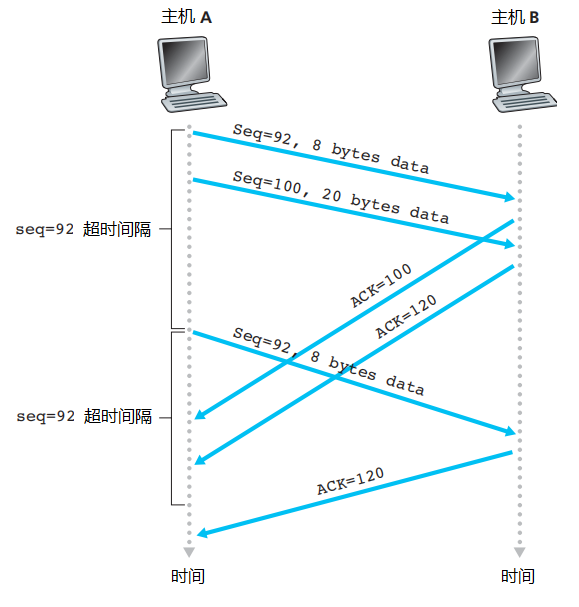
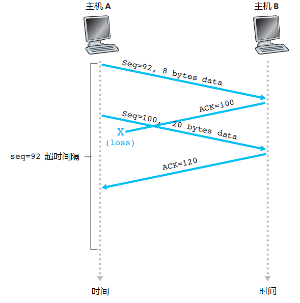

## 3.4 可靠数据传输原理

可靠数据传输协议(reliable data transfer protocol)是抽象的实现可靠数据传输的协议，接下来将一步一步设计这样一个传输协议：

1. rdt1.0

    <!--  -->

    我们首先考虑最简单的情况，也就是底层信道是完全可信，收发双方的速率完全相等。
    在这种情况下，rdt1.0收发双方都只需要一种状态，即发送/接受状态。
2. rdt2.0

    <!--  -->
    进一步，考虑传输过程中，数据包有比特位发生差错，但是数据包的顺序仍然一致。

    在这种情况是，基于这样的重传机制的协议称为**自动重传请求协议**，Automatic Repeat reQuest(ARQ)。

    这时需要考虑另一种问题，就是如果ACK或NAK分组报文出错了呢？

3. rdt3.0

    <!--  -->
    考虑传输过程中，可能发生比特错位和数据包丢失。

在rdt3.0中，已经能够实现可靠传输，利用自动重传、停止等待、序号和倒计数定时器。但是在实际应用中，停止等待产生的时间延时会很大，如果等待一个ACK到达才能够发送第二个数据包，整个链路的利用率会非常低、吞吐量会非常小。因此希望再次改进，把流水线的思想加入进去。