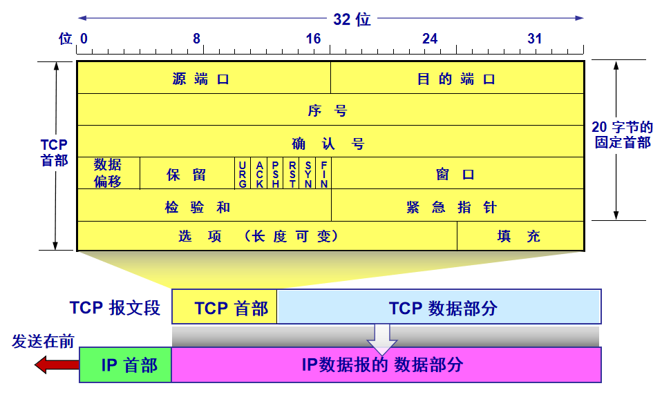
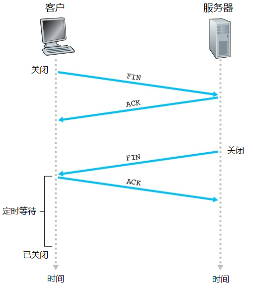

## 3.5 TCP

TCP被称为**面向连接**的，因为在一个进程开始与另一个进程发送数据前，两个进程必须先“握手”，并且连接双方都将初始化与TCP连接相关的TCP状态变量。

此外TCP提供的是全双工服务，如果A进程和B进程存在一条TCP连接，那么数据可以从进程A-进程B，也可以从进程B-进程A。

- 最大报文段长度(Maximum Segment Size)：一般根据最大传输单元来设置，最大传输单元是链路层的最大帧长度，保证MSS在加上TCP/IP首部长度(40字节)以后，不超过MTU值。由于以太网和PPP链路层协议都有1500字节的MTU值，所以一般MSS设置为1460.

### 3.5.1 TCP报文段

TCP的首部一般是20字节，比UDP多12字节。首部组成如下：

- **源端口号(16bit)**:

    和UDP一样。
- **目的端口号(16bit)**:

    和UDP一样，详情见3.4节。
- **序号(32bit)**:

    TCP把数据堪称无结构的、有序的字节流，因此序号是建立在传送的字节流基础上。TCP对数据流的每一个字节进行编号，首字节编号是0。
- **确认号(32bit)**:

    用于确认已经收到的字节流编号，填入的是主机A期望从主机B受到的下一个字节的序号。
- **首部长度(4bit)**：

    该字段指示了以32bit的字为单位的TCP首部长度，因为TCP包含选项字段，因此长度可变。而TCP首部长度最小为20字节。而4bit最大表示的数字是15，因此TCP首部长度最大范围应该是60字节。

    并且，这一个字段也称为“数据偏移”，因为指示了TCP的数据部分从第几个字节开始的（等同于首部长度）。
- **标志字段(6bit)**：
  - ACK：指示确认字段中的值是有效的
  - RST：
  - SYN：用于TCP建立连接
  - FIN：用于TCP拆除连接
  - PSH:指示接收方应该立即将数据交给上层
  - URG:只是报文段中存在被发送方标记为紧急的数据
- **接收窗口**:

    用于流量控制，指示接收方愿意接受的字节数量。
- **因特网校验和**：
- **紧急数据指针**：

### 3.5.2 TCP实现可靠传输

由于IP服务是不可靠的，因此传输过程中不保证**数据包按序到达**、**数据包不丢失**、**数据包数据完整**这几点。因此TCP需要保证数据流无损坏、无间隙、非冗余、按序到达。

TCP实现可靠传输和3.4节中描述的差不多，实现需求和方法总结如下：

1. 需要接收方确认和差错检测：**停止等待协议**+**自动重传协议(ARQ)**+**检验和**
2. 需要保证不乱序到达：字节流**序号**
3. 需要保证不丢包：**序号**+**ARQ**+**倒计时定时器**
4. 需要差错恢复：**滑动窗口**（回退N步+选择重传）
5. 需要更快传输：窗口+流水线
6. 需要流量控制：接收窗口（区别于拥塞控制），流量控制的目的是保证全双工通信速率相近

### 3.5.3 TCP连接三次握手

TCP客户端和服务器的连接步骤如下：
1. 第一次握手

    客户端TCP首先向服务器端TCP发送特殊的TCP报文段。该报文段不包含应用层数据，`SYN`标志位会被置为1.因此该报文也被称为SYN报文。此外，客户端会随机选择一个初始序号`client_isn`，放入初始序号中。

    客户端TCP进入`SYN_SENT`状态。等待服务器端确认。

2. 第二次握手

    服务器端接收到SYN报文段，提取SYN字段以后，为该TCP连接分配缓存和变量，并向客户端TCP发送允许连接的报文，称为SYNACK报文段。该报文段中`SYN`被置为1，确认号字段是`client_isn+1`，同时服务器端也生成一个随机初始序号`setver_isn`放入序号字段。

    服务器端TCP进入`SYN_RCVD`状态，等待确认。

3. 第三次握手

    客户端TCP收到SYNACK报文段后，需要为该连接分配缓存和变量。同时，客户端向服务器发送连接建立确认报文，此时`SYN`是0，但是确认字段则是`server_isn+1`，报文段负载中含有数据。

    客户端TCP进入`ESTABLISHED`状态，服务端TCP接收到第三个报文也进入`ESTABLISHED`。于此，客户和服务器的连接已经被建立，之后所有报文的`SYN`都是0.

### 3.5.4 TCP断开连接四次挥手

TCP是全双工通信，因此每一个方向都需要断开连接，一共需要四个报文，因此也称为四次挥手，步骤如下：

1. 第一次挥手

    客户TCP首先发送一个特殊TCP报文段，其中`FIN`标志位置为1。

    客户TCP进入`FIN_WAIT_1`状态。
2. 第二次挥手

    服务端TCP收到`FIN`报文段后，发送FINACK，确认号为FIN报文段序号+1.

    服务端TCP进入`CLOSE_WAIT`状态。

3. 第三次挥手

    服务端发送FIN报文段，用于关闭服务端-客户端方向的连接。

    服务端TCP进入`LAST_ACK`状态。

4. 第四次挥手

    客户端收到FIN报文段后，客户端进入定时等待状态，也就是`TIME_WAIT`状态，接着发送ACK报文段。

    服务端收到ACK报文段后，进入`CLOSED`状态，TCP连接关闭。

> **问：为什么建立连接需要三个报文，而断开连接需要四个？**
> 这是因为服务端在LISTEN状态下，收到建立连接请求的SYN报文后，把ACK和SYN放在一个报文里发送给客户端。
> 
> 而关闭连接时，当收到对方的FIN报文时，仅仅表示对方不再发送数据了但是还能接收数据，己方也未必全部数据都发送给对方了，所以己方可以立即close，也可以发送一些数据给对方后，再发送FIN报文给对方来表示同意现在关闭连接，因此，己方ACK和FIN一般都会分开发送。