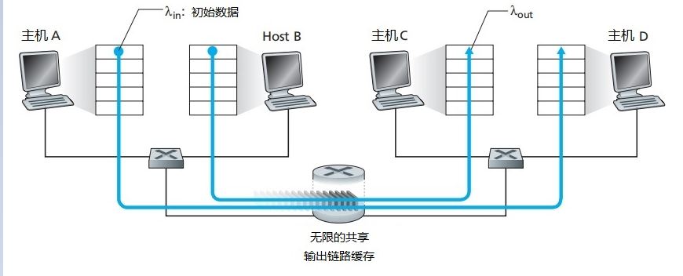
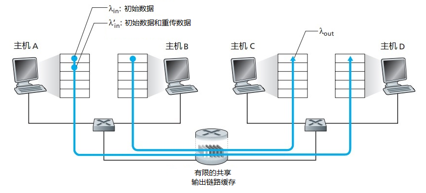
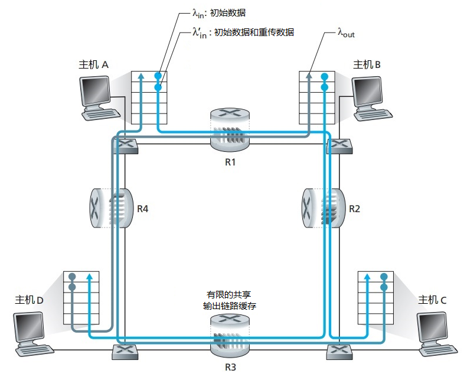

## 3.6 拥塞控制

### 3.6.1 两个发送方和一个拥有无穷大缓存的路由器

主机A-主机B，主机C-主机D，中间有一个无穷大缓存的路由器，共享链路吞吐量为R。
如果A和B的发送速率一致，可以从0上升到R/2，并且接收方速率能跟上。但是由于发送速率接近R/2时，平均时延也会越来越大，当超过R/2时，路由器中的平均排队分组会趋于无穷，平均时延也会趋于无穷。

> **问：为什么发送速率接近R/2会使得平均时延趋于无穷？为什么不是来一个过一个没有时延？**
>  
> 简单来说就是因为数据包抵达是随机的+缓存无穷。把路由器的缓存看成一个队列，如果包抵达是周期性的，稳定来一秒钟来一个分组发出一个分组，如果队列长度是N，那么+1和-1是同时发生的，队列长度会稳定保持在N。
> 
> 但是如果所有分组的抵达是随机过程，并且符合泊松分布，同时路由器发出分组的时间是固定的（也就是处理一个等长数据包的时间是固定的），当路由器缓存无限大，如果出现一秒钟来多个而只出一个，就会在缓存中排队，那么可以比较直观的想出，排队的包趋于无穷，因此平均时延也就趋于无穷。
> 
> 参考（包含公式）：https://www.zhihu.com/question/317549997

### 3.6.2 两个发送方和一个具有有限缓存的路由器

 

当分组到达一个已满的缓存时会被丢弃，这时有两个速率，一个是初始数据发送速率，一个是重传数据发送速率。

这时会导致，发送方由于重传，使得发送速率在R/2的情况下，接受速率只能达到R/3甚至R/4.

### 3.6.3 四个发送方和具有有限缓存的多台路由器及多跳路径

每一个主机都有相同的发送速率，A-C和B-D共享R2路由器。我们可以看出，不论A主机的发送速率是多大，R1-R2的速率最大只能是R，A-C和B-D的流量需要在R2上竞争，如果主机的发送速率逐渐提升，那么极端情况下，R2会被B-D的流量占满，导致A-C的流量无法到达C点。

而重传机制的存在会使得A不停重新传输，但是经过R1到R2，会始终在R2处丢弃，这里就会导致每一个上游路由器的传输都无用。造成资源浪费。