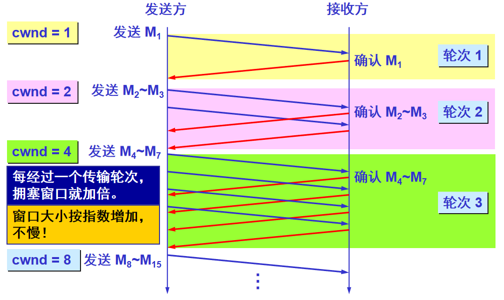
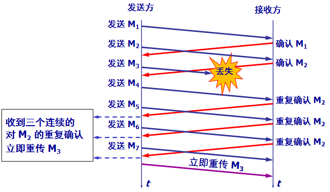
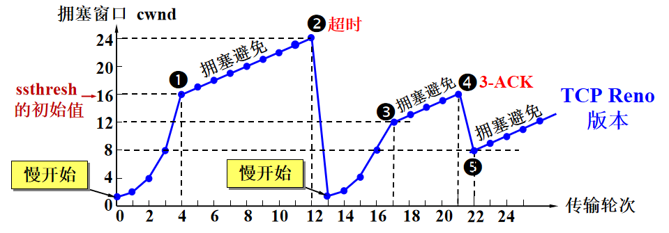

## 3.7 TCP拥塞控制

TCP使用端到端拥塞控制，采用的方法是让每一个发送方根据所感知到的网络拥塞程度来限制其能向连接发送流量的速率。需要考虑三个问题：
1. TCP发送方是如何限制向连接发送流量的速率呢？
2. TCP发送方如何感知从源到目的之间存在拥塞？
3. 当TCP感知到端到端的拥塞，如何改变呢？

为了解决问题1，TCP维护了一个拥塞窗口(congestion window)，是对TCP发送方能够向网络中发送速率进行的限制。实际上，拥塞窗口和接收窗口，都是对于速率的控制，这两个实际应用中，取更小的最为限制。

为了解决问题2，TCP是根据丢包事件感知，对于**丢包事件的定义是：要么出现超时，要么收到来自接收方的3个冗余ACK**。

对于问题3，需要明确几个原则：
- 丢包意味着拥塞，因此应该降低
- 发送方收到确认意味着网络良好，能够增加发送
- 需要明确带宽，没发生拥塞就一直增大，直到发生拥塞，此时是最大传输速率。

### 3.7.1 慢开始

当TCP连接开始时，cwnd值通常设置为一个MSS。在慢开始的状态下，cwnd的值以1个MSS开始，并且每当传输的报文段首次被确认就增加一个MSS。如图，这里每收到一个确认报文段，就会增加一个MSS。发送速率翻倍增加。因此虽然TCP起始发送速率慢，但是启动阶段会以指数增长。**图中画的可能有点不够严谨，在cwnd为2时，M2到达会发送M4和M5，M3到达会发送M6和M7。**

直到发生丢包，TCP会将慢启动阈值(`ssthresh`)设置为cwnd值的一半。然后将cwnd值重置为1，重新开始慢启动，直到到达慢启动阈值，进入到拥塞避免状态。

#### 3.7.1.1 慢启动阈值

- ssthresh > cwnd 慢开始
- ssthresh <= cwnd 拥塞避免

### 3.7.2 拥塞避免

进入到拥塞避免状态后，每次发送法收到确认，会将cwnd值增加一个MSS，是一个线性增长。如果遇到丢包，再次重复慢开始状态，并且ssthresh会被更新为cwnd值的一半。

### 3.7.3 快重传

当发送方接收到3个连续的ACK触发，表示快速重传该ACK指向的报文。

### 3.7.4 快恢复

丢包事件也可以被3个连续的ACK触发，但是这种丢包行为不能代表网络及其拥塞，而是还能够传输报文段。因此对于此情况TCP的反应不会那么剧烈，首先将cwnd减半，将ssthresh的值记录为cwnd的一半，进入快速恢复的阶段。

和慢开始不同的是，快重传的base是cwnd/2，并且立马进入拥塞避免状态。

### 3.7.4 总结
TCP拥塞控制概括来说就是**加法增大，乘法减小**，最后用一幅图可以很明显的展示TCP拥塞控制的各个过程，如下：

