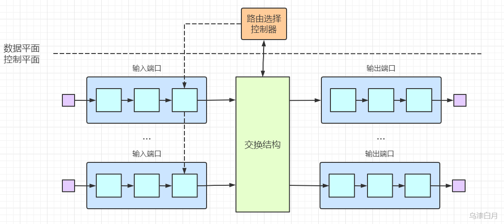

# Chapter 4. 网络层：数据面

## 4.1 概述
和传输层、应用层不同的是，网络中的每一个主机和路由器都有网络层的一部分。因此网络层协议是协议栈中最具有挑战性的。

根据SDN的定义，数控分离，这里的**数据平面**指的是每台路由器的功能，其决定到达路由器的数据报如何转发到下一跳，包含了传统的IP转发和通用的转发。而**控制平面**则是在网络范围的逻辑，控制数据报从源主机到目的主机，端到端的路由方式。

因此，通过上述总结，网络层有两种非常重要的功能：**转发**和**路由选择**。转发是指将分组从一个输入链路接口转移到适当的输出链路接口的路由器本地动作。而路由选择是指确定分组从源地址到目的地址所采取的端到端路径的网络范围处理过程。

## 4.2 路由器工作原理

下图显示了一个通用路由器体系结构的总体视图，标识了一台路由器的4个组组件：
- 输入端口
- 输出端口
- 交换结构
- 路由选择处理器

