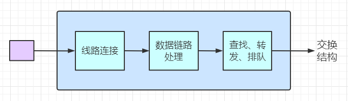
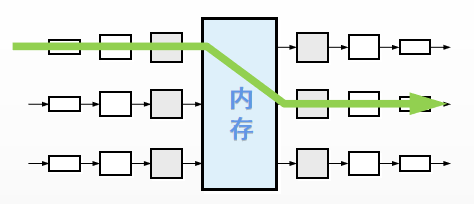
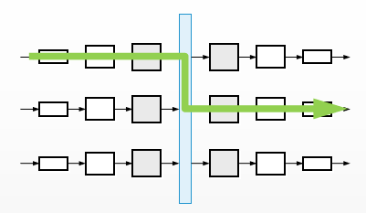
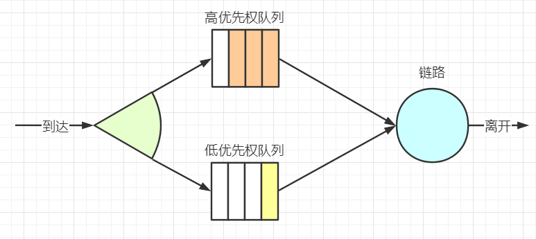
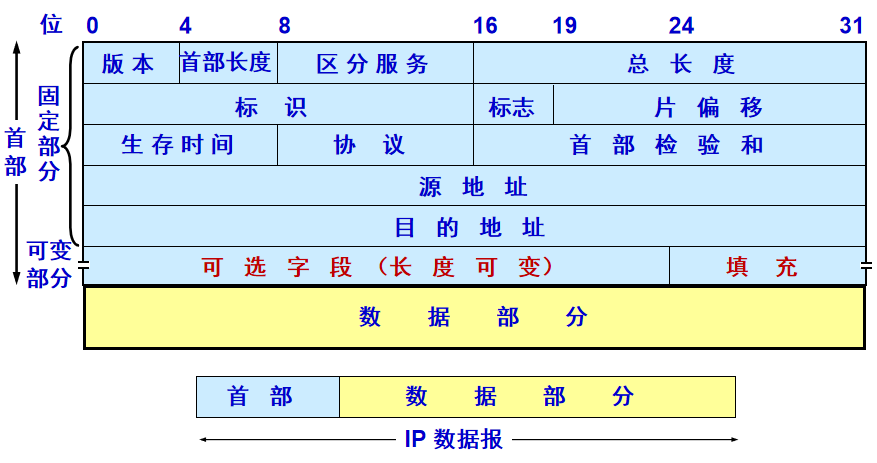
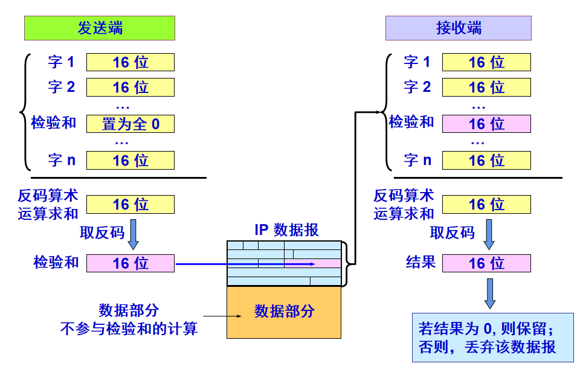

# Chapter 4. 网络层：数据面

## 4.1 概述
和传输层、应用层不同的是，网络中的每一个主机和路由器都有网络层的一部分。因此网络层协议是协议栈中最具有挑战性的。

根据SDN的定义，数控分离，这里的**数据平面**指的是每台路由器的功能，其决定到达路由器的数据报如何转发到下一跳，包含了传统的IP转发和通用的转发。而**控制平面**则是在网络范围的逻辑，控制数据报从源主机到目的主机，端到端的路由方式。

因此，通过上述总结，网络层有两种非常重要的功能：**转发**和**路由选择**。转发是指将分组从一个输入链路接口转移到适当的输出链路接口的路由器本地动作。而路由选择是指确定分组从源地址到目的地址所采取的端到端路径的网络范围处理过程。

## 4.2 路由器工作原理

下图显示了一个通用路由器体系结构的总体视图，标识了一台路由器的4个组组件：
- **输入端口**:终结入物理链路的物理层功能、与数据链路层交互、执行查找功能。
- **输出端口**：存储从交换结构来的分组，并执行链路层和物理层功能。
- **交换结构**：将路由器的输入端口和输出端口相连接，是一个路由器中的网络。
- **路由选择处理器**：传统路由器中执行路由选择协议、SDN路由器中接收远程控制器的转发表项。

### 4.2.1 输入端口处理和基于目的转发

如下图，输入端口处理包括三个模块：线路端接，数据链路处理和最重要的查找、转发和排队。在处理完物理层和链路层功能以后，路由器需要执行查找，而查找就是基于路由转发表，并且我们可以从上图看出来，这个路由转发表是路由选择处理器下发到每一个输入端口的，也就是每一个输入端口都有转发表的副本，这样就可以避免集中处理。

由于路由器对与查找的时间要求非常快，因此嵌入式芯片上常使用DRAM\SRAM和TCAM（三态内容可寻址存储器）。

同时，输入端口处理可以视为流水线操作，对于每一个报文都会执行**匹配+动作**，就例如P4中

### 4.2.2 交换
交换是路由器的核心部分，以下列举三种典型的交换方式：
- 经内存交换
  
  

- 经总线交换
  
  

- 经互联网络交换
  
  

### 4.2.3 输出端口处理

输出端口处理和输入端口的功能基本是对称的，只是缺少了一个查找转发功能。而在输出端口中仍然需要排队，对数据报进行缓存管理，如果路由器的缓存空间满了，就会发生丢包。

关于排队，有两种排队：
- 输入排队：发生在输入端口，当一个输入端口有多个数据报需要转发，就会在输入端口进行排队。
- 输出排队：发生在输出端口，当一个输出端口有多个从不同输入端口来的数据报，就会排队。

#### 4.2.3.1 分组调度

分组调度算法是用来决定，队列中的数据报应该以什么顺序传输除去。常见的有三种：

1. FIFO(先进先出)
   
   调度规则就是按照分组到达输出链路队列的相同次序，来选择分组来链路上传输。

2. 优先权排队
   
   该规则将分组分类放入输出队列中的优先权类，每个优先权类通常有自己的队列。当选择一个分组传输时，将从队列非空的最高优先权类中选择传输一个分组。

   

3. 循环和加权公平排队
   
   简单来说就是先分类，再按照每一类进行类似于FIFO的排队，如果当前类是空，立马移动到下一类。4
   
   

## 4.3 网际协议Internet Protocol

### 4.3.1 IPv4

#### 4.3.1.1 IPv4报文格式

IPv4报文段各字段如下：
- **版本号**(4bit)
  
  4代表IPv4，6代表IPv6
- **首部长度**(4bit)
  
  如果选项长度为0，则报文首部长度是20字节。
- **服务类型**(8bit)
  
  用于区分不同类型的IP数据报，例如区分实时数据和非实时数据报。

- **数据报长度**(16bit)
  
  IP数据报的总长度，包含首部和数据。
- **标识**(16bit)
  
    这个字段主要被用来唯一地标识一个报文的所有分片，因为分片不一定按序到达，所以在重组时需要知道分片所属的报文。
- **标志**(3bit)
  
    占 3 位，这个字段有 DF 和 MF 2 个标志。DF 标志为 1 时禁止分片，为 0 时允许分片。MF 标志为 1 时表示当前分片并非最后一片，为 0 时表示当前分片为最后一片。
- **片偏移**(13bit)
  
    占 13 位，该字段指明了每个分片相对于原始报文开头的偏移量，以 8 字节作单位。
- **TTL**(8bit)
  
  Time To Live，数据报的存活时间，避免有的数据报在网络中无限传输。
- **上层协议**(8bit)
  
  记录了上层协议的类型，6是TCP，17是UDP，仅当数据报达到目标时才会用上，告诉目的主机数据报交给上层什么协议。
- **首部校验和**(16bit)
  
  用于检验IP数据报首部是否发生了比特错误，计算方式为：将首部的每2个字节求和取反。每一跳会重新计算，因为TTL值是变化的。

- **源IP地址**(32bit)
  
  略
- **目的IP地址**(32bit)
  
  略
- **选项**
  
  通常为0.

检验和过程如下：

#### 4.3.1.2 IPv4数据报分片

网络中存在各种不同的链路，每个链路有不同的MTU值，因此如果一个数据报长度大了，需要进行分片，但是如果这种分片和组装在路由器中完成，是非常麻烦的，因此IP数据报的分片可以在路由器中进而，而重装是在端系统完成的。

因此首部的`标识、标志和片偏移`就是在这里使用的。当路由器需要对IP数据报进行分片，每一个小的IP数据报具有**相同的源地址、目的地址和标识号**。而不同的是标志和片偏移。

并且，为了端系统能够区分该报文是否是最后一个数据报，最后一个分片的IP数据报的标志位会被置为0.

一个实例如下：

|数据报 |总长度 |标识   |MF    |DF    |片位移 |
|:----:|:----:|:----:|:----:|:----:|:----:|
|数据报	|3820|	相同|	0|	0|	0|
|数据分片 |1|	1420|	相同|	1|	0|	0|
|数据分片 |2|	1420|	相同|	1|	0|	175|
|数据分片 |3|	1020|	相同|	0|	0|	350|

#### 4.3.1.3 IPv4编址

### 4.3.2 DHCP动态主机配置协议

### 4.3.3 NAT网络地址转换

### 4.3.4 IPv6
