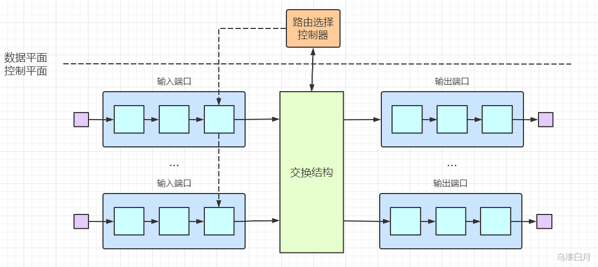

## 4.2 路由器工作原理

下图显示了一个通用路由器体系结构的总体视图，标识了一台路由器的4个组组件：
- **输入端口**:终结入物理链路的物理层功能、与数据链路层交互、执行查找功能。
- **输出端口**：存储从交换结构来的分组，并执行链路层和物理层功能。
- **交换结构**：将路由器的输入端口和输出端口相连接，是一个路由器中的网络。
- **路由选择处理器**：传统路由器中执行路由选择协议、SDN路由器中接收远程控制器的转发表项。

### 4.2.1 输入端口处理和基于目的转发

如下图，输入端口处理包括三个模块：线路端接，数据链路处理和最重要的查找、转发和排队。在处理完物理层和链路层功能以后，路由器需要执行查找，而查找就是基于路由转发表，并且我们可以从上图看出来，这个路由转发表是路由选择处理器下发到每一个输入端口的，也就是每一个输入端口都有转发表的副本，这样就可以避免集中处理。

由于路由器对与查找的时间要求非常快，因此嵌入式芯片上常使用DRAM\SRAM和TCAM（三态内容可寻址存储器）。

同时，输入端口处理可以视为流水线操作，对于每一个报文都会执行**匹配+动作**，就例如P4中.

### 4.2.2 交换
交换是路由器的核心部分，以下列举三种典型的交换方式：
- 经内存交换
  
  

- 经总线交换
  
  

- 经互联网络交换
  
  

### 4.2.3 输出端口处理

输出端口处理和输入端口的功能基本是对称的，只是缺少了一个查找转发功能。而在输出端口中仍然需要排队，对数据报进行缓存管理，如果路由器的缓存空间满了，就会发生丢包。

关于排队，有两种排队：
- 输入排队：发生在输入端口，当一个输入端口有多个数据报需要转发，就会在输入端口进行排队。
- 输出排队：发生在输出端口，当一个输出端口有多个从不同输入端口来的数据报，就会排队。

#### 4.2.3.1 分组调度

分组调度算法是用来决定，队列中的数据报应该以什么顺序传输除去。常见的有三种：

1. FIFO(先进先出)
   
   调度规则就是按照分组到达输出链路队列的相同次序，来选择分组来链路上传输。

2. 优先权排队
   
   该规则将分组分类放入输出队列中的优先权类，每个优先权类通常有自己的队列。当选择一个分组传输时，将从队列非空的最高优先权类中选择传输一个分组。

   

3. 循环和加权公平排队
   
   简单来说就是先分类，再按照每一类进行类似于FIFO的排队，如果当前类是空，立马移动到下一类。
   
   