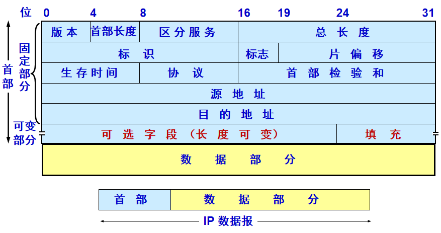
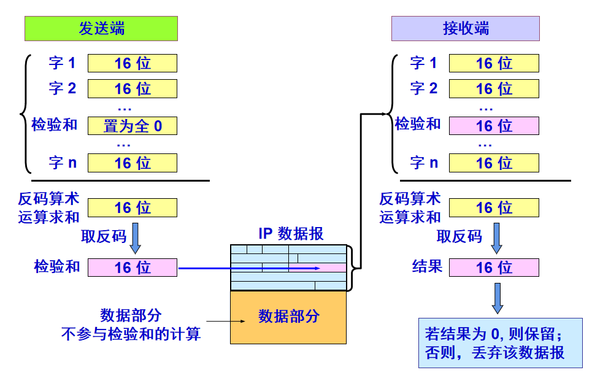
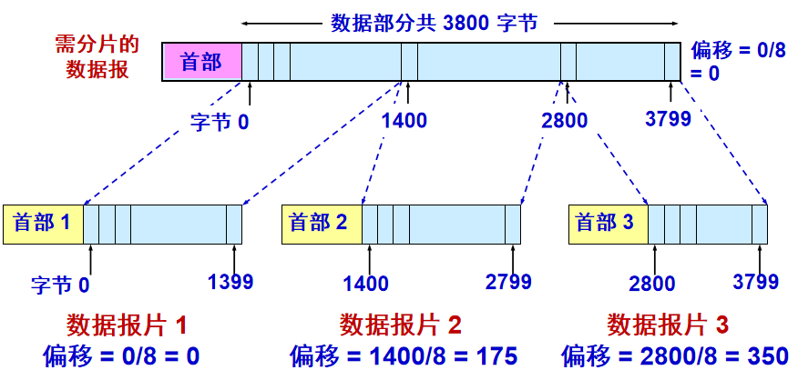
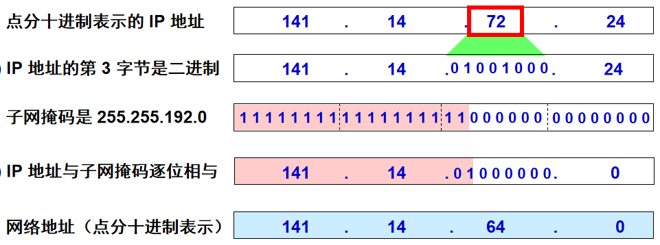
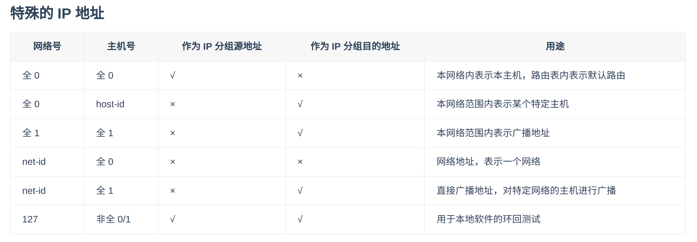
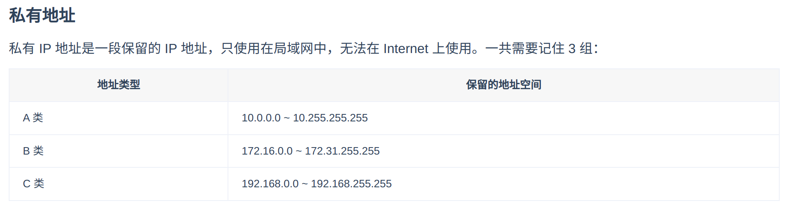
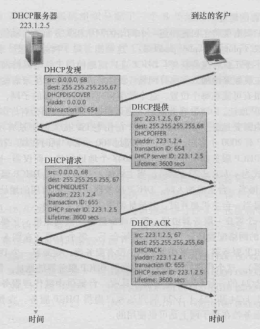
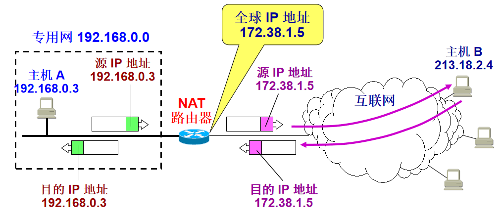
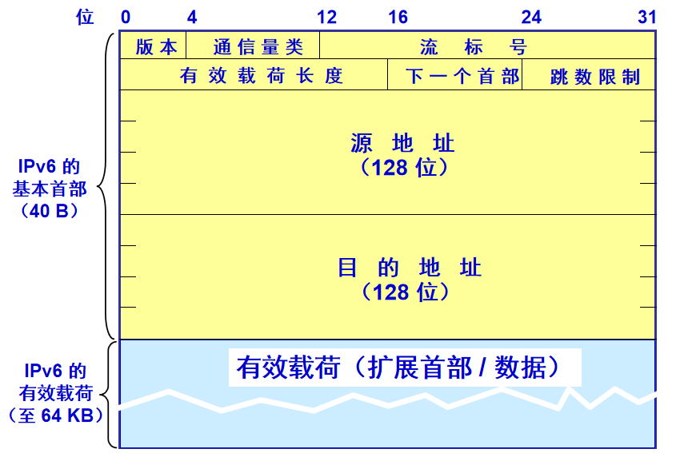
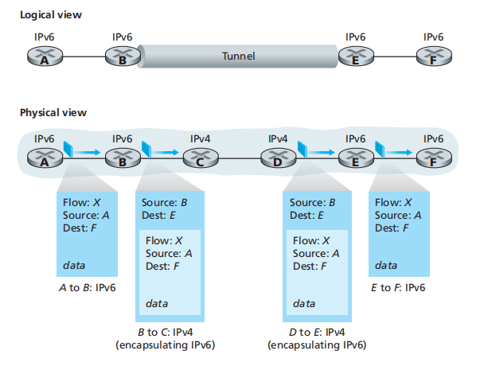

## 4.3 网际协议Internet Protocol

### 4.3.1 IPv4

#### 4.3.1.1 IPv4报文格式

IPv4报文段各字段如下：
- **版本号**(4bit)
  
  4代表IPv4，6代表IPv6
- **首部长度**(4bit)
  
  如果选项长度为0，则报文首部长度是20字节。
- **服务类型**(8bit)
  
  用于区分不同类型的IP数据报，例如区分实时数据和非实时数据报。

- **数据报长度**(16bit)
  
  IP数据报的总长度，包含首部和数据。
- **标识**(16bit)
  
    这个字段主要被用来唯一地标识一个报文的所有分片，因为分片不一定按序到达，所以在重组时需要知道分片所属的报文。
- **标志**(3bit)
  
    占 3 位，这个字段有 DF 和 MF 2 个标志。DF 标志为 1 时禁止分片，为 0 时允许分片。MF 标志为 1 时表示当前分片并非最后一片，为 0 时表示当前分片为最后一片。
- **片偏移**(13bit)
  
    占 13 位，该字段指明了每个分片相对于原始报文开头的偏移量，以 8 字节作单位。
- **TTL**(8bit)
  
  Time To Live，数据报的存活时间，避免有的数据报在网络中无限传输。
- **上层协议**(8bit)
  
  记录了上层协议的类型，6是TCP，17是UDP，仅当数据报达到目标时才会用上，告诉目的主机数据报交给上层什么协议。
- **首部校验和**(16bit)
  
  用于检验IP数据报首部是否发生了比特错误，计算方式为：将首部的每2个字节求和取反。每一跳会重新计算，因为TTL值是变化的。

- **源IP地址**(32bit)
  
  略
- **目的IP地址**(32bit)
  
  略
- **选项**
  
  通常为0.

检验和过程如下：

#### 4.3.1.2 IPv4数据报分片

网络中存在各种不同的链路，每个链路有不同的MTU值，因此如果一个数据报长度大了，需要进行分片，但是如果这种分片和组装在路由器中完成，是非常麻烦的，因此IP数据报的分片可以在路由器中进而，而重装是在端系统完成的。

因此首部的`标识、标志和片偏移`就是在这里使用的。当路由器需要对IP数据报进行分片，每一个小的IP数据报具有**相同的源地址、目的地址和标识号**。而不同的是标志和片偏移。

并且，为了端系统能够区分该报文是否是最后一个数据报，最后一个分片的IP数据报的标志位会被置为0.

一个实例如下：

|数据报 |总长度 |标识   |MF    |DF    |片位移 |
|:----:|:----:|:----:|:----:|:----:|:----:|
|数据报	|3820|	相同|	0|	0|	0|
|数据分片 |1|	1420|	相同|	1|	0|	0|
|数据分片 |2|	1420|	相同|	1|	0|	175|
|数据分片 |3|	1020|	相同|	0|	0|	350|

#### 4.3.1.3 IPv4编址

IP地址由网络地址和主机地址组成，网络地址在互联网中是唯一的，用于指明主机或路由器所连接的网络，主机地址用于标志主机和路由器，是该网络中设备的唯一地址。其中，网络地址由掩码确定其长度。

因特网的地址分配策略称为**无类别域间路由选择(CIDR)**,形式为`a.b.c.d/x`。一个地址的前x位是网络地址，而剩余的32-x比特才是可以用于区分该组织内部设备的。

在CIDR之前，IP地址的网络部分被限制长度为8、16、24比特，这是**分类编址**方案，这样的网络分别又被称为A、B、C类网络。但是C类网络的主机仅仅能方254个主机（全0和全1不用）。

下面是一些特殊的IP地址，用于参考：

### 4.3.2 DHCP动态主机配置协议

为了让一个组织内的主机和路由器接口逐个分配IP地址，就会使用动态主机配置协议，也称为即插即用协议。DHCP允许主机自动获取一个**临时的IP地址**，并且得到其**子网掩玛**，**第一跳路由器地址（默认网关）**和**本地DNS域名服务器地址**。

DHCP是一个客户-服务器协议，客户通常是新到达的主机，它需要获得包括自身使用的IP地址在内的网络配置信息，一般来说子网中会有一台DHCP服务器，如果没有，则会有一个DHCP中继代理（一般由路由器担任）。

对于一个新到达的主机，DHCP协议分成四个步骤：
1. DHCP服务器发现
   
   主机发送**DHCP发现报文**，端口号设置为67，目的地址使用广播地址`255.255.255.255`，源地址使用`0.0.0.0`。之后，链路层会将该帧广播到所有与该子网链接的节点。

2. DHCP服务器提供
   
   DHCP服务器收到DHCP发现报文以后，用**DHCP提供报文**向客户做出回应。目的地址仍然使用`255.255.255.255`，并且每个DHCP服务器提供的报文包含了收到报文的事务ID，向客户推荐的IP地址，网络掩码和IP地址租用期。

3. DHCP请求
   
   客户从一个或多个服务器提供的选择选择一个，并向选中的服务器提供**DHCP请求报文**进行响应。

4. DHCP ACK
   
   服务器用**DHCP ACK报文**对请求进行响应，证实所要求的参数。

### 4.3.3 NAT网络地址转换

NAT的作用说白了就是，用于分隔内网和外网，使得所有位于内网的设备在外网开来，共享同一个IP地址，而对于内网设备而言，其无法感知到这种变化。

而NAT是如何做到的？通过NAT转换表，在表中包含了端口号和对应的IP地址。在NAT路由器中，会对源地址和源端口进行改写，生成一个新的端口号，并使用对外的IP地址替换源地址。

通过NAT路由器的通信必须由专用网络内的主机发起，否则NAT路由器无法完成转换工作。专用网络内部的主机也不能充当服务器，因为互联网上的客户无法请求专用网内的服务器提供服务。

### 4.3.4 IPv6

由于新的子网和IP节点增长太多，因此32位的IP地址即将用完，为了应对IP地址空间的扩张需求，设计者开发了一种新的IP协议，即IPv6。

IPv6的数据报格式如下：

报文中各字段如下：
- **版本**
  
  只能填6，如果填4是不合法的。
- **流量类型**
  
  和IPv4的服务类型类似。
- **流标签**
  
  用于标识一条数据报的流，能够对于流的某些数据报给出更高的优先权。

- **有效载荷长度**
  
  给出了IPv6数据报中在定长的40字节首部后的字节数量。
- **下一个首部**
  
  用于标识需要交付给哪一个协议，TCP还是UDP。

- **跳限制**
  
  和TTL类似。

- **源地址**
  
  128位源地址。
- **目的地址**
  
  128位目的地址。
- **数据**

#### 和IPv4的不同之处：
1. 不允许中间路由器进行分片和重组，只能在源和目的进行。中间如果遇到数据报太大不能转发，则直接丢弃，返回一个“分组太大”的ICMP差错报文即可。
2. 去除了首部校验和。

#### IPv4到IPv6的迁移

目前广泛使用的是**隧道**技术，头和尾都是使用IPv6，中间使用的是IPv4，在报文到中间时，可以将IPv6报文直接封装到IPv4报文中。

如下图所示：

