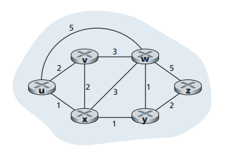

## 5.2 路由选择算法

路由选择算法的目的是，确定一条从发送方到接收方的过程中通过路由器的好的路径，一般是最低开销的路径。

为了描述好路由选择算法，我们使用图来形式化描述网络：`G=(N,E)`，其中图`G`是一个包含`N`个节点`E`条边的集合。同时，每一条边上还由一个权重标识开销。我们要做的就是从一个节点`u`找到到所有其他节点的最低开销路径集合。也成为**最短路径**。



### 5.2.1 链路状态路由选择算法（LS算法）

具有全局状态的算法称为链路状态算法。在实践中是让每一个节点向网络中的所有节点广播链路状态分组。LS算法内部实现是Dijkstra算法，具体实现步骤如下。

#### 5.2.1.1 Dijkstra算法思想

Dijkstra算法解决的是单源点最短路径问题：给定带权有向图G和源点v0，求从v0到G中其余个顶点的最短路径，即一个出发点到达其他顶点的最短路径。Dijkstra算法的思想是按照路径长度递增的次序产生最短路径的算法。

#### 5.2.1.2 算法流程
首先定义下列记号
- `D(v)`: 到算法的本次迭代，从源节点到目的节点v的最低开销路径的开销。
- `p(v)`: 从源到v沿着当前最低开销路径的前一个节点（也就是v的邻居）。
- `N'`:   节点子集，如果从源到v的最低开销路径已知，则在集合中

初始化过程如下，最开始已知的最短路径集合中只有节点`u`，之后在其他所有的节点中，如果`v`是`u`的邻居，那么其开销设置为邻边的权重，否则开销则为无穷大。
```
# Initialization
-----------------------------
N' = {u}
for all nodes v:
    if v is a neighbor of u:
        then D(v) = c(u,v)
    else:
        D(v) = _MAX_
```

之后就进入循环，循环的次数为节点数量。

```
Loop：
    find w not in N' such that D(w) is a minimum
    add w to N'
    update D(v) for each neighbor v of w ans not in N':
        D(v) = min(D(v), D(w)+c(w,v))
until N'=N
```
上面的伪代码流程表示，一轮只加入一个节点，并且没加入一个节点，邻居节点的值就会有可能更新。

#### 5.2.1.3 代码实现

略，[代码详情见博客](https://www.cnblogs.com/linfangnan/p/12803201.html)

#### 5.2.1.4 振荡问题

LS算法产生的振荡问题简单来说就是，当网络中的节点检测到一条好的链路时，大家第一跳发送就会都走那条链路；结果链路情况变差，原来不好的链路又变成和好的，因此数据报又回来，来来回回，数据报会在网络中乱窜。

形象的比喻就是一堆人走平衡木，觉得另一边人少结果所有人都去另一边，导致原先的一边又空了。

解决的方法就是，确保并非所有的路由器都同时运行LS算法，避免自同步。

### 5.2.2 距离向量路由选择算法

距离向量算法是一种迭代的、异步的和分布式的算法，其被称为分布式是因为每一个节点都要从一个或者多个直接相连的邻居节点接收信息，执行计算，然后将计算结果分发给邻居。迭代是因为这个过程会一直持续到邻居之间没有更多的信息需要交换。

DV算法的原理如下：
```
d_x(y) = min_v{c(x,y),d_v(y)}
```

该算法的步骤类似于，当前节点到别的节点的距离，是邻居到别的节点的距离+当前节点-邻居，然后取最小值。