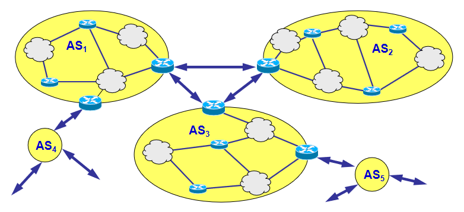

## 5.4 BGP(ISP之间的路由选择)

BGP协议可以被称为因特网的粘合剂，用于确定AS之间的路由选择。

### 5.4.1 BGP的作用
对于一个AS和AS内的某一个路由器，在路由器中有一个转发表，用于选择和确定分组在路由器的输出链路。对于分组需要发送到AS之外时，BGP提供的并不是特定的目的地址，而是提供了一个通过CIDR得到的网络前缀，这个网络前缀能够标志一个子网或一个子网的集合。概括起来，BGP的作用是：容许子网向路由器其余部分通告它的存在。

### 5.4.2 BGP的任务

BGP 对于每一台路由器来说，需要完成 2 个任务：

1. 从临近的AS获得前缀可达性信息：BGP允许每个子网向因特网的其他部分告知自己的存在，同时BGP确保在因特网中所有的AS都知道该子网；
2. 确定到达子网的最佳路由：路由器将在本地允许BGP路由选择过程，此时BGP协议需要基于网络前缀的可达性信息，向路由器提供最佳路由。

...略