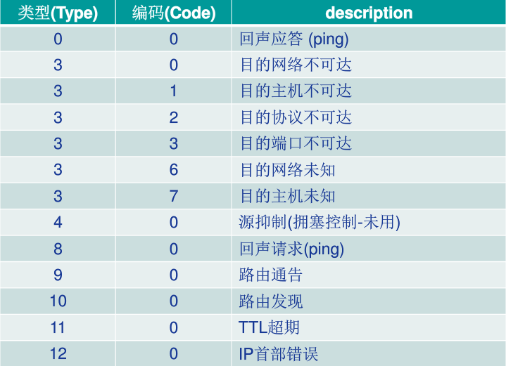

## 5.6 ICMP因特网控制报文协议

ICMP用于主机和路由器沟通网络层信息。最典型的用途是差错报告，例如运行一个HTTP会话，如果IP路由器无法找到通往HTTP请求的主机的路径，就会返回“目的网络不可达”这样的错误信息。

ICMP通常被认为是IP的一部分，但是从体系结构讲它是位于IP之上的。因此ICMP的报文和TCP/UDP一样是作为有效载荷放在IP分组中的。ICMP报文由一个**类型字段**和**编码字段**，并且包含了首次引起该ICMP报文的IP数据报的首部和前8个字节。

## 5.6.2 Traceroute

Traceroute允许跟踪从一台主机到世界上任何一台主机之间的路由。Traceroute就是ICMP报文实现的。为了判断所有从源到目的之间的路由器名字和地址，源主机中的Traceroute向目的主机发送了一系列普通的IP数据报，每个数据报携带了一个具有不可达UDP端口和UDP报文段。

第一个数据报TTL设为1，第二个设为2，以此类推。因为根据IP协议规则，路由器丢弃该数据报需要发送一个ICMP告警报文给源主机，该告警报文包含了路由器的名字和IP地址。

而源主机可以通过ICMP报文的类型分辨是否到达了目标主机，因此目的主机会返回一个“端口不可达”的ICMP控制报文。