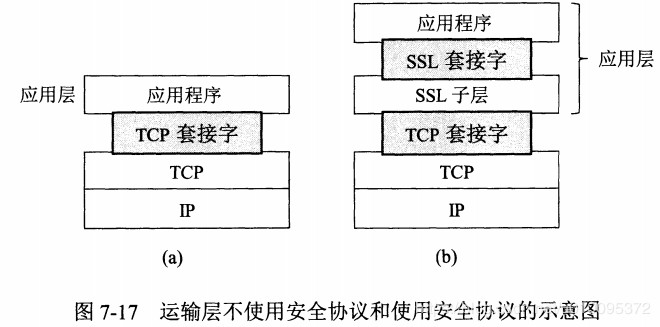
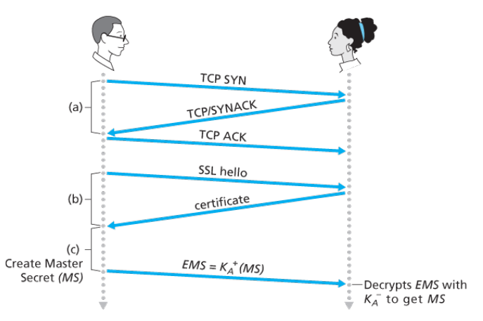
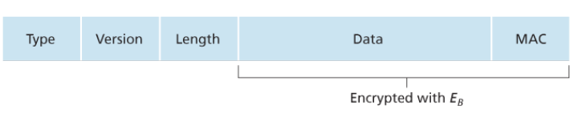

# Chapter 8. 计算机网络中的安全

## 8.1 安全通信的需求

安全通信具有以下所需要的特性：
1. 机密性:指报文加密
2. 报文完整性：指报文没有被修改和篡改
3. 端点鉴别：指通信双方可以相互确认
4. 运行安全性：发现网络威胁

## 8.2 密码学

### 8.2.1 对称密钥密码体系
在这种加密方式中，两者的密钥是相同并且秘密的。最早的凯撒密码，变成单码代替密码，后来又演变成多码代替密码。而如今，对称加密技术的方式主要分为两种，一种是流密码，一种是块密码。

#### 8.2.1.1 块密码

块密码用于多种因特网协议的加密中，包括PGP(用于安全电子邮件)、SSL(用于使TCP连接更安全)、IPsec(网络层传输安全)。块密码中，要加密的报文被处理成k个比特的块，每一块单独加密。

用一个例子理解，假设k=3，因此块密码将3比特输入映射为3比特输出，下面是一种可能的映射：
|输入|输出|输入|输出|
|---|----|----|----|
|000|110|100|011|
|001|111|101|010|
|010|101|110|000|
|011|100|111|001|

为了防范暴力破解，块密码通常使用非常大的块，由64比特甚至更多比特组成，这样映射的数量是指数级，组成的可能性也是指数级。但是，上述这种方式需要通信双方都维护一张非常大的映射表，如果改变密钥需要重新生成该表，这是一项庞大且不可能的任务。因此，块密码通常使用函数模拟随机排列表。

常见的块密码加密包括DES，3DES和AES。

#### 8.2.1.2 块密码链接

### 8.2.2 公开密钥密码体系

当使用公钥私钥这种非对称加密体系后，所有人都知道通信对方的公钥，用公钥进行加密，而只有自己才拥有私钥，使用私钥解密。在这个情境下，由于所有人都知道公钥，因此任何一个人都可以向接收方发送报文，因此需要数字签名。（对称加密中，由于密钥仅通信双方持有，因此隐含了身份认证）。

#### 8.2.2.1 RSA

RSA算法几乎就是非对称加密的代名词，RSA算法的工作原理是基于以下一个事实：
```
[(a mod n) + (b mod n)] mod n = (a+b) mod n
[(a mod n) - (b mod n)] mod n = (a-b) mod n
[(a mod n) * (b mod n)] mod n = (a*b) mod n

推出
(a mod n)^d mod n = a^dmod n
```

生成RSA公钥和私钥的步骤如下：
1. 选择两个大素数`p`和`q`。
2. 计算`n=pq`和`z=(p-1)(q-1)`
3. 选择一个小于`n`的数`e`，使得`e`和`z`没有公因数，`e`用于加密。
4. 求数`d`使得`ed mod z = 1`，使用`d`解密。

公钥是`(n,e)`而私钥是`(n,d)`.

明文是`m`，密文是`c`，加密和解密的过程如下：
1. 加密：
   
   `c = m^e mod n`
2. 解密：
   
   `m = c^d mod n`

#### 8.2.2.2 会话密钥

实际中，RSA的运算非常耗费时间，而DES算法则更快，因此通信双方一般使用两者结合。先使用RSA传输用于加密数据本身的密钥，这个密钥也就称为**会话密钥**，之后使用会话密钥来进行对称加密通信。

## 8.3 报文完整性和数字签名

### 8.3.1 密码散列函数

散列函数以`m`为输入，计算得到一个称为散列的固定长度的字符串`H(m)`。并且不存在`x!=y-->H(x)=H(y)`的情况出现。

常见的密码散列函数有MD5，SHA-1等。


### 8.3.2 报文鉴别码MAC

首先通信双方共享秘密`s`，然后执行报文完整性鉴别的过程如下：
1. Alice生成报文`m`，用`s`级联`m`生成`m+s`，并计算散列`H(m+s)`。这里的`H(m+s)`被称为报文鉴别码(MAC)
2. Alice将MAC附加到报文`m`上，生成扩展报文`(m,H(m+s))`，发送给Bob。
3. Bob收到扩展报文`(m,h)`，计算报文鉴别码`H(m+s)`并进行验证。

### 8.3.3 数字签名

数字签名用于验证身份，使用了非对称加密的技术。由于私钥是Bob独有的密钥，因此如果该明文使用Bob的私钥进行加密，能够通过Bob提供的公钥进行解密，这样就可以验证加密方是Bob本人。

但是由于对整个报文进行加解密计算量太大，在身份验证上明显不划算，因此我们使用散列函数，首先计算报文的**指纹**，也就是该报文的固定长度散列，之后对指纹进行私钥签名。

### 8.3.4 公钥认证

上述的数字签名存在一个问题，Alice是通过Bob的公钥判断是否是Bob本人，但是如果有人故意篡改了Bob的公钥，并使用对应的私钥进行签名，Alice是无法洞悉的。

因此，网络中存在CA(Certification Authority)认证中心，将公钥和实体进行绑定。X509就规定了证书的鉴别服务和特定语法。

## 8.4 SSL

**安全套接字层(Secure Socket Layer)**是TCP的强化版本，提供了包括机密性、数据完整性和端点鉴别集中功能。并且SSL版本3的一个稍加修改的版本被称为**运输层安全性(Transport Layer Security)**。



SSL经常用来为发生在HTTP之上的事务提供安全性，然而因为SSL使TCP安全，因此能够被应用于运行在TCP之上的任何应用程序。SSL提供了一个简单的具有套接字的API，当一个应用程序使用SSL时，它包括了SSL类。如上图，尽管SSL技术上位于应用层，但是从研发者的角度看，它是一个提供TCP服务的运输协议。

### 8.4.1 宏观描述

首先我们描述一个简化版的SSL协议，之后将具体介绍，填充细节。我们将简化版的SSL称为类SSL。

类SSL具有三个阶段：握手、密钥导出和数据传输。客户是Bob，服务器是Alice，其中Alice具有私钥/公钥，还有将身份与公钥绑定的证书。

1. **握手**
   
   在握手阶段，Bob需要：
   1. 与Alice创建一条TCP连接
   2. 验证Alice是真实的Alice
   3. 发送给Alice一个主密钥，用于生成SSL会话所需的所有对称密钥
   
   

2. **密钥导出**
   
   Bob和Alice都拥有MS主密钥以后，用MS会生成4个密钥：
   - E_B：用于从Bob发送到Alice的数据的会话加密密钥
   - M_B：用于从Bob发送到Alice的数据的会话MAC密钥
   - E_A：用于Alice从发送到Bob的数据的会话加密密钥
   - M_A：用于Alice从发送到Bob的数据的会话MAC密钥

3. **数据传输**
   
   SSL将数据流分割成记录，对每一个记录附加一个MAC用于完整性检查，然后加密该“记录+MAC”。这里的MAC就是报文鉴别码，将数据和M_B级联，放入散列函数中，之后用E_B加密数据+MAC。


SSL记录的组成如下：
- 类型（不加密）
- 版本（不加密）
- 长度（不加密）
- 数据（加密）
- MAC（加密）
  


### 8.4.2 详细描述

#### SSL握手

SSL握手过程生动一点的如图。


1. 客户端发送hello报文，包含支持的加密套间和客户端随机数
2. 从发送的加密套间中，服务器选择加密套间，返回服务器随机数，还有证书
3. 客户端验证证书，并生成一个随机数Pre-Master Secret，利用服务器的公钥加密并发送给服务器
4. 客户端和服务器使用三个随机数生成MS主密钥，并从主密钥中生成4个对应的密钥。
5. 客户发送所有握手报文的MAC
6. 服务器发送所有报文的MAC

最后两步是为了防止握手报文被篡改。更详细的过程如下图所示：


图中有些步骤是可选项，本书中只介绍了基础版。

## 8.5 IPsec
IP安全协议常被称为IPsec，它为网络层提供了安全性。IPsec为任意两个网络层实体的IP数据报提供了安全，例如常使用的虚拟专用网(VPN)就是用IPsec创建的。

IPsec提供包括机密性、源鉴别、数据完整性和重放攻击防护功能。在IPsec协议族中，由两个主要协议：**鉴别首部AH协议**和**封装安全性载荷ESP协议**。其中AH协议提供源鉴别和数据完整性服务，但不提供机密性服务。ESP协议提供了源鉴别、数据完整性和机密性服务。因此更多使用ESP协议。

### 8.5.1 隧道模式

隧道模式的IPsec数据报报文格式如下。


## 参考
1. [图解SSL/TLS协议](http://www.ruanyifeng.com/blog/2014/09/illustration-ssl.html)
2. [HTTPS协议详解(四)：TLS/SSL握手过程](https://blog.csdn.net/hherima/article/details/52469674)
3. [HTTPS握手过程及客户端如何验证证书的合法性](https://www.jianshu.com/p/94dd4b197f5b)