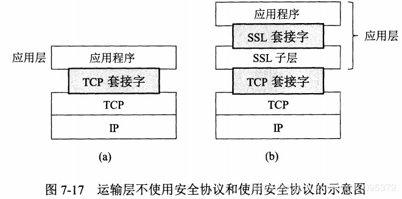
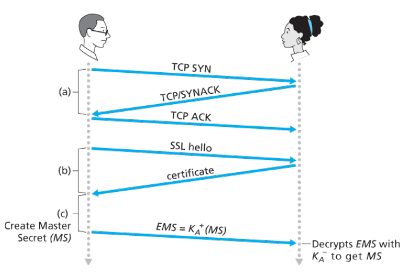
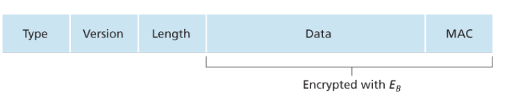

## 8.4 SSL

**安全套接字层(Secure Socket Layer)**是TCP的强化版本，提供了包括机密性、数据完整性和端点鉴别集中功能。并且SSL版本3的一个稍加修改的版本被称为**运输层安全性(Transport Layer Security)**。

SSL经常用来为发生在HTTP之上的事务提供安全性，然而因为SSL使TCP安全，因此能够被应用于运行在TCP之上的任何应用程序。SSL提供了一个简单的具有套接字的API，当一个应用程序使用SSL时，它包括了SSL类。如上图，尽管SSL技术上位于应用层，但是从研发者的角度看，它是一个提供TCP服务的运输协议。

### 8.4.1 宏观描述

首先我们描述一个简化版的SSL协议，之后将具体介绍，填充细节。我们将简化版的SSL称为类SSL。

类SSL具有三个阶段：握手、密钥导出和数据传输。客户是Bob，服务器是Alice，其中Alice具有私钥/公钥，还有将身份与公钥绑定的证书。

1. **握手**
   
   在握手阶段，Bob需要：
   1. 与Alice创建一条TCP连接
   2. 验证Alice是真实的Alice
   3. 发送给Alice一个主密钥，用于生成SSL会话所需的所有对称密钥
   
   

2. **密钥导出**
   
   Bob和Alice都拥有MS主密钥以后，用MS会生成4个密钥：
   - E_B：用于从Bob发送到Alice的数据的会话加密密钥
   - M_B：用于从Bob发送到Alice的数据的会话MAC密钥
   - E_A：用于Alice从发送到Bob的数据的会话加密密钥
   - M_A：用于Alice从发送到Bob的数据的会话MAC密钥

3. **数据传输**
   
   SSL将数据流分割成记录，对每一个记录附加一个MAC用于完整性检查，然后加密该“记录+MAC”。这里的MAC就是报文鉴别码，将数据和M_B级联，放入散列函数中，之后用E_B加密数据+MAC。

SSL记录的组成如下：
- 类型（不加密）
- 版本（不加密）
- 长度（不加密）
- 数据（加密）
- MAC（加密）
  

### 8.4.2 详细描述

#### SSL握手

SSL握手过程生动一点的如图。

1. 客户端发送hello报文，包含支持的加密套间和客户端随机数
2. 从发送的加密套间中，服务器选择加密套间，返回服务器随机数，还有证书
3. 客户端验证证书，并生成一个随机数Pre-Master Secret，利用服务器的公钥加密并发送给服务器
4. 客户端和服务器使用三个随机数生成MS主密钥，并从主密钥中生成4个对应的密钥。
5. 客户发送所有握手报文的MAC
6. 服务器发送所有报文的MAC

最后两步是为了防止握手报文被篡改。更详细的过程如下图所示：

图中有些步骤是可选项，本书中只介绍了基础版。