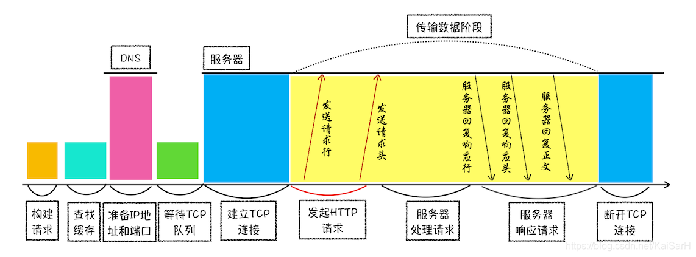

# 计网面经

## 应用层

1. 浏览器从发起请求到获得资源，中间有哪些过程？
   
   > 1. 浏览器首先将url进行拆分解析，找到协议、域名、端口等字段。
   > 2. 浏览器根据域名去本地hosts文件中寻找，如果没有找到会使用DNS协议进行域名解析，这里会涉及**DNS解析**的过程。
   > 3. 浏览器拿到服务器的IP地址以后，发送HTTP请求，**HTTP请求报文的字段填充**。
   > 4. HTTP报文由TCP封装发送，客户端和服务器经过**三次握手**建立连接。
   > 5. IP协议（IPv4）将TCP报文切片发送，中间经过**ARP协议**解析服务器IP地址对应的MAC地址，再通过各种**路由选择**最终到达服务器。
   > 6. 服务器收到请求后，返回HTTP响应报文。
   > 7. 当其中一方完成数据传输后，发起关闭连接请求，进行TCP的**四次挥手**过程。
   > 
   > 

2. 如果发送了一个HTTP请求（输入一个url到页面展现），整个过程是什么样的？
   
   > 同上。
   > 

3. HTTP的请求报文和响应报文的结构？
   
   > - 请求报文：**请求行+首部行+空行+实体体**
   > 
   >     其中，请求行由**方法、URL、HTTP版本**三个字段构成。首部行由关键字/值对组成，每行一对，包括浏览器类型、请求主机名，连接是否关闭等。

   > - 响应报文：状态行+首部行+实体体
   > 
   >     其中，状态行由**版本、状态码、状态信息短语**三个字段构成。

4. HTTP中的cookie是什么，请详细说一说？
   
   > cookie是一段键值对文本，是用于补充HTTP协议的无状态性质，让服务器能够识别用户身份，以此提供个性化的服务。
   > 
   > cookie的步骤如下：用户第一次与某网站建立连接，服务器会为用户创建ID，然后在响应报文中加入该cookie ID，之后用户在发送请求报文时，会在首部行加入该网站的cookie值，这样服务器端就会将该用户在本网站的一些列操作都存储下来。可以用于身份识别。
   > 
   > cookie会带来的问题：由于cookie是保存在终端这一侧，因此也就意味着是可以被人为修改和冒用的。冒用和劫持cookie可能会产生会话劫持、XSS攻击、跨站请求伪造等攻击。
   > 
   > 如果想要安全，可以使用session代替cookie。

   > [参考](https://developer.mozilla.org/zh-CN/docs/Web/HTTP/Cookies)

5. 讲一讲代理服务器是如何运作的？
   
   > 代理服务器又称为Web缓存器，通常是由ISP购买并安装，充当中间商和防火墙的作用。当用户发送一个web请求，首先经过代理服务器，代理服务器会查询本地存储中是否有相应的资源，如果找到相应资源，代理服务器会进行内容检查，通过**条件GET**，其中有字段`if-modified-since`。如果没有，代理服务器会充当web请求发起人，向目标服务器发送请求，将请求到的副本存储在本地。
   > 
   > 因为代理服务器可能会修改用户的web请求，同时也会过了目标服务器返回的资源，因此可以充当防火墙或web过滤器。

6. HTTP协议常用的方法有哪些？
   
   > - GET :请求指定的页面信息，并返回实体主体。
   > - POST :向指定资源提交数据进行处理，数据在请求体中。
   > - HEAD :类似于GET，但是只返回报头。
   > - PUT :从客户端向服务器传送的数据取代指定的文档的内容。
   > - DELETE :请求服务器删除指定的页面。
   > - CONNECT :略。
   > - OPTIONS :允许客户端查看服务器的性能。
   > - TRACE :回显服务器收到的请求，主要用于测试或诊断。
   > - PATCH :是对 PUT 方法的补充，用来对已知资源进行局部更新 。

7. HTTP协议常用的状态码和对应的含义？
   > - 200: OK 请求成功
   > - 301: Moved Permanently 永久重定向
   > - 302: Found 临时重定向
   > - 400: Bad Request 客户端请求的语法错误，服务器无法理解
   > - 401: Unauthorized 请求要求用户的身份认证
   > - 403: Forbidden 服务器理解请求客户端的请求，但是拒绝执行此请求
   > - 404: Not Found 服务器无法根据客户端的请求找到资源（网页）
   > - 500: Internal Server Error 服务器内部错误，无法完成请求
   > - 502: Bad Gateway	作为网关或者代理工作的服务器尝试执行请求时，从远程服务器接收到了一个无效的响应
   > - 504: Gateway Time-out 充当网关或代理的服务器，未及时从远端服务器获取请求

8. HTTP1.0，1.1，2.0的区别？
   > 1. 1.*面向文本传输，2.0面向二进制传输，更高效。
   > 2. 1.*的头部信息未压缩，2.0压缩头部信息。
   > 3. 1.*每个请求都要建立连接，串行工作，2.0支持多路复用，并行工作。
   > 4. 1.*不支持服务器推送，2.0支持服务器主动推送。 
   
9. HTTP/1.1的局限性是什么？
    > 1. 高延迟——队头阻塞（当有一个请求被阻塞，后面排队的请求都会阻塞）
    > 2. 无状态特性
    > 3. 明文传输不安全
    > 4. 不支持服务端推送

10. 服务端如何处理/解析HTTP请求？
   > 1. 建立TCP连接
   > 2. 接受http请求
   > 3. 解析http请求：解析请求行和首部行
   > 4. 访问对应资源
   > 5. 构建响应
   > 6. 发送响应报文
   > 7. 记录日志

11. HTTP客户端可以有多少条连接？
    > 对于每一个IP，受限于端口号，端口号最大是65535，一般内核开放给TCP的端口号是65000-15000，约50000个。
    > 65535的最大端口号是根据TCP报文头中，对应端口号字段是16位无符号整数。
12. 服务端如何同时处理多个请求？
   > 并行处理请求有三种模式：多进程、多线程和异步。
   > 1. 多进程：服务器每当接收到一个客户端请求，就由服务器主进程生成一个子进程进行交互，连接断开，子进程结束。
   > 2. 多线程：服务器当收到一个客户端时，会由主进程派生一个线程和哭护短交互。
   > 多线程比多进程的创建更快，消耗更少的系统资源，但是会有同步问题
   > 3. 略。

13. 如果输入网址打不开网页，如何排查问题？
    > 1. 查看浏览器提示：首先排除网络设置问题和url地址输入是否有误。
    > 2. 查看是否有状态码，如果没有状态码，打开其他网页查看，排查DNS解析问题。
    > 3. 若DNS没有问题，或者网页始终无法加载，查看接口。
    > 4. 如果有状态码，则根据状态码的提示解决对应问题。

14. 我们在访问之前访问过的网站，不需要重新登录，是如何实现的？
    > 是利用cookie和session机制实现的。
    > cookie是一段键值对文本，是由服务器生成，存储在浏览器中的凭证，当用户再次访问相同网站时，浏览器会找出当前网站对应的cookie，并将其放在HTTP请求中，服务器会根据cookie内容识别用户身份，进行个性化服务。
    > 
    > session相当于一个服务器生成的口令，称为session id，采用cookie的形式存储在浏览器中，其他的使用方法和cookie相似，区别就是cookie的键值对中就有用户的数据，在本地是可以修改和冒用。而session则是一串口令，对应的用户信息则是存储在服务器端，无法修改。
15. 假设安全应用场景，如果我们将别人电脑中的cookie拷贝，是否可以伪造身份进行登录？用什么方法检测和避免呢？
    > 首先结论是可以伪造身份，类似的使用cookie机制可以进行XSS（跨站脚本攻击）和CSRF（跨站域请求伪造攻击）就是利用cookie的不安全机制发起的攻击。
    > 从两个角度进行检测和避免：
    > - 从用户角度，不在非私人电脑存储cookie，常清理cookie，并且不点击不安全的网址。
    > - 从服务端角度，可以增加一些验证机制，包括常用IP、设备检验，增加token检验等。

16. HTTP和HTTPS协议是什么？有什么区别？
    > HTTP是超文本传输协议，用在Web浏览器和网站服务器之间传递消息，以明文方式发送内容，不提供任何方式的数据加密。
    > HTTPS是安全套接字层超文本传输协议，是在HTTP的基础上加上了SSL/TLS协议，提供身份认证和加密传输等功能。
    > 
    > 两者的区别在于：
    > 1. HTTP是明文传输，HTTPS是加密传输。
    > 2. HTTP使用80端口，HTTPS使用443端口。
    > 3. HTTPS需要CA证书，成本比HTTP高。

17. HTTPS连接的过程与步骤？
    > 宏观上，HTTPS首先需要建立SSL连接。SSL连接过程由三个阶段：
    > 1. 握手阶段，客户端和服务器端首先通过三次握手建立TCP连接。然后客户端发送SSL Hello，其中包含客户端生成随机数，客户端支持的加密套件。服务器端返回服务器端生成随机数和证书。
    > 2. 密钥导出阶段，客户端验证证书，然后再生成一个随机数，将这个随机数利用公钥加密并发送给服务器端。客户端和服务器使用三个随机数生成主密钥，并从主密钥中生成4个对应的密钥。
    > 3. 数据传输阶段，会利用生成的会话密钥对数据进行加密，再服务器端进行解密，这里使用的是对称加密。

18. 浏览器是如何区分http和https协议的？
   > 在没有明确输入是https的时候，浏览器的默认端口一直都是80，也就是默认情况下使用http协议。
   > 服务器使用http协议在监听80端口，并在端口上设置url重定向，通过301状态码（永久重定向）指向443端口的https协议网站。
   > 同时为了避免每一次都进行重定向，也为了安全考虑（避免中间人攻击），服务器会设置`HSTS`的有效期，通知浏览器本站点只能使用HTTPS访问。
   > [HSTS详情](https://developer.mozilla.org/en-US/docs/Web/HTTP/Headers/Strict-Transport-Security)

19. HTTPS的缺点？
    > 1. HTTPS协议握手阶段比较耗费时间，并且加密解密需要消耗时间，会让整个浏览活动更慢。
    > 2. SSL证书需要可信第三方，因此需要额外的费用。
    > 3. HTTPS协议的安全性仅仅针对身份验证和数据加密，对于类似DDoS攻击等没有效力，并且如果CA证书有问题，则一样解决不了安全性问题。
     
20. DNS是什么，如何进行解析的？
    > DNS是域名服务器，是提供域名转换IP地址的服务（还提供主机别名、邮件服务器别名等功能），DNS运行在UDP之上，使用53端口。
    > DNS在网上实现分布式数据库，有三种类型的DNS服务器，分别是根DNS服务器、顶级DNS服务器和权威DNS服务器，除此之外还有一个本地DNS服务器。
    > 当主机进行DNS查询时，首先访问本地DNS服务器，然后本地DNS服务器再进行迭代查询。
    > 关于DNS解析，首先域名是具有层次结构的，从上到下依次为根域名、顶级域名和二级域名等，对应级别的域名是由高一级的域名服务器进行管理。

21. DNS劫持了解吗？如何防范？
    > DNS劫持称为域名劫持，指攻击者篡改了域名的解析结构，替换了IP地址，是的用户访问攻击者指定的网页。
    > 如何防范？
    > 1. 使用正规的DNS服务器地址
    > 2. 可以使用HTTPS协议，能够有效防止DNS劫持。
    > 3. 对于路由器等网络设备的密码需要经常修改。

## 传输层

1. 视频流使用什么协议？
   
   > 理论上来说，视频流具有**时延敏感**和**容忍丢包**的特点，应该使用UDP流，但是因为UDP无法控制带宽，所以大型视频网站一般使用HTTP流和适应性HTTP流，底层使用的是TCP协议。

2. TCP是如何保证可靠通信呢？
   > 可靠通信需要再传输过程中保证数据包按序到达、数据包不丢失、数据包数据完整。因此实现这些目标，TCP使用了**停止等待协议、自动重传、检验和、序号、倒计时定时器、滑动窗口**等。

3. TCP协议连接过程是什么样的？
   
   > TCP协议连接过程是三次握手：
   > - 第一次握手，客户端发送SYN报文，SYN设置为1，序号为随机生成。客户端进入SYN_SENT状态。
   > - 第二次握手，服务端收到请求，允许连接，发送SYNACK报文，SYN设置为1，序号随机生成，ack为客户端序号+1。服务端进入SYN_RECV状态。
   > - 第三次握手，客户端收到服务端的回应，对此进行确认，SYN设置为0，序号和确认号都是对应的。两者进入ESTABLISHED状态。

4. TCP协议断开连接的过程是什么样的？
   > TCP通过四次挥手断开连接：
   > - 第一次挥手，客户端发送FIN报文，FIN标志为1。
   > - 第二次挥手，服务端收到后，发送FINACK，确认号为FIN报文序号+1。
   > - 第三次挥手，服务端发送FIN报文，FIN标志为1。
   > - 第四次挥手，客户端收到FIN报文后，进入定时等待，发送ACK报文。客户端直到2MSL后关闭。

5. TCP为什么连接的时候是三次握手，关闭的时候却是四次握手？

   > 因为三次握手中，服务端收到客户端的SYN报文后，将ACK报文和SYN报文合并了，因此是三次。而在关闭连接的时候，服务端和客户端并不是同时关闭，而是分成两次单向关闭，当客户端发起关闭连接，服务端这时可能还在发送数据，因此服务端回复ACK表示收到关闭请求，但是需要等服务端完成数据传输，才能发起服务端的FIN报文。

6. TCP三次握手的目的和功能？
   > 1. 确认双方都知道彼此做好了发送数据的准备。
   > 2. 双方就初始序列号进行协商，并确认窗口大小。

7. 为什么不能用两次握手进行连接？
   > 因为TCP是双工通信，两次握手只能保证一个方向上的传输，另一个方向序号都没有协商完成。

8. TCP的四次挥手为什么需要等2MSL？如果不等待会就关闭有什么问题？
   
   > MSL是报文在网络中的最大生存时间，如果最后一个ACK丢失，服务器端在一个MSL没有收到就会重新发送FIN报文，而如果客户端在这个时间内收到了FIN包，就会重置定时器，保证连接的正常关闭。
   > 属于异常关闭，服务器端不知道客户端收到FIN报文，会超时重传，浪费服务器资源，占用一段时间的端口。

9.  TCP的报文头是什么样的？
   > TCP首部长度固定部分是20字节，包含源端口、目的端口、序号、确认号、数据偏移（首部长度）、标志位、窗口和校验和。

11. 什么情况下机器会产生大量的TIME_WAIT，会有什么影响？
    > 在持续高并发的场景下，例如在HTTP请求中，如果connection首部的值设置为close，那么会由服务器端发起主动关闭，这时会产生大量的短连接。
    > 每一个TIME_WAIT状态，都会占用一个端口，并且这个时间会非常长，消耗服务器连接资源。

12. 拥塞控制了解吗？
    > TCP的拥塞控制可以简单描述为：慢开始、拥塞避免、快重传、快恢复。
    > 其中快重传是对接收方的要求，要求接收方每收到一个失序报文就立即发出重复报文，这时候发送方在收到3个ACK后，进入快恢复，直接进入拥塞避免。

13. 介绍一下TCP和UDP的应用场景。
    > - TCP是面向连接，面向字节流，提供可靠服务的，一对一通信。
    > - UDP是无连接，面向报文的，首部资源占用小，提供一对一、一对多、多对多通信。
    > 凡是需要进行可靠数据传输的都使用TCP，其他的场景可以使用TCP也可以使用UDP。

14. 拥塞窗口和滑动窗口的区别？
    > 滑动窗口是TCP实现可靠传输的机制之一，相当于对确认数据包添加缓冲区，以便提高数据传输速率，平衡发送方和接收方的数据传输速度。
    > 拥塞窗口是基于全局网络的，体现自发解决网络拥塞的理念。
    > 两者都是TCP的流量控制机制，最终哪个小用哪个。

15. MSS是什么？
    > MSS是Maximum Segment Size，最大报文长度，是TCP数据包每次能传输的最大数据分段，注意是数据部分，因此MSS=TCP报文总长-TCP首部长度。
    > TCP MSS大小一般为MTU-IP头-TCP头，以太网中MTU一般设置为1500，因此MSS一般是1460。

16. 拥塞窗口的初始值是怎么设定的？
    > 1. 根据RCF文档(2002)表示，TCP初始窗口的上限设置为:min(4*MSS, max(2*MSS, 4380bytes))；旨在限制初始窗口在4K范围内。所以根据MSS的大小，初始窗口大小一般是2/3/4.
    > 2. 根据RCF文档(2013)表示，TCP初始窗口的上限设置为:min(10*MSS,max(2*MSS, 14600bytes)).

17. 拥塞窗口cwnd的大小是什么时候变化的？
    > 在慢开始阶段，一个RTT结束后，cwnd会翻倍，而在此RTT阶段中，每收到一个ACK，cwnd++。
    > 在拥塞避免阶段，一个RTT结束后，cwnd++。

18. 拥塞机制中的一个RTT是怎么算的？ 
    > 从窗口中第一个数据包发送出去开始，到收到最后一个数据包的ACK结束。

19. 如何使用UDP，还能够实现可靠传输？
    > 参考TCP的可靠传输机制，增加相应机制。

20. ping是什么，其工作原理是什么？
    > ping是基于ICMP协议（网络层协议）工作的，当ping命令执行的时候，源主机首先会构建一个ICMP会送请求消息数据包。其中有两个字段比较重要：
    > - 类型字段：回送请求类型的报文，该字段设置为8
    > - 序号：用于区分连续ping的时候发出的多个数据包
    > 之后，如果该ICMP数据包到达目标主机，则会返回ICMP回送响应报文，如果在网络中不可达，则会有中间的最后一跳路由器返回ICMP回送报文。

## 网络层

1. 简要说一下IP协议？
2. 知道一个IP地址，是如何找到服务器的？
3. Arp协议中网关怎么去转换ip地址到对应MAC地址的？
4. IP数据包的大小有限制吗？
5. IPv4和IPv6的区别？
6. 子网掩码的作用，如何划分和计算？
7. 广播地址和网络地址是什么？
8. 路由协议部分待补充

## 其他

1. 网络协议为什么要分层？
   > 各层之间独立，通过接口使用下层服务，可以简化每一层不同功能的设计，增强独立性。
   > 灵活、并且易于实现和维护。

2. **Rust协议有了解吗？**
3. 