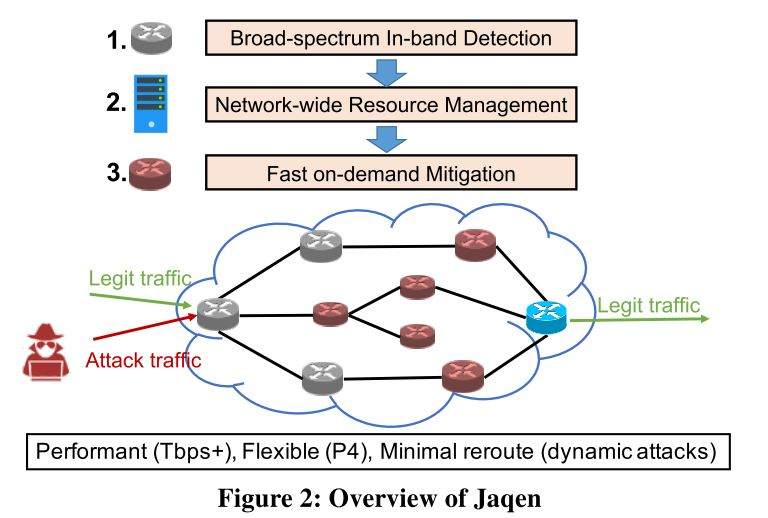
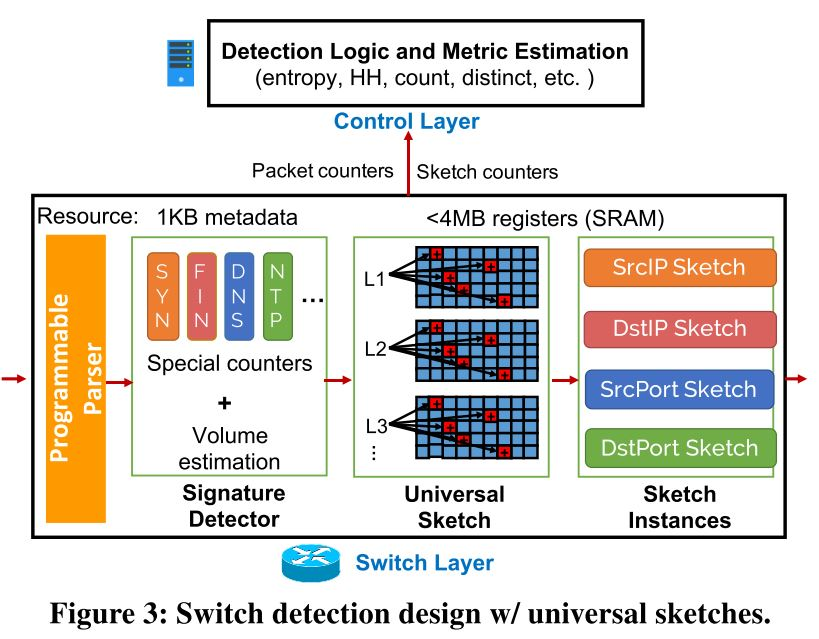
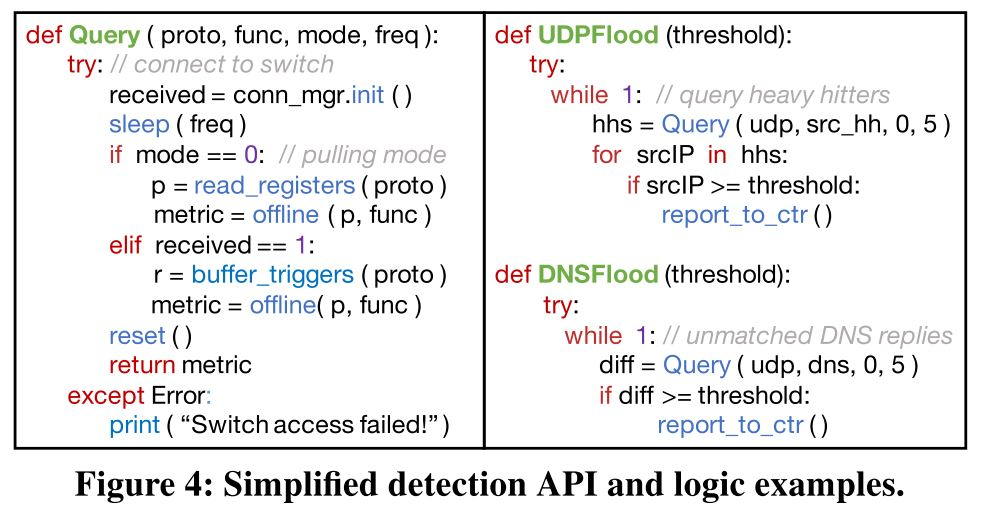

# DDoS论文

[TOC]

...
<!-- more -->

# Jaqen : A High-Performance Switch-Native Approach for Detecting and Mitigating Volumetric DDoS Attacks with Programmable Switches

## 摘要
可编程交换机的出现为ISP级别的体积型DDOS攻击的检测提供新的思路。理论上来说，可编程交换机的方法相对于专用硬件和虚拟应用的方法，可以在成本、性能和灵活性上有更好的表现。但是ISP的设定带来了巨大的挑战，需要运行大范围的检测、支持可编程交换机原生的DDOS缓解功能、动态调整来适应DDOS攻击的规模。本文提出了一套系统`Jaqen`，可以支持以上功能。

## 介绍及相关工作

尽管有多年的工作，体积型DDOS攻击任然是严重威胁，因此ISP作为基础运行商，是对抗DDOS的一个有利位置，因为ISP不会干扰客户端侧的服务。可编程交换机的出现促进了其应用在ISP级别的DDOS检测，但是现有的基于可编程交换机的研究都存在一定程度的缺陷，其中有一点是现有的方法都依赖于带外检测，需要将流量重路由到单独的监控设备中，增加了延迟和开销。

### 待解决的问题
1. 开发算法需要是可编程交换机原生的，并且需要支持多种类型DDOS攻击检测。
2. 交换机原生的灵活DDOS攻击缓解机制。
3. 全网范围内的DDOS攻击检测与缓解的动态调度。

### ISP级别防御的需求
1. 不干扰正常流量
2. 高速包处理能力
3. 低成本

### 现有DDOS防御系统及限制
1. 基于专有硬件
   - 价格昂贵
   - 缺少灵活性难升级
2. 基于SDN/NFV的防御
   - 处理速度慢
   - 单个虚拟机的处理容量小
3. 基于可编程交换机的DDOS防御
   - 带外测量，即需要离线计算统计数据
   - 低效的缓解机制

## 主要贡献

### 问题及环境
- 威胁模型：
Jaqen主要针对体积型DDOS攻击，例如 TCP SYN 泛洪， ICMP泛洪，大流，DNS泛洪和其他。其他非体积型DDOS攻击如应用层连接攻击则不在此范围内。文章模拟多层、动态的DDOS攻击威胁，攻击者会从多种攻击中选择一种，并且$V$是其最大流量，给定预算值$V$，攻击为：$\sum_{i}{v_t(A_i)} \leq V$,其中$v_t(A_i)$是某一时刻某种类型攻击的流量值。

- 工作流程
如图

- 攻击检测
  - 基于TCP的攻击：SYN泛洪，ACK泛洪，RST/FIN泛洪，DNS泛洪（在TCP之上），TCP大流等。
  - 基于UDP的攻击：利用各种基于UDP协议的放大攻击——DNS、NTP、SNMP、SSDP、Memcached、QUIC和UDP flood。
  - 基于ICMP的攻击：ICMP flood，smurf attack.
  - 应用层攻击：简单的非加密HTTP GET/POST flood，SIP Register flood。
  - 其他非体积型DDOS攻击，详情见后续表16
  
- Jaqen可能存在的限制
首先，Jaqen中使用的现有可编程交换机没有实现完整的数据包解析。因此，任何需要有效载荷信息的攻击检测和缓解都不受支持。其次，Jaqen需要几秒钟的时间对袭击做出反应。一个高级的攻击者如果能够灵活且频繁地改变攻击类型(例如<5秒)，就可以躲避防御。然而，这种潜在的规避将需要更多的计算/带宽，使攻击者更难隐藏他们的身份(例如，由于流量模式频繁变化)，导致替代防御，如IP过滤攻击源附近。

### 关键挑战
1. **对当前和未来的体积攻击的广泛检测覆盖**：与通用服务器相比，可编程交换机在表达能力、资源方面有限。例如，Tofino交换机有O(10)MB SRAM, O(1) ALU, O(10)hash units。这样的资源约束限制了将大量(复杂)算法拟合到交换机硬件中的可能性。
2. **针对交换机进行优化和资源有效的缓解机制**：对于可编程交换机，之前专为服务器设计的缓解机制已经不适用。
3. **动态攻击的高效ISP级别的防御**：因为攻击流量可以从任意一个入口交换机进入，想要达到ISP级别的检测及缓解，一个可能的方案是在边缘入口交换机部署Jaqen，但是由于受限的资源，这样的方法不可取。最好的解决方案是，能够动态调整资源分配机制来应对全网范围内的攻击防御。

### Jaqen的DDOS检测
如图：

#### 数据面设计

如上图，在数据面中，jaqen维护了特殊包的计数值，也就是上图的第一块；之后维护了几层Universal sketches，最后是不同sketch instances。这个地方文章没有说清楚，具体还得在讲的时候问一下老师。

#### 控制面设计

控制面在这里的作用只有一个，就是query，query出不同的测度信息。如下图

### Jaqen的缓解机制

Jaqen的DDOS缓解机制分成三类策略：**Filtering、Analysis、Update**。每一类都设计了一个API，并且都是基于p4原生的，也就是说可以直接部署在p4交换机中。具体API如下图：

### Jaqen的全网资源调配机制

在ISP网络中，Jaqen的目标是按需调度，因此需要在全网范围内解决检测和缓解的调度。作者将资源分配问题描述成混合整数规划问题，提出了一系列边界条件，这是一个NP难问题，因此实际上也只能双层循环来解决。

> 输入：
>
> 网络拓扑和缓解模块:$v_i=<AvailRes_i,Band_i,Type_i>$,
>
> 交换机i的j模块缓解能力和处理回环流量的能力：$MCap_{i,j,k}$,$BCap_{i,j,k}$
>
> ISP的总控制器控制路由，即已知每个流量在ISP中的路径

对于每一对可能有攻击流量的入口交换机和出口交换机对，都使用广度优先搜索确定每个交换机上分布的攻击流量和攻击类型。再将每一对路径，根据其路径攻击流量之和进行排序，最后计算每个交换机上分配的缓解流量和类型。

确定分配机制以后，还需要做的就是动态更新，三步走原则：

1. 重路由，把所有交换机的过滤组件停用，并告知其他所有交换机此交换机不接受数据包，也就是将其在网络拓扑中暂时删去
2. 复制？（Replication: Once the new rules have been applied, replicate the switch states about the legitimate connections (if not expired) in the controller.）
3. 重新写规则，将其纳入网络拓扑中

## 实现

Mitigation API：

- Blocked Bloom filters：

  详情参见论文[Cache, Hash- and Space-Efficient Bloom Filters](extension://bfdogplmndidlpjfhoijckpakkdjkkil/pdf/viewer.html?file=https%3A%2F%2Falgo2.iti.kit.edu%2Fdocuments%2Fcacheefficientbloomfilters-jea.pdf)

- Counting Bloom filters：

- LRU cache：

- Key-value store：

- switch-embedded structrures：

## 实验

我们将Jaqen部署在一个6.5 Tbps Barefoot Tofino交换机和11台Dell R230服务器(Intel Xeon E2620 v4, 64GB RAM,40Gbps Intel Network Interface Card)的测试台上。

在单次攻击实验中，我们使用10个40gbps的服务器产生流量，剩下一个服务器作为目标受害者。我们使每个服务器上的Intel DPDK[75]库能够实现高性能流量生成。当发送合法流量时，我们重放来自CAIDA的一小时流量，聚合数据包速率为每秒5900万个数据包(Mpps)。对于TCP相关的攻击，发送者使用虚拟IP地址维护最多1048576个合法TCP连接。交换机控制器每5秒拉一次检测结果。

### 攻击流量的生成：

攻击流量来源：

1. “Capture Traces from Mid-Atlantic CCDC 2012.” http://www. netresec.com/?page=MACCDC.
   [78] 
2. “DARPA Scalable Network Monitoring (SNM) Program Traf- fic, Traces taken 2009-11-05 to 2009-11-05.” https://www. impactcybertrust.org/dataset_view?idDataset=742.

此外，各种类型的攻击流量复现用以下方式：

- SYN flood：使用MoonGen(带DPDK)来发送随机源地址的SYN请求包。
- ICMP flood 和 TCP/UDP 大流：通过MoonGen，使用自定义Lua脚本。
- DNS和NTP放大攻击：我们将本地DNS和NTP服务器设置为谷歌公共DNS和来自ntp.org的服务器池，本地DNS响应将淹没受害服务器。
- Mencached放大攻击：我们将Memcached部署到服务器上，向目标受害者发送带有伪造源ip的GET请求。

### 实验结果对比：

- 和NetFlow对比检测效果：

- 和Poseidon对比缓解结果：

  

- 单一攻击的检测结果：

  

- 动态调整攻击，并识别

  

# PathFinder: Capturing DDoS Traffic Footprints on the Internet

## 摘要

DDOS攻击易于部署和实现，但是DDOS防御方法却面临很多困难，包括不知道DDOS流量的路径、无法判断源地址是否为伪造等问题。尽管现阶段是由IP traceback等技术，但是都代价昂贵难以实施。本文提出pathfinder，一种DDoS防御系统可以使用的服务，以获取DDoS流量对受害者的footprint。

## 介绍与主要贡献

DDOS防御系统有几个挑战：（这里和jaqen就是不一样的假设，jaqen中直接知道流量的路径）

1. DDoS防御系统通常不知道DDoS流量经过了哪些路径
2. 每条路径上有多少流量
3. 每条路径上与哪些源地址或前缀相关联。

以上这些信息可以作为DDOS流量的footprints信息，加入到DDOS防御系统中。可以考虑各种获取此类信息的方法，包括许多IP回溯方法和路径推断方法，这些方法旨在解决Internet路径的非对称性质，并确定DDoS包到达受害者所经过的路径。不幸的是，正如我们将在第二章中更详细地讨论的那样，这些方法有严重的缺陷。

本文的贡献：

- PathFinder可以按需部署，并且每一个自治域都可以部署而不需要依赖其他自治域
- 高速，且应用现实
- 设计了PFTrie可以支持存储查询等操作

关于源地址伪造这一事件，无论源地址如何伪造，PathFinder可以找出DDOS流量的正确路径，通过路径信息进行拦截。

## 相关工作

### IP Traceback

IP Traceback能够让受害者追踪IP数据包的来源，并且重构数据包的路由路径，即使源地址是伪造的。同时，IP Traceback技术采用最多的是`marking`和`logging`。

采用`marking`技术的方法，路由器会在IP数据包中增加标记。而`logging`方法则是在路由器中利用数据结构存储该数据包的摘要信息，便于下游受害者追溯这个数据包。

相比于当前的IP Traceback技术，PathFinder有些有点：PathFinder也是基于`logging`的方法，但是不同于之前的方法追溯受害者已经收到的任何数据包(例如来自特定源的数据包)的路径，PathFinder找的时将要到来的数据包的路径。即按需追踪。

——总结来说，就是按需操作，开销小并且准确性会高。

### Path Inference

研究人员研究了如何推断互联网上两个端点之间的路径。[10]的研究没有假设对网络基础设施或对端点的访问有任何控制，而是研究了如何利用从多个有利点收集的边界网关协议(BGP)表来推断Internet上任意两个端点之间的AS路径。

——总结来说，这种属于路径推断，是基于比如BGP表等路有信息，推断出数据包来源，但是这种方法准确性不高，并且还不是实时方法，无法判断路径其他参数信息，例如带宽等。

## PathFinder设计

PathFinder仅为DDOS防御系统中的一部分，不能区分DDOS流量和正常流量，能够记录以下信息：

- 流量经过的所有AS路径
- 如果需要，可以记录流量的源地址或前缀地址
- 如需，可以记录流量的其他信息，例如字节数等

如图，该模块分成客户端、代理和监控节点三个部分，客户端发布请求，代理和所有AS的监控节点联系。

……

## 总结

本篇文章用于溯源DDOS攻击流量的源地址和路径，但是看下来用处并不是很大，文章设计了新的数据结构，虽然没有细看，可以看出是一种树形结构，因为其需要记录完整的IP地址，基本结构就是前缀树，并且属于从这些监控节点拉日志的操作。对于可编程交换机而言，这样的操作确实有点鸡肋，不能检测不能缓解，仅仅为了溯源就要花费这么大的空间存储，相比于sketch结构，树形结构存储IP地址还是太浪费了。

# Collaborative detection and mitigation of DDoS in software‑defined networks

## 摘要

文章主要提出了一种在SDN下的DDOS流量检测和缓解系统，该方法有三个模块：分类模块、缓解模块和协作模块。其中分类模块用机器学习的方法快速检测DDOS流量，缓解模块可以有效阻拦恶意流量，协作模块通过Redis简单消息队列机制，告知其他交换机相关规则和信息。

## 介绍及相关工作

文章指出SDN网络中DDOS攻击威胁更重，原因就是SDN控制器和南向接口的存在。由于SDN网路中，流表的

## 主要贡献

## 实验

# A fast all-packets-based DDoS attack detection approach based on network graph and graph kernel

## 摘要

## 介绍及相关工作

## 主要贡献

## 实验

# Poisoning of Online Learning Filters: DDoS Attacks and Countermeasures

## 摘要

文章题目为：破坏在线学习过滤器：DDoS攻击和对策。文章的主要内容并非针对DDoS攻击进行检测和防御，而是提出在基于机器学习的在线学习过滤方法情况中，攻击者如果变换攻击流量的分布特点，对于现有的在线学习DDoS过滤方法的影响。文章的主要贡献就是，设计并实现了这样可以绕过在线学习DDoS过滤器的流量产生模块，并验证了此种情况下，攻击者刻意混淆训练数据集是会对DDoS过滤产生影响。

## Introduction

目前基于机器学习的应用越来越多，针对机器学习系统产生的混淆训练数据集的攻击也变得越发常见。在网络攻击中，DDoS是一个严重且常见的攻击，针对DDoS攻击的过滤方案目前大多基于在线学习方法，也就是在一次攻击过程中，在线学习方案能够不断更新学习攻击流量的特征，逐渐过滤攻击流量，以此达到清洗DDoS攻击流量的效果。但是以上清洗方案的基础是建立在攻击者在同一次攻击中使用的是基于同种流量文件生成的攻击流量，也就是说，同一次攻击的攻击流量有这相同或类似的流量分布特征，可以通过在线学习实时筛选检测。

但是问题是，如果攻击者变得狡猾，在一次攻击中不断改变攻击流量的分布特点，这是否会导致现有的在线学习清洗方案无法防御？现有的基于在线学习的DDoS流量清洗方案可以分成两类：第一类是基于简单的决策树或基础机器学习算法，第二类是基于深度学习算法。在本文提出的DDoS攻击场景下，还没有相关工作证明这两种方案是否有效，因此本文对于这样的方法进行实验并验证，最终得出最新的基于深度学习的在线学习防御方案，是无法应对Poisoning Attack。

对于攻击流量的说明如下图：

本文的贡献有以下几点：

- 描述了poisoning attack如何绕开在线学习DDoS过滤器，攻击者可以根据正常流量生成攻击流量并转换流量分布。
- 设计了模拟模型，可以复制任何给定请求报文的特征，并根据马尔可夫模型生成指定分布流量，在此基础上，本文证明了此种攻击对于现有DDoS在线学习方案的有效性。

## 背景和挑战

### Online DDoS Filtering

无监督学习缓解策略被运用于在线方式对抗DDoS攻击。这些基于机器学习的方法，采用基本的机器学习算法，如随机森林，逻辑回归，决策树，使用一些基本特征执行聚类和简单的距离测量。虽然它们可以捕获一些基本的网络流量属性，但它们无法了解合法请求和恶意请求的更深层次的表示，从而更好地区分这两种类型的流量。

Tann``[Filtering ddos attacks from unlabeled network traffic data using online deep learning]``最新提出的在线深度学习过滤方法中，综合使用了正常流量和攻击流量提出两种方法。一种方法是估计每个请求都是攻击的可能性，假定它来自攻击混合流量。另一种方法是建立一个特定于两类分类器的损失函数，目的是将来自正常流量的请求分类为正常请求，并将攻击期间估计的请求比例分类为恶意请求。这两种方法被证明适用于短时间内的攻击。

### Attacking DDoS Defenses

虽然目前存在多种DDoS过滤方法，但针对DDoS检测系统的深度生成模型的研究还很少。近年来，一些方法被提出来生成对抗样本以规避DDoS检测。一方面，其中一些方法是在白盒环境中使用的。假设攻击者了解目标深度学习入侵检测系统的详细信息，这在现实世界中是不现实的。另一方面，另一组方法被认为是黑盒攻击，攻击者对目标模型的了解非常有限，比如只有模型的输出。两种回避方法都对样本进行干扰，直到敌对样本成功地避开目标DDoS检测器。

目前还没有针对在线深度学习DDoS过滤器进行投毒攻击效果的研究，最相关的工作是对自适应统计滤波器的研究。可以确定的是，自适应统计过滤器对动态改变其行为的攻击者的性能要差得多。然而，目前还没有针对在线深度学习过滤器的研究。

### Data Poisoning

数据中毒是一种攻击类型，攻击者可以注入恶意数据，在训练阶段针对机器学习模型。大多数现有的中毒攻击会破坏训练数据集。这些攻击的目的是通过让模型对未消毒的数据进行学习，从而破坏机器学习系统的完整性，从而在运行过程中操纵模型对测试样本进行高错误率的学习，导致糟糕的性能和模型的有效性失效。

## 投毒攻击和避开DDoS过滤

### 避开DDoS过滤场景介绍

首先定义一个攻击场景：

攻击者对于受害者发起应用层DDoS攻击，每一次攻击都是一个子序列`x=(x1,x2,x3,...xL)`，受害者采用了在线学习的过滤算法，可以根据流量自适应训练，并丢弃异常请求数据包。攻击者不知道在线学习过滤算法的内容，即不清楚使用了什么数据，基于哪些流量特征或多长的时间间隔。攻击者唯一知道的就是在其IP未被拉黑前，收到的服务器传来的状态消息。为了避免被发现，攻击者有一个生成器，以正常流量为模型生成可控的网络请求攻击流量。例如，生成器可以通过允许攻击者控制生成流量的分布移位来动态生成恶意流量请求。由于攻击者对在线DDoS保护机制的了解有限，只有不断改变其攻击流量分布，才能混淆在线学习过滤器，使攻击者总能比过滤器提前一步估计出攻击情况。

### 采用的在线学习过滤器

参考文章`[Filtering ddos attacks from unlabeled network traffic data using online deep learning]`实现，在线学习模型训练阶段分成几个步骤：

1. 在正常流量阶段，模型从正常流量的分布中学习。
2. 当攻击开始，模型开始学习攻击混合流量矩阵，并根据上一个时间的攻击混合流量矩阵和中间表示矩阵，进行下一个阶段的分布预测和过滤器设置。
3. 根据上一个时间间隔得出的规律进行过滤。

### 狡猾的攻击者

攻击者会随意变化生成的攻击请求包，其一是会根据不同特征生成，其二在下一个时间间隔中，会变换不同特征和特征的值。举一个例子，例如以TCP Length作为特征，攻击者在当前时间段可以生成长负载的数据包，下一个时间段就可能生成短负载的数据包，同时，下一个时间段改变的还不一定是TCP Length这一个特征。

## Poisoning方法描述和整体架构

整体框架就如上图所示，分成三大训练模块：

- C——复制特征模块：用来根据采样的正常流量的特征，利用LSTM神经网络学习训练，最终模拟出类似的特征向量。
- G——生成流量模块：基于有条件对抗生成网络，在给定特征的情况下，利用LSTM神经网络，以上一个时间段的memory state和当前时间段的特征作为输入，生成攻击流量
- D——对抗区分模块：D是一个二分类长短期记忆模型，结合攻击流量和正常流量，D区分每一个流是攻击流还是正常流，

同时，为了能够控制每一个时间间隔中选取特征的不同，在整个框架前面，加入了马尔科夫链模型，用于随机生成不同的特征组合，来采用不同的正常流量。

## Evaluation

文章中的实验，完全是从攻击的角度去验证模型的有效性，非常值得借鉴。需要的时候可以回顾。

# Riemannian manifold on stream data: Fourier transform and entropy-based DDoS attacks detection method

## 摘要

文章首先指出了现有DDoS攻击的一个特征，即当今自动化攻击工具越来越多，导致DDoS攻击的流量特征有着不可避免的周期性和重复性。一些研究者针对DDoS攻击流量的频域信息和信息熵进行检测，但是这种检测仍然存在低准确率和检测耗时长的缺点。因此本文希望能够解决针对大规模DDoS攻击数据的检测，本文提出了基于快速傅里叶变换和信息熵的DDoS检测方法，针对攻击流量的周期性进行区分。文章还证明了网络流具有黎曼流型结构，是一种轻量级的检测框架，对于NetBIOS，SNMP，syn，WebDDoS集中攻击流量有非常高的检测准确率。

## Introduction

| Method | References                                                   | Details | Performances | Deploy Place |
| ------ | ------------------------------------------------------------ | ------- | ------------ | ------------ |
|        | Jaqen : A High-Performance Switch-Native Approach for Detecting and Mitigating Volumetric DDoS Attacks with Programmable Switches(2021) |         |              | 中间网络     |
|        |                                                              |         |              |              |
|        |                                                              |         |              |              |
|        |                                                              |         |              |              |
|        |                                                              |         |              |              |
|        |                                                              |         |              |              |
|        |                                                              |         |              |              |
|        |                                                              |         |              |              |
|        |                                                              |         |              |              |

# Application layer HTTP-GET flood DDoS attacks: Research landscape and challenges(综述)

- [x] Mitigating DNS random subdomain DDoS attacks by distinct heavy hitters sketches

  这篇文章针对随机子域名DDoS攻击提出了distinct Heavy Hitter检测的方法，由于随机子域名DDoS攻击会在短时间内，针对目标域名产生大量随机的、无意义的子域名，这也会导致某一个域名的子域名统计数量会在短时间内异常增长。因此本文提出基于概率采样和分层大流的原理，在未受到攻击的时候统计正常情况下各个域名查询的基线值，之后在攻击检测中使用基线值作为DDoS攻击的告警阈值。在攻击检测的过程中，通过哈希函数计算采样概率，并将通过采样的域名对存入固定长度的缓存中，之后统计其域名和子域名的数量，当其值超出阈值会把该域名对作为攻击流量生成的子域名作为黑名单上报，从而实现随机子域名DDoS的缓解措施。

- [x] SkyShield: A sketch-based defense system against application layer DDoS attacks

  本文针对应用层泛洪型DDoS攻击，使用了一种基于sketch和bloom filter的防御方案，该方案基于两种预设：1.DDoS攻击的流量速率相对于正常流量的速率更快。2.正常流量在sketch中的流量分布是稳定的。
  在上述两个预设条件下，在检测攻击阶段，作者利用两个sketch之间的改进海灵格距离作为异常流量的判断依据，找出异常流量所在sketch中的相应位置，并为了减少追溯源IP所带来的计算开销，在缓解攻击阶段使用了bloom filter作为黑名单、白名单来过滤已知的攻击流量和正常流量。

- [x] NETHCF: Enabling line-rate and adaptive spoofed IP traffic filtering

  本文作者为解决IP地址欺骗问题，在可编程交换机中实现了NETHCF，一种基于传输路径跳数统计的过滤方法。该方法部署在中间网络的可编程交换机中，采用解耦合的思想，在数据面实现NETHCF的cache部分，在控制面实现NETCHF的mirror部分，利用了可编程交换机线速处理和全局流量性质，解决了之前在主机端侧或中间服务器部署带来的带宽浪费、处理速度不足、网络动态性适应慢等痛点。作者在Barefoot Tofino交换机中部署NETHCF，通过实验证明其有效性。

- [x] In-Network Volumetric DDoS Victim Identification Using Programmable Commodity Switches

  本文作者针对流量型DDoS攻击设计了一种基于可编程交换机的受害者识别方法，作者基于Bitmap和Count-Min Sketch的思想，结合两者设计了BACON的sketch数据结构，能够在可编程交换机中统计二元组的同时，统计不同目的地址的数目，从而确定受害者的IP地址，之后上报给控制器，由控制器进行限速或丢包操作。并且，作者还在Tofino交换机中用P4语言实现了该方法，能够在线速条件下快速准确识别DDoS受害者。

- [x] Tracking Normalized Network Traffic Entropy to Detect DDoS Attacks in P4

  本文作者专注于实现P4可编程交换机进行DDoS攻击检测，由于P4语言生态暂未完善，因此无法支持很多复杂计算，例如for循环，导致很多稍微复杂一些的检测算法无法实现。作者针对这一问题，设计了P4LogLog、P4Entropy和P4DDoS三种P4功能函数，能够仅在可编程交换机的数据面就计算出流基数、流熵和DDoS攻击，而无需控制面过多的参与。

  本文和UnivMon等文章的不同在于，之前的文章中数据面仅仅用于支持统计计数过程，而更复杂的流基数估算、流熵值计算等都需要控制面抓取数据面的数据进一步进行计算，而本文可以直接在数据面计算出需要的基数、熵值等。

- [ ] Collaborative detection and mitigation of DDoS in software-defined networks

- [ ] Identifying Application-Layer DDoS Attacks Based on Request Rhythm Matrices

- [ ] A fast all-packets-based DDoS attack detection approach based on network graph and graph kernel

- [ ] Real time DDoS detection using fuzzy estimators

- [ ] Offloading real-time DDoS attack detection to programmable data planes

- [ ] Poseidon: Mitigating Volumetric DDoS Attacks with Programmable Switches

- [ ] JESS: Joint Entropy-Based DDoS Defense Scheme in SDN

- [ ] Euclid: A Fully In-Network, P4-based Approach for Real-Time DDoS Attack Detection and Mitigation

## HHH问题

- [ ] Efficient computation of frequent and top-k elements in data streams.

- [ ] Hierarchical heavy hitters with the space saving algorithm

  HHH问题可以扩展为用分层的方式管理频繁项数据，本文建立在space saving算法基础上，也就是文献【Efficient computation of frequent and top-k elements in data streams.】，在space saving算法中，维持计数器，并只对集合中的部分子集元素维护估算值，从而统计频繁项和top-k。

  > space saving的具体步骤：首先维持计数器，当一个项到达，首先检查是否在计数器中，如果在，则相应计数器值相加；若不在，则替换计数器中值最小的项，并将计数器值相加以后替换。虽然这种计数方式有悖直觉，但是实验表明，只要计数器T的尺寸足够大，那么所有的HH都会出现在最终的T中。

  本文的算法为：在每一层上保持一个Heavy Hitter算法的实例，对于每个更新e，我们计算e的所有一般化，并将每个e分别插入到不同的Heavy Hitter数据结构中。当确定哪些前缀输出为近似的HHHs时，我们从晶格的底部开始，并向顶部工作，使用包含-排除原则来获得每个前缀的条件计数的估计。我们输出任何估计条件计数超过阈值φN的前缀。

- [ ] Constant time updates in hierarchical heavy hitters

  本文的算法在文献【Hierarchical heavy hitters with the space saving algorithm】的基础上进一步改进，原先需要在HHH的每一个晶体格中维护HH实例，并在新元素到达的时候，对于每一个前缀晶体格单元进行更新。这样一来每一个元素的插入复杂度会随着维度和分层大小而上升。本文在插入更新的操作上进行更新，不再是插入更新每一层，而是通过概率，只更新某一层的HHH，并更新其对应的HH实例，从而让插入更新操作的时间复杂度降低成Ｏ（１），也就是常数时间。

  与此相对应的，本文还对于查询操作的准确度进行了松弛化定义，证明了在一定程度上，准确度和精度不会下降的很厉害，并且对于插入时间的消耗来说，是可以接收的。

  

- [ ] Volumetric Hierarchical Heavy Hitters

  本文是在【Constant time updates in hierarchical heavy hitters】基础上进行改进的，作者注意到新的问题，在流量型HHH检测中，之前仅针对数据包进行采样计数的方法，有着高达50％的误差，因此对于数据包进行采样是不可行的。因此作者针对该问题，对字节数进行采样，随着数据包字节数大小改变采样的概率。也就是说，字节数大的数据包会被重复采样，而字节数小的数据包可能会被忽略。

  

  

- [ ] Finding hierarchical heavy hitters in streaming data

- [ ] Revealing Hidden Hierarchical Heavy Hitters in network traffic

- [ ] Finding Hierarchical Heavy Hitters with the Count Min Sketch

- [ ] Recursive latice search: Hierarchical heavy hiters revisited

