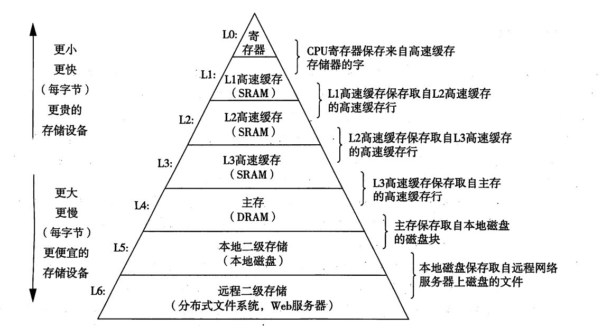

## 1.3 计算机硬件简介

### 1.3.1 处理器
CPU从内存中取出指令并执行，在每个CPU的周其中，首先从内存中取出指令，解码以确定其类型和操作数，然后按照指令执行，这就是CPU的运行方式。每一个CPU都有一套可执行的专门指令集，不同处理器的指令集是不相通的。

CPU的结构可以详见[计算机组成原理]()，这里简要介绍组成CPU的一些组件：
- **通用寄存器**：用于保存关键变量和临时结果
- **程序计数器**：保存将要取出的下一条指令的内存地址
- **堆栈指针**：指向内存中当前栈的顶端，该栈包含了每个执行过程的栈帧。
- **程序状态字寄存器**：该寄存器包含条件码位、CPU优先级、模式（用户态或内核态）以及其他控制位。

现在的CPU基本使用流水线、超标量CPU的设计，用于更快速的取指、解码和执行。

多数CPU都有两种模式，即内核态和用户态。通常在PSW(程序状态字寄存器)中有一个二进制位能控制这两种模式，当在内核态运行时，CPU可以执行指令集中任一指令，并使用硬件的每种功能。

相反在用户态下，CPU仅允许执行整个指令集中的一个子集，并能够访问所有功能的一个子集。这里也不会允许在用户态将PSW中的模式位摄制成内核态。

为了从操作系统中获得服务，用户程序必须使用**系统调用(system call)**以陷入内核并调用操作系统，`TRAP`指令能够把用户态切换成内核态，并启用操作系统。

**多线程**允许CPU保持两个不同的线程状态，然后在纳秒级的时间尺度来回切换。**多核**则是在一个CPU芯片上装有多个独立的CPU，并且每一个CPU都有分离的L2缓存。

GPU值得是由成千上万个微核组成的处理器，其擅长处理大量并行的简单计算，但是不能胜任串行任务，很难编成，因此操作系统本身不太可能运行在GPU上。

### 1.3.2 存储器

计算机中第二种主要部件是存储器，理想情况下，存储器应该速度块、容量大、便宜。但是当前的技术无法同时满足这三个目标，因此一般采取分层次的存储方式，如下图：

存储系统的顶层是CPU中的寄存器，其和CPU一样快，可以直接参与CPU的运算，其典型容量都小于1KB。

下一层是高速缓存，多数由硬件控制，其速度慢于寄存器。现代操作系统一般都有三个缓存，**L1缓存**一般都在CPU中，用来将已解码的指令调入CPU的执行引擎。而近来使用过的若干兆字节的内存字，一般会存放在**L2缓存**，以此类推还有**L3缓存**。L1和L2缓存的区别在于时序，L1缓存基本不存在延时，而L2缓存的访问会延时1/2个时钟周期。

再下一层是主存，也称为随机访问存储器(RAM)，也就是我们笔记本中的内存的说法。再往后就是辅存，也称为ROM，它的特点就是断电以后不会丢失内容。

### 1.3.3 磁盘

详情见[5.4 盘]()

磁盘是一种机械装置，在一个磁盘中由一个或多个金属盘片，它们以5400rpm、7200rpm、10800rpm或者更高的速度旋转。从边缘开始有一个机械悬臂横在盘面上，有点类似于老式唱片机。信息和数据是写在磁盘的一系列同心圆上，在任意一个给定臂的位置，每一个磁头可以读取一段环形区域，称为**磁道**。

许多计算机支持**虚拟内存**机制，这种机制使得期望运行大于物理内存的程序称为可能。方法是将程序放在磁盘上，而将主存作为一种缓存，用来保存最频繁使用的部分程序。

### 1.3.4 I/O设备

略...

### 1.3.5 总线

系统有很多总线，大致分为以下几种：
- PCIe
- DDR3/4/5
- USB
- ...

### 1.3.6 启动计算机

简要的系统启动如下：
1. BIOS开始运行（BIOS是基本输入输出系统，内含底层I/O软件，包括键盘/屏幕/磁盘IO过程），首先检查所安装的RAM数量，键盘和其他基本设备是否安装并正常响应。
2. BIOS通过尝试存储在CMOS存储器中的设备清单决定启动设备，例如启动分区。
3. 操作系统开始询问BIOS，获得配置信息，并家在全部的设备驱动程序。

## 1.4 操作系统的种类

- 大型机操作系统
- 服务器操作系统
- 多处理器操作系统
- 个人计算机操作系统
- 掌上计算机操作系统
- 嵌入式操作系统
- 传感器节点操作系统
- 实时操作系统
- 智能卡操作系统