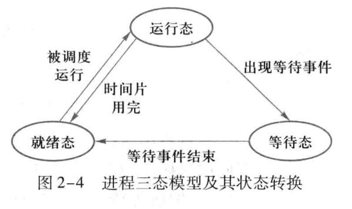
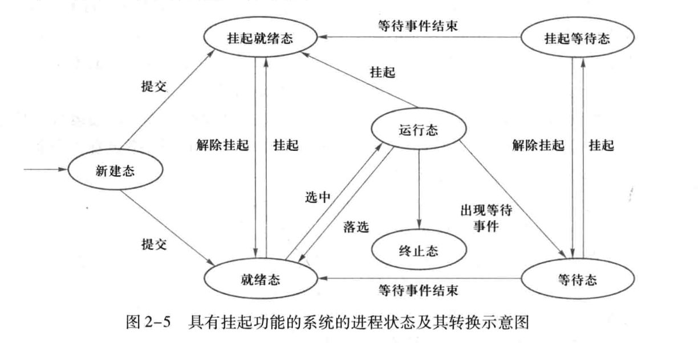

## 2.1 进程

### 2.1.1 进程模型

一个进程就是一个正在执行程序的实例，也可以理解为一个进程是某种类型的一个活动，它有程序、输入、输出以及状态。CPU在同一瞬间，其实只能运行一个进程，但是CPU可以快速切换进程，在一段长的时间看来，所有的进程是并行的。

由于CPU在各进程之间的来回切换，所以每个进程执行运算的速度是不确定的。**所以对进程编程时不能对时序做任何想当然的假设**。例如，一个I/O进程，用流式磁带机恢复备份文件，执行一个10000此的空循环以等待磁带机到达正常速度，如果CPU在过程中切换了其他进程，那么可能磁带机到达正常速度时，该进程还没有开始运行。

### 2.1.2 进程创建

首先导致进程创建只有4个主要事件：
1. **系统初始化**：

    在启动操作系统时，系统会创建若干个进程。
2. **正在运行的程序执行了创建进程的系统调用**：

    一个正在运行的进程可以发出系统调用，以便创建一个或多个新进程协助其工作。
3. **用户请求创建一个新进程**：

    在交互式系统中，键入命令或者启动程序会开始一个新的进程。
4. **一个批处理作业的初始化**：

    这一种情形旨在大型机的批处理系统中应用。

#### **创建进程的步骤**

在UNIX系统中，只有一个系统调用可以创建新进程：`fork`，步骤为：
1. 调用`fork`创建与调用进程相同的副本，两个进程拥有相同的内存映像、同样的环境字符串和同样的打开文件。
2. 子进程执行`execve`系统调用，以修改其内存映像并运行一个新的程序。

在Windows中，只需要一个`CreateProcess`系统调用，既可以处理进程的创建，也负责把正确的程序装入新进程。

### 2.1.3 进程的终止

进程的终止通常由下列条件引起：
1. 正常退出（自愿）
2. 出错退出（自愿）
3. 严重错误（非自愿）
4. 被其他进程杀死（非自愿）`kill`

### 2.1.4 进程的层次结构

当进程创建了另一个进程后，父进程和子进程就以某种形式继续保持关联。子进程自身可以创建更多的进程，这些进程共同组成一个**进程组**。

在UNIX中，进程的层次结构很明显，是树状的层次结构，用UNIX启动自己为例：一个名为init的特殊进程出现在启动映像中，参数为终端的数量，接着，该进程会为每一个终端创建一个新进程。这些终端进程会等待用户登录，等用户登录成功，该登录进程就会执行shell准备接受命令，以此类推，系统中所有进程都属于以init为根的一棵树。

### 2.1.5 进程的状态

进程的状态可以粗略的分成三种：运行、阻塞和就绪。
- **运行态**：该时刻进程实际占用CPU。
- **阻塞态**：除非某种外部事件发生，否则进程不能运行。也就是进程在逻辑上不能运行，常见的例子时等待输入。
- **就绪态**：可以运行，但是因为其他进程正在运行而暂时停止。

进程三态模型如下图所示：


这里的等待也就是阻塞。

1. 运行-阻塞

    进程因为等待输入或者其他事件，逻辑上不能运行，因此阻塞。
2. 运行-就绪

    调度程序选择了另一个进程。
3. 阻塞-就绪

    出现了有效输入或者其他等待事件结束。
4. 就绪-运行 

    调度程序选择了该进程。

除了进程的三态模型，还有五态模型和七态模型。五态相比三态多了**新建态**和**终止态**，表示进程的创建和结束。而七态模型则多了**挂起**，三态模型和五态模型都假设所有进程都在内存中，但是如果内存不够用，就必须把某些进程挂起，对换到磁盘对换区中，释放占有的资源。

新增的两个状态为：
- **挂起就绪态**：进程具备运行条件，但是目前在外存中，只有它对换到内存才能被调度执行。
- **挂起等待态**：进程正在等待某一个事件，并且目前在外存中。

七态模型的状态转移如下图所示：


### 2.1.6 进程的实现

进程模型的实现依靠**进程表**，也称为**进程控制块(Process Control Block)**。PCB是进程实体的一部分，有以下作用：
- PCB是进程存在的唯一标识
- 操作系统能且只能对PCB进行进程控制和调度
- PCB记录了操作系统所需要的，用于描述进程的当前情况以及控制进程运行的全部信息

PCB中的信息包括：
1. **进程标识符**
    1. 内部标识符
    2. 外部标识符
2. **处理机状态**
    1. 通用寄存器
    2. 指令计数器
    3. 程序状态字PSW
    4. 用户栈指针
3. **进程调度信息**
    1. 进程状态
    2. 进程优先级
    3. 进程调度所需的其他信息，例如进程已执行时间总和，进程等待时间总和
    4. 事件，指进程由执行-阻塞所等待的事件
4. **进程控制信息**
    1. 程序和数据的地址
    2. 进程同步和通信机制，例如消息队列指针和信号量
    3. 资源清单，指除CPU外，进程所需要的全部资源和已经分配到该进程的资源清单
    4. 链接指针，指向该进程所在队列的下一个进程的PCB首地址

### 2.1.7 多道程序设计模型

多道程序设计可以提高CPU的利用率，因为如果进程需要等待I/O，那么这段时间CPU是空闲的，就可以运行其他进程，具体计算公式如下：
```
CPU利用率 = 1 - p^n
```
其中，`p`是一个进程等待I/O时间和停留在内存中的事件比，`p^n`为n个进程都在等待I/O的概率。
|
