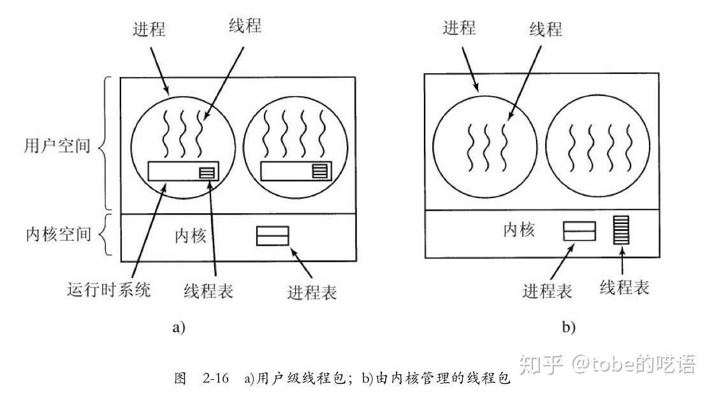
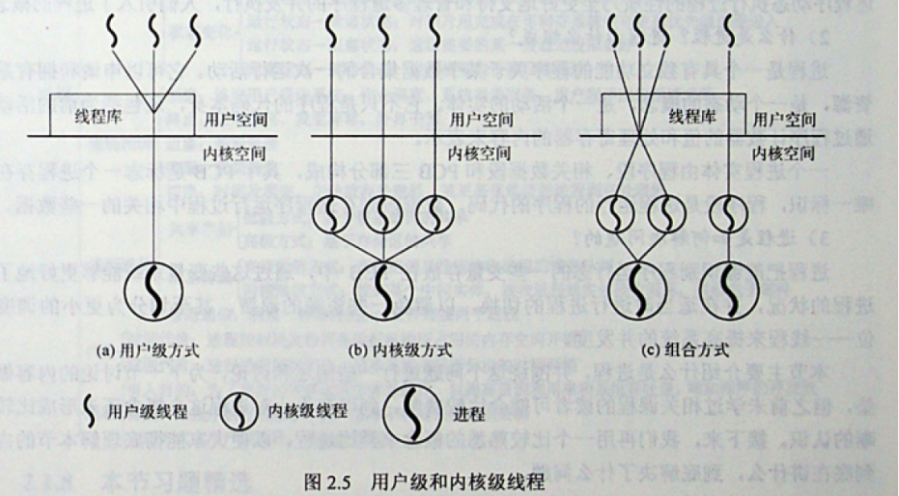

## 2.2 线程

### 2.2.1 线程的使用

**为什么要有线程？**
1. 在一个应用中同时发生许多活动，某些活动会被阻塞，通过将这些程序活动分离，程序设计模型可以更简单。**不需要考虑中断、定时器和上下文切换等**。
2. 线程比进程更轻量级，所以线程的创建和撤销更快。
3. 同样，对于I/O密集型的程序，多线程是可以提高速度的。

以文字处理软件为例子：
> Word中，磁盘保存、键盘输入、格式化显示可能是一起发生的，但是如果是单线程，需要顺序完成，那么在磁盘保存的时候，就不能接收键盘输入，因此非常的不方便。而使用了多线程，不同的功能由不同线程完成，因此可以并行工作。

### 2.2.2 经典的线程模型

进程模型基于两种独立的概念：**资源分组处理**和**执行**。可以认为，进程是用某种方法将相关的资源集中在一起进行管理。而进程的执行，需要用到线程的概念。

也就是说，进程用于把资源集中到一起，线程则是在CPU上被调度执行的实体。

在同一个进程中并行多个线程，是对在同一台计算机上并行多个进程的模拟。前者多线程共享一个地址空间和其他资源，后者共享物理内存、磁盘等资源。

进程中的不同线程拥有完全一样的地址空间，也就意味着共享相同的全局变量。线程之间是没有保护的，原因也很简单，没有必要。因为进程是由同一个用户创建的，该用户在一个进程中创建多线程是为了让多个线程相互合作。

线程中的内容：
1. 程序计数器：用于记录接着要执行哪一条指令
2. 寄存器：用于保存线程当前的工作变量
3. 堆栈：用于记录执行历史，其中每一帧保存了一个已调用但是还没有从中返回的过程。
4. 状态

### 2.2.3 POSIX线程
为了实现可移植的线程程序，IEEE定义了线程的标准。定义的线程包叫`pthread`，大部分UNIX系统都支持该标准，一些常见的pthread函数调用如下：
- `pthread_create`
    创建一个新线程
- `pthread_exit`
    结束调用的线程
- `pthread_join`
    等待一个特定的线程退出
- `pthread_yield`
    释放CPU来运行另一个线程
- `pthread_attr_init`
    创建并初始化一个线程的属性结构
- `pthread_attr_destroy`
    删除一个线程的属性结构

详细的多线程编程参见[CppThread](../../cpp/CppThread/chapter1.md)

### 2.2.4 在用户空间中实现线程

有两种主要的方法实现线程包：在用户空间中和在内核中。

对于第一种方法是把整个线程包放在用户空间中，内核对线程包一无所知。从内核角度考虑，就是按正常的方式管理，即单线程进程。这种方式的优点在于，用户级线程包可以在不支持线程的操作系统上实现。

如上图的第一个子图，线程在一个运行时系统的上层运行，该运行时系统是一个管理线程的过程的集合，包括但不限于`pthread_create`、`pthread_exit`、`pthread_join`等。

在用户空间管理线程时，每个进程需要有专用的线程表，用来跟踪该进程中的线程。这些表和内核的调度表基本一致。但是和内核中管理线程不同的是，如果所有线程的指令都装入寄存器，线程的切换会比陷入内核快一个数量级，并且用户级线程允许每一个进程有自己定制的调度算法。

但是用户级线程有一些明显的问题，包括以下：
1. **如何实现阻塞系统调用**

    假设在还没有任何输入前，一个线程读取键盘，让该线程实际进行系统调用是不可接受的，因为会停止所有的线程。
2. **关于缺页中断问题**

    因为所有程序都一次性放在内存中，如果某个程序调用跳转到了一条不在内存中的指令，就会发生页面故障，因为内核不知道线程的存在，因此相关进程就会直接被阻塞。
3. **线程运行永久问题**

    线程一旦开始运行，由于没有始终中断，也没有轮转调度，因此除非这一个线程自动放弃，其他线程没有办法抢夺。

### 2.2.5 在内核中实现线程

和在用户空间类似，只不过线程表和线程的管理是内核直接管理控制。内核线程虽然不会产生系统调用问题，但是在内核中创建或撤销线程的代价是比较大的，同时，信号是传给进程的，那么当信号到来时，该由哪一个线程处理？

### 2.2.6 混合实现

一种方法是将用户级线程和内核级线程多路复用，编程人员决定有多少个内核级线程和多少用户级线程彼此多路复用。如下图：

### 2.2.7 调度程序激活机制

尽管内核级线程在一些关键点上优于用户级线程，但是无可争议的是内核级线程的速度慢。因此有研究人员提出了**调度程序程序激活**机制。

调度程序激活的目标是模拟内核线程的功能，但是为线程包提供通常在用户空间才能实现的更好的性能和林活动。特别地，如果用户线程从事某种系统调用时是安全的，就不该进行专门的非阻塞调用或者进行提前检查。

该机制的运行步骤如下：
1. 内核给每个进程安排一定数量的虚拟处理器
2. **上行调用**：当内核了解到一个线程被阻塞之后，内核通知该进程的运行时系统，并在堆栈中以参数形式传递有问题的线程编号和所发生事件的一个描述。内核通过在一个已知的起始地址启动运行时系统，从而发出通知。
3. 一旦激活，运行时系统就重新调度其线程。当内核知道原来的线程可以运行时，内核有一次上行调用，通知运行时系统这一事件，由运行时系统自行判断。

总结来说，就是内核将线程调度的决定权交给用户空间的运行时系统。

[详情参见](../image/Asynopsis.pdf)

### 2.2.8 弹出式线程

在分布式系统中，线程的处理会有所不同。如果按照传统的线程处理方式，例如服务请求，传统的方法是将进程或线程阻塞在`receive`的系统调用上，等待消息的到来。

但是实际中有另一种处理方式，一个消息的到达导致系统创建一个处理该消息的线程，这种线程称为**弹出式线程**。也就是为控制到达的消息而创建的线程。

### 2.2.9 使单线程代码多线程化

略。