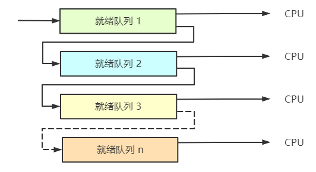

## 2.4 调度
在多道程序设计系统中，如果多个进程处于就绪态，且只有一个CPU可用，这时候就需要**调度程序**决定哪一个进程可以运行，而该程序使用的算法称为**调度算法**。

### 2.4.1 调度简介

在早期以磁带上的卡片作为输入的批处理系统时代，调度算法仅仅是依次运行磁带上的每一个作业。对于多道程序设计系统，调度算法会复杂一些，因为经常有多个用户等候服务。

个人计算机的出现让情形向两个方向发展：多数时间内只有一个活动进程，以及现在CPU资源不是稀缺资源。因此调度算法在个人PC上不是那么重要。

但是在网络服务器中，调度算法很重要。因为多个进程经常竞争CPU，同时用户的体验会由于调度算法的不同而不同。

另外，调度程序还需要考虑CPU的利用率，因为进程切换的代价是比较高的。首先用户态必须切换到内核态，然后保存当前进程的状态；接着运行调度算法选定另一个进程，之后将新进程的内存映像装入MMU，会消耗大量CPU时间。

#### 2.4.1.1 进程行为

所有进程的I/O请求和计算都是交替突发的。一般而言，CPU不停顿的运行一段时间，然后发出一个系统调用来读写文件，在完成系统调用以后，CPU又开始计算。当然，这里有些I/O活动是可以看成是计算的。

在这样的情况下，有些进程花费绝大多数时间在计算上，有些在绝大多数时间在I/O上。前者称为**计算密集型**，后者称为**I/O密集型**。

随着CPU越来越快，更多的进程倾向于I/O密集型。这是因为CPU的改进比磁盘改进快的多。

#### 2.4.1.2 何时调度

由于存在需要调度处理的各种情形，所以在何时进程调度决策很重要，一般有以下集中情况：
1. 在创建新进程之后，需要决定运行父进程还是子进程。
2. 在一个进程退出时，需要从就绪进程集中选择某一个进程。
3. 当一个进程阻塞在I/O或信号量上时，需要选择另一个进程。
4. 当一个I/O中断发生时。

#### 2.4.1.3 调度算法分类

1. 批处理
2. 交互式
3. 实时

#### 2.4.1.4 调度算法的目标

在不同环境下，调度算法的目标是不一样的：

1. 所有系统
   - 公平：给每个进程公平的CPU份额
   - 策略强制执行：保证规定的策略被执行
   - 平衡：保持系统的所有部分忙碌
2. 批处理系统
   - 吞吐量：每小时最大作业数
   - 周转时间：从提交到终止间的最小时间
   - CPU利用率：保持系统的所有部分忙碌
3. 交互式系统
   - 响应时间：快速响应请求
   - 均衡性：满足用户期望
4. 实时系统
   - 满足截止时间
   - 可预测性

### 2.4.2 批处理系统中的调度

#### 2.4.2.1 先来先服务

在所有调度算法中，最简单的是非抢占式的**先来先服务**(first-come first-served)。进程按照它们请求CPU的顺序使用CPU，当第一个作业从外部进入系统，就立即开始并允许运行它所期望的时间长度，该作业不会因为运行时间太长而被中断。当其他作业进入时，它们会排到就绪队列的尾部。当正在运行的进程被阻塞，就绪队列中的第一个进程会接着运行。而在被阻塞进程变成就绪时，会像新来到的作业一样排在就绪队列的末尾。

算法的主要优点在于易于理解并且便于实现，而缺点在于，如果一个有大量I/O操作的进程需要运行，会重复等待，导致该进程的运行时间非常长。

#### 2.4.2.2 最短作业优先

该算法适用于运行时间可以预知的非抢占式的批处理调度算法。当输入队列中有若干个同等重要的作业被启动时，调度程序应该使用**最短作业优先算法**。

假设A、B、C、D四个作业的时间分别是8、4、4、4分钟。若按照原来顺序执行，A的周转时间是8分钟，B为12分钟(8+4)，C为16分钟(8+4+4)，D为20分钟(8+4+4+4)。按照最短作业优先的原则，A的周转时间20分钟(4+4+4+8)，B为4分钟(4)，C为8分钟(4+4)，D为12分钟(4+4+4)。

所以这样一来，每个作业的平均周转时间就是最小的。**同时需要指出，在所有作业都可以同时运行的情况下，最短作业优先算法才是最优化的。**

可以思考这个例子：
> 考虑5个作业，从A到E，运行时间分别是2、4、1、1、1，它们的到达时间是0、0、3、3、3，按照最短作业优先算法，平均等待时间是多少？

#### 2.4.2.3 最短剩余时间优先

**最短剩余时间优先算法**是最短作业优先的抢占式版本，使用该算法，调度程序总是选择剩余时间最短的进程运行，当一个新作业到达，其整个时间同当前进程的剩余时间做比较，如果新的进程时间更少，当前进程就会被挂起，运行新的进程。

### 2.4.3 交互式系统中的调度

#### 2.4.3.1 轮转调度

一种最古老、简单、公平的算法是**轮转调度**。每个进程被分配一个时间段，称为时间片，允许该进程在该时间段内运行。如果时间片结束时该进程该在运行，则剥夺CPU并分配给另一个进程。如果该进程在时间片结束前阻塞或结束，则CPU立即切换。

该算法的关键在于，时间片设置的大小。进程切换也称为上下文切换，是有时间消耗的。假设进程切换需要1ms，而时间片是4ms，这样CPU时间的20%是消耗在管理上，显然很不划算。

但是如果我们将时间片设置成100ms，又会产生，例如同时到达50个请求，第二个进程会在100ms后才启动，依次类推，最后一个进程必须等待5秒。

因此通常时间片设置为20ms~50ms。

#### 2.4.3.2 优先级调度

轮转调度有一个隐含假设，就是所有的进程同等重要。而在多用户的计算机系统中，不同用户的进程优先级是不一致的。因此**优先级调度**的思想很简单，每个进程被赋予一个优先级，允许优先级高的可运行进程先运行。

同时为了防止高优先级进程无休止地运行，调度程序可能在每个时钟中断降低当前进程的优先级；另一种方法是，每一个进程赋予一个最大时间片，当时间片用完，次高优先级的进程便获得运行机会。

并且，优先级可以是静态赋予也可以是动态赋予。

#### 2.4.3.3 多级队列

设立优先级类，属于高优先级类的进程运行1个时间片，属于次高优先级的进程运行2个时间片，再次一级运行4个时间片，以此类推。当一个进程用完分配的时间片后，将会被移动到下一类。

#### 2.4.3.4 最短进程优先

在批处理系统中，最短作业优先基本等同于最短响应时间，因此如果把该策略用于交互进程，会非常不错。

因为交互进程遵循：等待命令、执行命令、等待命令、执行命令……这样的循环模式，如果将每一条命令的执行看成一个独立的作业，我们就可以通过最短作业优先来使响应时间最短。

交互式进程的问题在于，如何从当前可运行进程中找出最短的进程。有一种方法是根据进程过去的运行时间预测。并且侧重于当前测量的时间，有滑动平均的思想在里面。

#### 2.4.3.5 保证调度

#### 2.4.3.6 彩票调度

#### 2.4.3.7 公平分享调度

### 2.4.4 实时系统中的调度

### 2.4.5 策略和机制

### 2.4.6 线程调度

