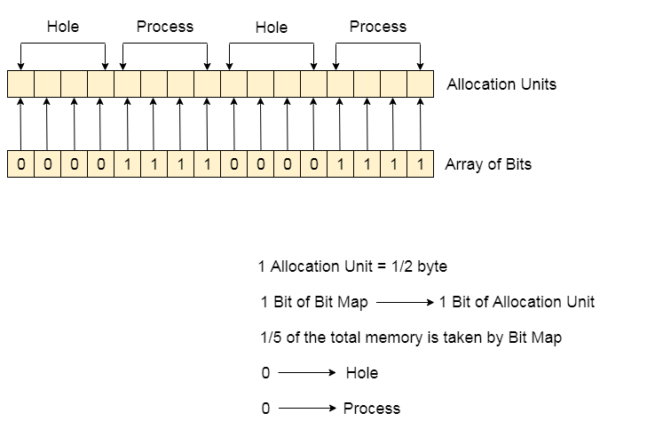

## 3.2 地址空间
正如上节所说，直接访问物理地址非常不安全，并且对于多程序并行的支持也非常薄弱。因此提出了地址空间的概念。

### 3.2.1 地址空间

要使得多个应用程序同时处于内存中并且不会相互影响，需要解决两个问题：**保护**和**重定位**。

地址空间为程序创造了一种抽象的内存，是一个进程可用于寻址内存的一套地址集合。每一个进程都有自己的地址空间，并且这个地址空间独立于其他进程的地址空间，除非特殊性况下，进程需要共享它们的地址空间。

### 3.2.2 动态重定位

如何实现这样的地址空间，最简单的解决方法是**动态重定位**，简单地把每个进程的地址空间映射到物理内存的不同部分，而实现的方法是在CPU中加上**基址寄存器**和**界限寄存器**。

基址寄存器存放程序的起始物理地址，界限寄存器存放程序的长度。每次一个进程访问内存，取一条指令，CPU硬件会在地址发送到内存总线前，自动把基址值加到进程发出的地址值上，同时会检查程序提供的地址是否等于或大于界限寄存器的值。如果访问的地址超出界限，就会产生错误并中止访问。

但是使用基址寄存器和界限寄存器实现重定位有缺点，每次访问内存都需要加法和比较运算，在没有特殊电路的情况下会很慢。

### 3.2.3 交换技术

如果内存足够大，可以保存所有进程，那么现在的方案已经足够。但实际上，所有进程需要的RAM数量总和都远远超过存储器能够支持的范围。

因此，两种处理内存超载的方法：
1. 交换技术：把一个进程完整调入内存，运行一段时间后，再存回内存。
2. 虚拟内存：使得程序再只有一部分调入内存的情况下运行。

交换技术的思想很好理解，将其他进程调出内存来为新进程腾出空间。这其中可能会出现产生多个空洞的问题，针对这个问题，内存紧缩技术可以将所有进程尽可能向下移动，将小的空闲区合成大块。

产生的另一个问题是，进程进入内存所分配地址的大小。如果进程的大小固定并不再改变，则分配会很简单。但是现在进程的数据段会增长，那么需要堆中动态地分配内存，这种情况下，如果相邻是空闲区则很容易，如果相邻是另一个进程，那么就需要交换了。

由此衍生出一种可用的方法，当进程进入内存中时，为进程分配一些额外的内存，而交换进程时只交换实际使用的内存中的内容。

直白来说，就是为进程多分配一部分空间，当数据段、程序堆栈增长，再下一次进入内存时，在已使用内存的基础上再多分配一些。

### 3.2.4 空闲内存管理

在动态分配内存时，操作系统必须对其进行管理，一班由两种方法跟踪内存使用情况：位图和空闲区链表。

#### 3.2.4.1 位图

位图就是将内存划分成几个字或几千字节的分配单元。每个分配单元对应于位图中的一位，0表示空闲，1表示占用。直观上就是将内存分块，利用`0`和`1`表示块是否已经使用。

对于位图来说，分配单元的大小是一个重要的设计因素。分配单元越小，位图越大。如果进程的大小不是分配单元的整倍数，就会存在一定数量的内存浪费。

同时，该方法还有一个问题：我们需要根据进程所需要的内存大小分配，这就涉及到需要对位图中连续比特串进行查找，找到指定长度的，而这种查询又是一个很耗费时间的操作。

#### 3.2.4.2 空闲区链表

空闲区链表的每一个节点包含以下域：
- 空闲区(H)或进程(P)的指示标志
- 起始地址
- 长度
- 只想下一节点的指针

在上面的这个例子中，段链表是按照地址排序的，好处是当进程终止或被换出时，链表的更新非常直接。一般来说，段链表使用双向链表可能会比单向更方便。

#### 3.2.4.3 内存分配算法
在为创建的进程分配内存时，由以下几种算法：
1. **首次适配**：存储管理器知道需要为进程分配多少内存，沿着段链表搜索，找到一个空闲区，将其查分成使用部分和未使用部分。
2. **下次适配**：该算法和首次适配类似，不同之处在于，每次找到合适的空闲区都会记录当时的位置，下次再寻找不会从头寻找，而是从上次结束的地方开始。
3. **最佳适配**：搜索整个链表，找出能容纳进程的最小的空闲区，而不是先拆分一个以后可能会用到的大的空闲区。但是这种算法会产生大量无用的小空闲区。
4. **最差适配**：该算法为了解决最佳适配产生的小空闲区，总是分配最大的可用空闲区，使新的空闲区较大从而可以继续使用。