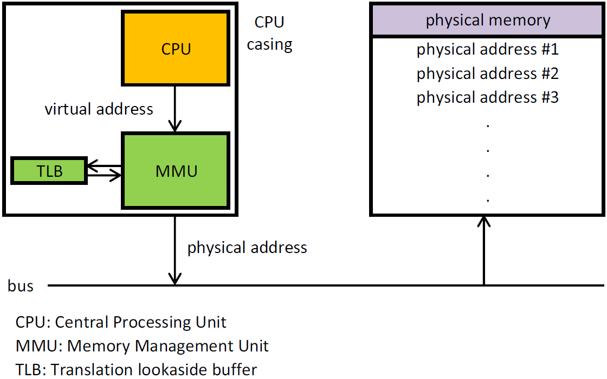
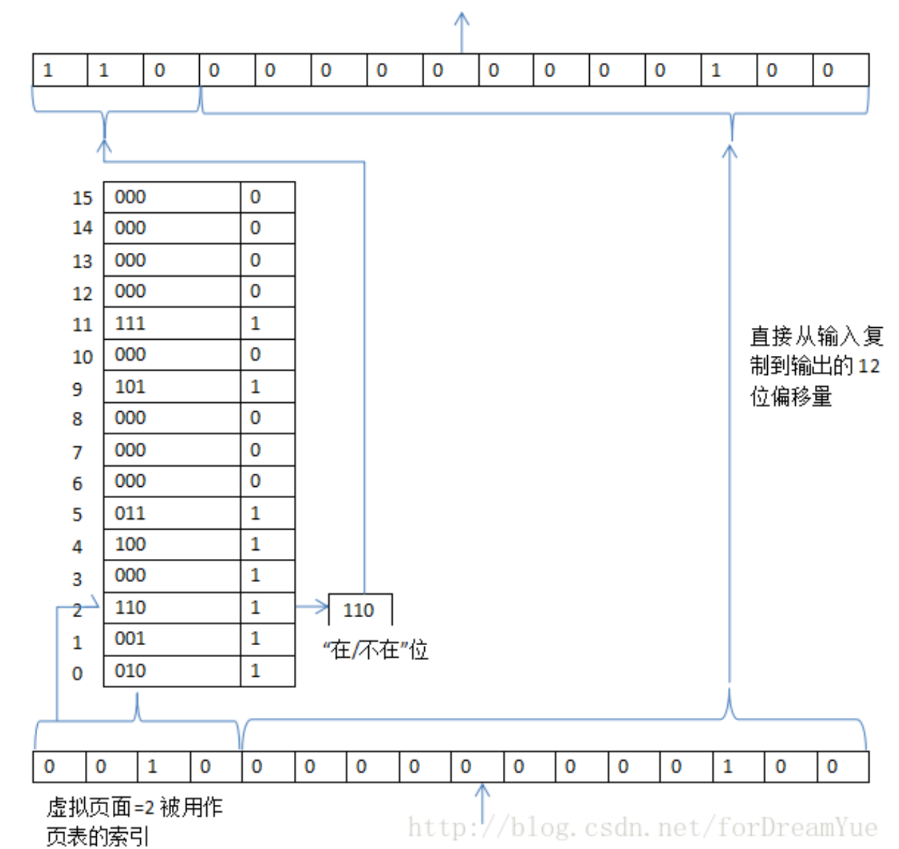
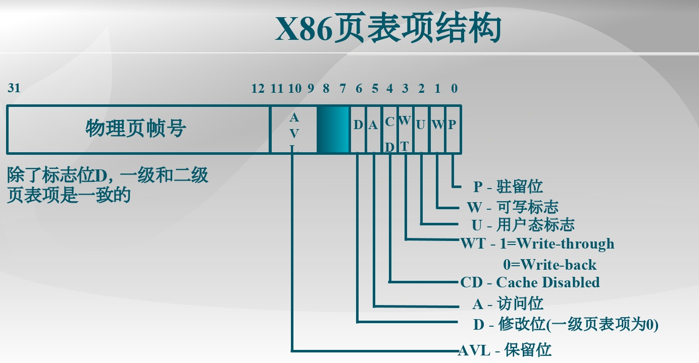
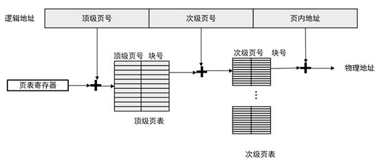
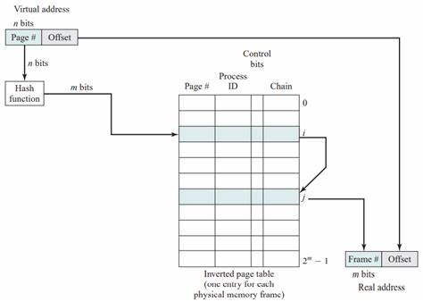

## 3.3 虚拟内存

地址空间可以解决多进程带来的内存不够问题，但是如果一个进程所需要的内存依然不够呢？这就需要虚拟内存。

虚拟内存的基本思想是：每个程序拥有自己的地址空间，这个空间被分割成多个块，每一块称作一页或页面(page)。每一页由连续的地址范围，这些页被映射到物理内存，但并不是所有的页都必须在内存中才能运行程序。当程序引用到一部分在物理内存中的地址空间，由硬件立刻执行必要的映射。当程序引用到一部分不在物理内存中的地址空间时，由操作系统负责将确实的部分装入物理内存并重新执行指令。

### 3.3.1 分页

大部分虚拟内存系统中都是用了一种称为分页的技术。由程序产生的地址称为虚拟地址，它们构成了虚拟地址空间。如果使用虚拟内存的情况下，虚拟地址是被送到内存管理单元MMU，MMU把虚拟地址映射为物理内存地址。

在一台可以产生16位地址的计算机，地址范围从0-64K-1，且这些地址是虚拟地址。然而物理内存只有32KB，因此虽然可以编写64KB的程序，磁盘上必须有一个最多64KB的程序核心映像的完整副本，但是物理内存中只有部分程序片段。

虚拟地址空间按照固定大小划分成称为**页面**的若干单元，在物理内存中对应的单元称为**页框**。页面和页框的大小通常是一样的，RAM和磁盘之间的交换总是以整个页面为单元进行的。

因此MMU在收到虚拟地址后，会根据映射结果，比如这个页面对应为页框2，然后执行相应的转换，将地址送到总线中。

如果程序访问了一个没有映射的页面，就会陷入内核，该陷阱称为**缺页中断**或者**缺页错误**。操作系统会找到一个很少使用的页框，并把页框中的内容写入磁盘，然后把需要访问的页面读到刚才回收的页框中，修改映射关系。

上图就是MMU如何实现虚拟地址映射的过程，16位虚拟地址会被分为4位页号和12位偏移量。4位的页码号可以表示16个页面，12位偏移可以称为全部4096个字节编址。

### 3.3.2 页表

页表的最简单实现是，虚拟地址到物理地址的映射表示为：虚拟地址被分成**虚拟页号**(高位)和**偏移量**(低位)。虚拟页号可用为页表的索引，以找到该虚拟页面对应的页表项，然后把页框号拼接到偏移量的高为，替换调虚拟页号。

#### 3.3.2.1 页表项的结构

页表项的结构与机器密切相关，但是不同机器的页表项存储信息却大致相同。大概有以下几种：
- 页框号
- 在/不在位
- 保护：读/写/执行
- 修改：如果已经修改过，那么该页必须写回磁盘；如果没有修改，则可以直接丢弃。
- 访问：帮助操作系统在发生缺页时选择被淘汰的页面。

### 3.3.3 加速分页过程

在任何分页系统中，都需要考虑两个主要问题：
1. 虚拟地址到物理地址的映射必须非常快。
2. 如果虚拟地址空间很大，页表也会很大。

第一个问题是由于每次访问内存都需要进行虚拟地址到物理地址的映射。因此页表查询需要很快，否则会称为执行指令的瓶颈。

第二个问题是由于，现代计算机至少使用32位虚拟地址，现在更普遍使用64位，这就导致地址空间的页表非常大。并且每一个进程都有自己的页表。

如何加速分页基址并处理大的地址空间，有以下几种方案：

#### 3.3.3.1 转换检测缓冲区

首先我们需要知道，分页以后由于需要查询页表项等操作，原本只需要一次访问内存会变成至少两次访问内存，这会带来性能上的下降。

而计算机设计者又观察到一个事实：大多数程序总是对少量的页面多次访问。因此只有很少的页表项会被反复读取，而其他页表项则很少被访问。

解决方案是为计算机设置一个小型的硬件设备，将虚拟地址直接映射到物理地址，而不必再访问页表。这个设备就称为**转换检测缓冲区(TLB)**。有时又称为相联存储器或快表。

TLB通常在MMU中，包含少量的表项，每个表项记录了一个页面的相关信息，包括虚拟页号、修改位、保护位、物理页框等。

TLB的工作流程如下：
1. CPU将虚拟地址放入MMU进行转换。
2. 硬件首先将虚拟页号与TLB中所有表项(并行)进行匹配，如果有则会根据规则进行替换或者保护。
3. 如果虚拟页号不在TLB中，MMU就会进行正常的页表查询，并从TLB中淘汰一个表项。

#### 3.3.3.2 软件TLB管理

之前的设计中，我们都假设对于TLB的管理和失效处理都会由MMU硬件实现，只有当内存中没有找到某个页面，彩绘陷入操作系统。

而现在很多机器，对于TLB表项的管理是由软件实现的，也就是操作系统。当TLB失效，不再是由MMU到页表中查询需要的页表项，而是生成TLB失效问题将其交给操作系统。操作系统必须先找到该页面，然后从TLB中删除并装载新的表项。

### 3.3.4 针对大内存的页表项

对于处理巨大的虚拟地址空间，介绍两种解决办法：

#### 3.3.4.1 多级页表

我们可以将32位虚拟地址划分为3个部分(可以更多)：
- PT1域 10位
- PT2域 10位
- 偏移量域 12位

多级页表的工作原理如下：
1. MMU首先提取PT1域的值并把该值作为访问顶级页表的索引
2. 顶级页表的表项包含二级页表的地址或页框号，再从二级页表项中找到该虚拟地址对应的页框号。

当页表项扩展到64位时，四级页表已经能表示256TB大小，够用很长一段时间，因此芯片制造商没有再多家一层页。

#### 3.3.4.2 倒排页表

针对页式调度层级不断增长的另一种解决方案是倒排页表。设计如下：实际内存中的每一个页框对应一个表项，而不是每一个虚拟页面对应一个表项。例如对于64位虚拟地址，4KB的页，4GB的RAM，一个倒排页表仅需要1048576个表项，表项中记录了哪一个进程/虚拟页面定位于该页框。

虽然倒排页表节省大量空间，但是从虚拟地址到物理地址的转换汇编的很困难。

解决这个问题的办法是使用TLB，如果TLB失效，实现该搜索的方法是建立一张hash表，用虚拟地址来hash，当前所有在内存中的具有相同hash值的虚拟页面被链接在一起。

