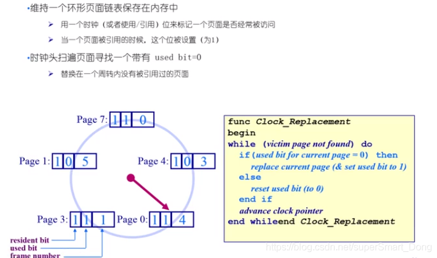
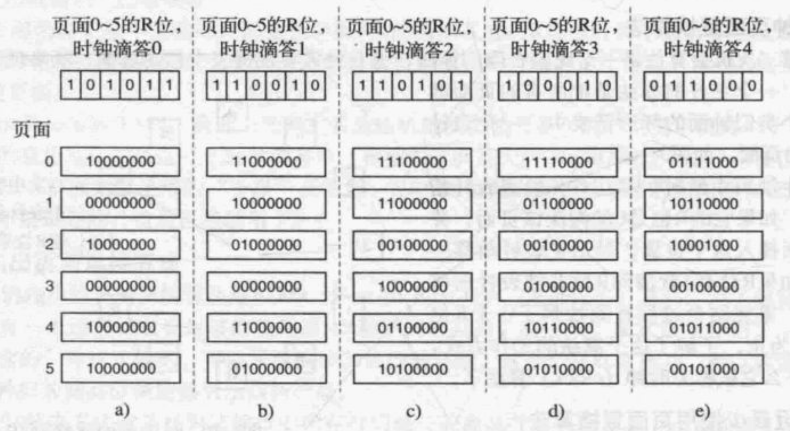

## 3.4 页面置换算法
当发生缺页中断，操作系统必须在内存中选择一个页面将其换出内存，因此需要页面置换算法来决定置换哪一个页面。

同时需要注意的是，页面置换问题还会发生在例如高速缓存中、Web服务器的缓存中。

### 3.4.1 最优页面置换算法

最好的页面置换算法应该是这样：在缺页中断发生时，我们可以知道该页面在多少条指令后被访问，最优页面置换算法就是将置换标记最大的页面，即：页面A在800条指令后才会被使用，页面B则在200条指令后会被使用，那么肯定是置换页面A。

这个算法唯一的问题在与无法实现，因为我们无法预测各个页面下一次将在什么时候被访问。

该算法提出的目的是用于比较其他算法的性能，该算法只存在理论中，只能用于仿真。

### 3.4.2 最近未使用页面置换算法

大部分具有虚拟内存的计算机中，系统为每一个页面设置两个状态位，当页面被访问时置R位，页面被修改置M位，并且这种更新是由硬件实现的，一旦设置某位为1，就会一直保持直到操作系统将其复位。

我们可以使用R位和M位构造一个简单的页面置换算法：当启动一个进程，它的所有页面的两个位都设置成0，R被定期清零。当发生缺页中断，操作系统检查所有页面，并根据R/M位分成四类：
1. 类0：无访问，无修改
2. 类1：无访问，被修改
3. 类2：被访问，无修改
4. 类3：被访问，被修改

算法会从类编号最小的非空类随机挑选一个页面淘汰。该算法的开销比较小，虽然性能不是最好的，但是够用。

### 3.4.3 先进先出页面置换算法

操作系统维护一个所有当前在内存中的页面的链表，最新进入的页面放在表尾，最早进入的放在表头。当发生缺页中断，淘汰表头的页面，并将新调入的页面加到表尾。

该算法的问题在于，可能会淘汰常用的页面。

### 3.4.4 第二次机会页面置换算法

该算法是对FIFO算法的简单改进，针对了FIFO可能会淘汰常用页面的问题。该算法检查最老页面的R位，如果R位是0，则该页面又老又没用，直接替换；而如果R位是1，则将R清零，并把该页面防盗表尾。

### 3.4.5 时钟页面置换算法

由于第二次机会页面置换算法总是需要在链表中移动页面，因此更好的方法是将所有页面保存在类似于钟面的环形链表中，用一个表指针指向最老的页面。

检查和替换的逻辑和第二次页面置换一致。

### 3.4.6 最近最少使用页面置换算法

Least Recently Used即LRU算法是基于这样的观察：在前面几条指令中频繁使用的页面可能在后面几条指令中也会被使用，反过来说，就是很长时间没有使用的页面，之后一段时间也非常有可能不用。

完全实现LRU应该是，内存中维护一个所有页面的链表，最近最多使用的页面在表头，最近最少使用的页面在表尾，每次访问内存都需要更新整个链表。

还有一种简单的实现方法，硬件有一个64位计数器C，将C放在每一个页表项中，只要对该页面访问一次，就在页表项的C中加1.

### 3.4.7 软件模拟LRU

上述的硬件实现方法可行但不适用，因为很少有计算机有这样的硬件，因此需要软件实现这个方案。

软件实现的方案称为NFU(Not Frequently Used)，该算法将每个页面和一个软件计数器相关联，计数器的初始值为0，每次时钟中断，有操作系统扫描内存中所有页面，将每个页面的R位加到计数器上。这个计数器大体跟踪了各个页面被访问的频繁程度，如果发生缺页中断，则置换计数器值最小的页面。

但是该算法也有一个问题，就是相对于老页面，新页面可能很快就会被淘汰，反而只有老页面会留下。针对这个问题的解决方案是：**老化**。

老化的具体操作是：首先在R位被加进之前将计数器右移一位，其次将R位加到计数器最左端的位而不是最右端的位。

### 3.4.8 工作集页面置换算法

绝大多数进程表现出一种**局部性访问**的行为，即在进程运行的任何阶段，都只访问较少的一部分页面。一个进程当前正在使用的页面的集合称为**工作集**。如果整个工作集都被装入内存，那么进程在运行到下一个阶段前，不会产生很多缺页中断。

因此操作系统会跟踪进程的工作集，确保在进程运行以前，它的工作集就已经在内存中，目的是减少缺页中断。

### 3.4.9 工作集时钟页面置换算法

略。

### 3.4.10 总结

略。