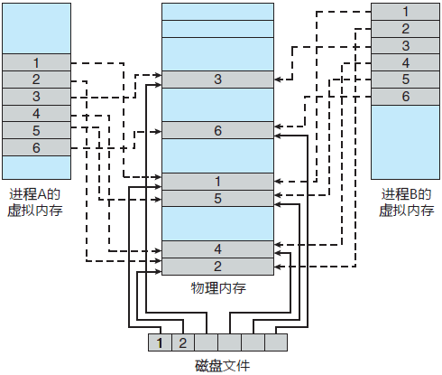
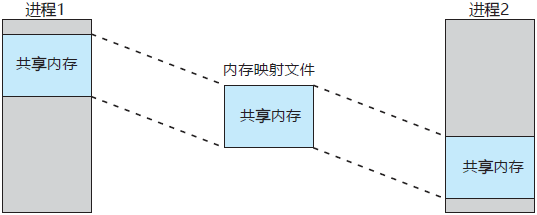

## 3.5 分页系统中的设计问题

在设计分页系统，还有一些问题需要思考，以下是相关问题。

### 3.5.1 局部分配策略和全局分配策略

首先需要考虑的是，在置换页面时，内存中有不同进程的页面，置换页面是置换发生了缺页中断的进程的页面，还是置换全局所有页面呢？

按照分类可以分成两种：
- 局部页面置换
- 全局页面置换

在局部页面置换中，局部算法为每个进程分配固定的内存片段，只置换当前进程的页面。如果内存片段数量小了，即使有大量的空闲页框存在，但是因为固定了内存片段，随着工作集的增长，颠簸也会增加。而如果内存片段大了，就会产生浪费。

在全局页面置换中，全局算法在可运行进程之间动态地分配页框。但是全局算法中，系统需要不停确定给每个进程分配多少页框。

此外关于进程分配页框的算法，有一些不同的尝试：
- 定期确定进程运行的数目并为它们分配等额的页框
- 根据进程大小的比例分配相应的页面，如果是全局算法，那么该分配还需要根据PFF(缺页中断率)动态更新

通常而言，全局算法工作得比局部算法好。

### 3.5.2 负载控制

但是即使采用最理想的分配和页面置换算法，操作系统仍然可能发生颠簸，因为没有进程需要更少的内存，一旦进程的工作集超过了内存容量，就会发生颠簸。

减少竞争内存的进程数就需要将一部分进程交换到磁盘，并释放所占有的页面。

### 3.5.3 页面大小

页面大小是操作系统可以选择的参数。要确定最佳的页面大小需要在几个互相矛盾的因素之间进行权衡，从结果来看，不存在全局最优。

选择小页面的理由：
1. 小页面可以减少内部碎片，也就是减少一个页面装不满的现象。
2. 小页面可以减少任何时刻某一进程所需要的内存代大小，进程A共32KB，分8个阶段，如果页面是16KB则任意时刻都是16KB，而如果是4KB则就是4KB。

选择大页面的理由：
1. 小页面需要更大的页表，内存与磁盘的传输一般是一次一页，但是传输中大部分时间都在寻道和旋转延时，因此传输小页面和大页面的时间是差不多的。
2. TLB需要相对稀疏才能保持性能，因此大页面是值的的。

最终，一般常见的页面大小是4KB或8KB。

### 3.5.4 分离的指令空间和数据空间

大多数计算机只有一个地址空间，既存放程序也存放数据。如果地址空间足够大没有问题，而如果地址空间小，就会对地址空间的使用产生困难。

当地址空间小时，一种解决方案是为指令(程序正文)和数据设置分离的地址空间，分别称为**I空间**和**D空间**。

### 3.5.5 共享页面

在大型多道程序设计系统中，几个不同的用户同时运行一个程序是常见的。如果使用共享，就可以避免内存中有一个页面的副本。

如果系统支持分离的I空间和D空间，那么让两个进程共享程序就会变得简单。这些进程可以使用相同的I空间页表和不同的D空间页表。

同时需要专门的数据结构记录共享页面，因为这样才可以避免进程A结束，不会释放和进程B共享的代码区。

### 3.5.6 共享库

可以使用其他的粒度取代单个页面实现共享，如果一个程序被启动两次，大多数操作系统会自动共享所有代码页面，而在内存中只保留一份代码页面的副本。代阿页面总是只读的，因此这样做不存在任何问题。依赖于不同的操作系统，每个进程都有一份数据页面的私有副本，如果任何一个进程对一个数局页面进行修改，系统就会为次进程复制这个数据页面的副本，这个副本是该进程私有，执行的策略是**写时复制**。

程序的运行有时需要链接其他程序函数，链接器就是这个作用，会将所有用到的程序装载进入内存中。而如果有很多链接库重复装载，会消耗大量内存空间，这就是引入共享库的原因。

当一个程序和共享库链接时，链接器没有加载被调用的函数，而是加载一段能在运行时绑定被调用函数的存根例程。共享库在第一次被调用时装载，之后就不会被装载。

并且，整个库不是一次性地读入内存，而是根据需要，以页面为单位进行装载。

### 3.5.7 内存映射文件

共享库实际上时一个更为通用的机制——**内存映像文件**的一个特例。这种机制的思想是：进程可以通过发起一个系统调用，将一个文件映射到虚拟地址空间的一部分。在多数实现中，映射共享的页面不会实际读入页面的内容，而是在访问页面时才会被每次一页地的入，磁盘文件则被当作后备存储。当进程退出或显式地接触文件映射时，所有被改动的页面会被写回到磁盘文件中。

内存映像文件提供了一种I/O的可选模型，可以把一个文件当作内存中的大字符数组来访问。

多个进程的共享如图所示：

### 3.5.8 清除策略

缺页中断时，内存中最好有大量的空闲页框，因此为了保证有足够多的空闲页框，很多分页系统有一个称为分页守护进程的后台进程，该进程在大多数时候睡眠，定期被唤醒以检查内存的状态。如果空闲页框过少，分页守护进程通过预定的页面置换算法选择页面换出内存。

同时为了有一个缓冲，分页守护进程会清除空闲页框，但是不会立刻就写回磁盘并清空，而是保证该空闲页框是可用的，如果用到了刚刚淘汰的页框，则判断是否脏了，如果是干净的是可以直接读取的。

### 3.5.9 虚拟内存接口

这是为了进一步扩展内存地址，比如分布式共享内存等技术。

剩下略。