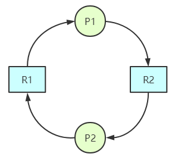

## 6.2 死锁简介

死锁的规范定义为：**如果一个进程集合中的每个进程都在等待只能由该进程集合中的其他进程才能引发的事件，那么该进程集合就是死锁的。**

简单来说，就是所有进程都在等待，但是没有一个进程可以引发唤醒其他进程的事件。因此所有进程只能无限期地等待下去。

### 6.2.1 资源死锁的条件
死锁的四个必要条件：
1. 互斥条件：每个资源要么已分配，要么可用。
2. 占有和等待条件：已得到某个资源的进程可以请求新的资源。
3. 不可抢占条件：已分配给一个进程的资源不能强制性被抢占，只能由该进程自己释放。
4. 循环等待条件：死锁发生时，系统中一定存在两个或两个以上的进程组成的一条循环，该循环中每个进程都在等待下一个进程所占用的资源。

死锁的发生一定同时满足上述4个条件。

### 6.2.2 死锁建模

我们可以用有向图建立死锁模型。有向图中有两类节点：圆形表示进程，方形表示资源。从资源节点到进程节点的有向边代表该资源已被请求和占用，而从进程节点到资源节点的有向边表示当强进程正在请求该资源。

因此两个进程竞争两个资源的死锁建模如下：

处理死锁有四种策略：
1. 忽略该问题。
2. 检测死锁并恢复。
3. 仔细对资源进行分配，动态避免死锁。
4. 破坏引起死锁的四个必要条件之一。