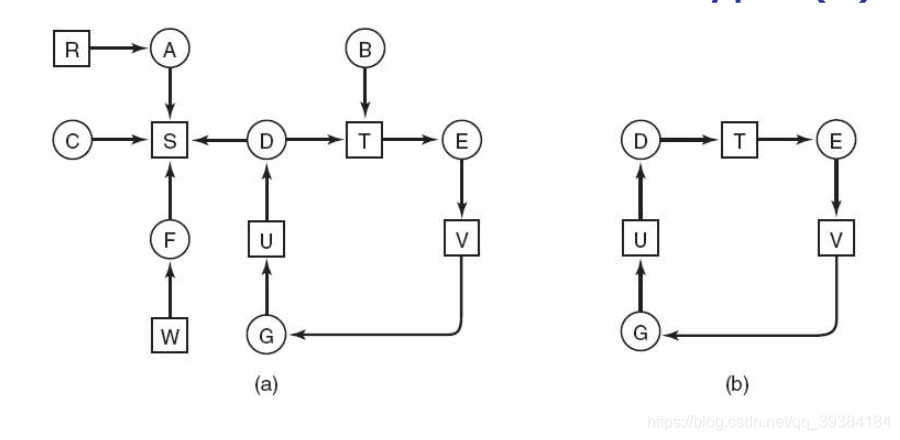

## 6.4 死锁检测和死锁恢复

第二种技术是死锁检测和恢复，系统并不试图阻止死锁的发生，而是允许死锁发生，当检测到死锁发生后采取措施恢复。

### 6.4.1 每种类型一个资源的死锁检测
从最简单的例子开始，即每种资源类型都只有一个资源。
当我们对这样的系统构造一张资源分配图，如果这张图包含了一个或多个环，那么死锁就会存在，并且此环中的任何进程都是死锁进程。

如上图，我们可以从资源分配图中找到环，可以判断出进程D、E、G产生了死锁。为了实用，我们仍然需要正规的算法来检测死锁。该算法也就是在资源分配图中找出环，思路就是从其中每一节点作为起始节点，然后不断将其下一个节点放入链表中，如果有节点出现两次，证明有环，如果一直运行到最后，则可以判断没有环。

### 6.4.2 每种类型多个资源的死锁检测

利用矩阵和向量表示请求资源和现有资源，之后不断比较，直到没有进程满足要求。如果最后剩进程没有完成，则产生死锁。

具体略。

### 6.4.3 从死锁中恢复

#### 6.4.3.1 利用抢占恢复

即临时从占有的进程中把相关资源拿走，之后再送回。

#### 6.4.3.2 利用回滚恢复

定期记录一个时间点，如果死锁发生，回到未发生死锁的时间点，并将资源给发生死锁的进程。

#### 6.4.3.3 通过杀死进程恢复

如小标题。