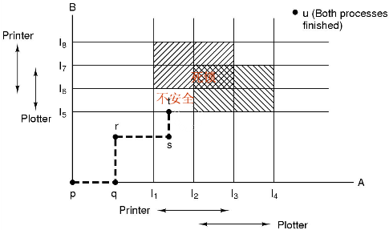
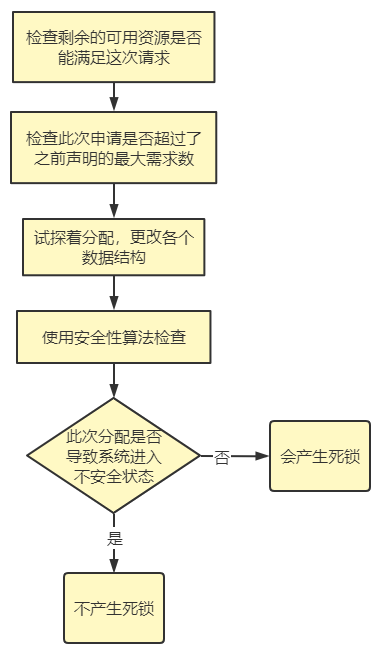

## 6.5 死锁避免

这是第三种策略，也就是动态分配资源，保证死锁不会发生。

### 6.5.1 资源轨迹图

如图所示，线不能穿过重叠的部分，穿过就代表产生死锁。

### 6.5.2 安全状态和不安全状态

- 安全状态：指没有死锁发生，并且即使所有进程突然请求对资源的最大需求，也仍然存在某种调度次序能使得每一个进程运行完毕。
- 不安全状态：从不安全状态出发，系统不能保证所有进程都完成，也就是会产生死锁。

### 6.5.3 单个资源的银行家算法

Dijkstra提出了一种能够避免死锁的调度算法，称为**银行家算法**，是6.4.1节死锁检测算法的扩展。该模型基于一个小城镇的银行家，他向一群客户分别承诺了一定的贷款额度。算法要做的就是判断对请求的满足是否会进入不安全状态。如果是就决绝请求。

首先，银行家直到不可能所有客户同时都需要最大贷款额度，因此保留的资金会比最大贷款额度和要小。

如上面的算法描述，银行家算法就是对每一个请求进行检查，而检查状态是否安全：银行家需要考虑他是否有足够的资源满足某一个客户，如果可以，那么该客户的所有资金就可以收回，以此类推，如果所有投资最终都可以收回，那么状态是安全的。

### 6.5.4 多个资源的银行家算法

借鉴6.4.2节中的矩阵，思路不变，只是对于安全状态的判断有一些区别。

检查一个状态是否安全：
1. 查找请求资源矩阵中，是否有某一行小于等于A，如果没有则会产生死锁。
2. 假设找到这样一行，在假设该行的资源被释放，标记。
3. 重复上两步，如果所有进程都被标记，那么该状态就是安全的。

### 6.5.5 缺点

银行家算法虽然可以进行死锁避免，但是实用价值很小，因为很少有进程在运行前就直到自己所需要资源的最大值。